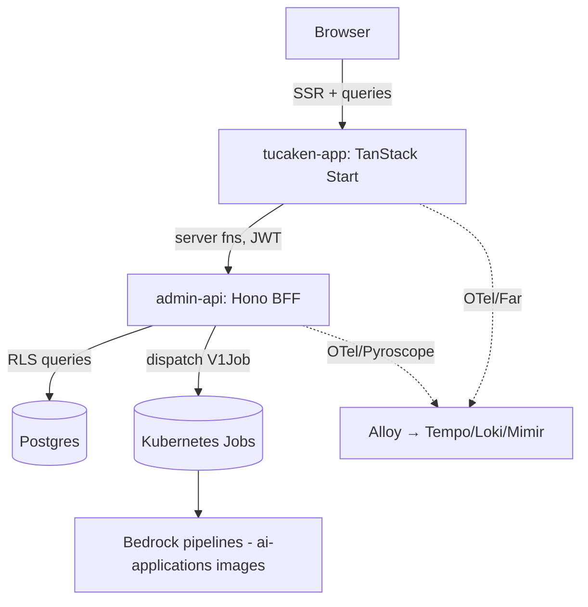

# Tucaken — web app and BFF

**Tucaken turns a developer's real code into a job-tailored, evidence-backed
resume.** A job-seeker connects their GitHub account; Tucaken builds a Knowledge
Base from their repositories, resume imports, and career entries, verifies which
skills they can actually prove from that data, and — given a specific job
description — generates a resume tailored to the role using only skills the
candidate can defend in an interview. It is for engineers whose real work lives in
GitHub, work that generic resume tools cannot read and end up flattening into
something impersonal.

This repository is the **user-facing web application and its Backend-for-Frontend
(BFF)**: the TanStack Start SSR app users interact with, plus the `admin-api`
service that authenticates requests, owns the Postgres data layer, and dispatches
the heavy AI work. The Bedrock-driven pipelines themselves (ingestion, strategist,
coach) run as Kubernetes Jobs whose worker images live in the sibling
**ai-applications** repository — this repo dispatches and consumes them.

## Who it's for

Software engineers and adjacent technical roles applying for jobs who want a
resume that is both tailored to each posting and honest — grounded in what their
code actually shows, not aspirational keyword stuffing.

## The problem it solves

- **Resumes claim skills the candidate can't prove.** ATS filters reward
  keywords, so resumes drift toward unverifiable claims. Tucaken grounds every
  skill in concrete repository evidence (files, commits, PRs) and is honest about
  gaps.
- **Tailoring to each job is slow and manual.** Tucaken reads a job description
  once, maps its required skills to the candidate's verified evidence, and
  produces a tailored draft automatically.
- **Candidates can't see how they actually match a role.** Tucaken surfaces a
  per-skill verdict (verified / partial / gap), an evidence-quality overview, and
  interview coaching, so the user understands their real standing.

## How it works (user flow)

1. **Connect GitHub** — repositories are ingested and chunked into the Knowledge
   Base.
2. **Verify skills** — a deterministic + LLM pipeline extracts a per-skill
   evidence ledger from the actual code, classified by source lane (repo code,
   documented project, career history).
3. **Add a job description** — the JD is read once into a canonical required-skill
   list; a matcher assesses each required skill against the verified evidence.
4. **Generate the tailored resume** — a multi-agent Bedrock pipeline writes a
   resume tailored to the JD, grounded in verified skills, with honest framing of
   partial matches and gaps.
5. **Coach and iterate** — interview coaching (organised by hiring stage),
   evidence-quality insight, and project case studies help present the work
   credibly.

## Architecture



The SSR app calls `admin-api` through TanStack server functions. `admin-api`
verifies Cognito JWTs, runs user-scoped queries under database row-level
security, and dispatches background AI work as Kubernetes Jobs rather than running
it in request handlers. Both runtimes are instrumented with OpenTelemetry,
Prometheus, Pyroscope, and structured logs; the browser adds Grafana Faro RUM.

## Tech stack

- **Web app:** TanStack Start (SSR), TanStack Router / Query / Form, React 19,
  Vite 8, Tailwind CSS v4, Zustand, Zod, Motion.
- **BFF (`admin-api`):** Hono on Node, `pg` (Postgres via PgBouncer), `ioredis`,
  `@kubernetes/client-node`.
- **Auth and payments:** AWS Cognito with `jose` (JWKS verification, M2M), Stripe.
- **Observability:** OpenTelemetry, Pyroscope, Grafana Faro, Prometheus
  (`prom-client`), Pino.
- **Tests:** Vitest (web app), Jest (`admin-api`).

Versions are pinned in [package.json](package.json) and
[admin-api/package.json](admin-api/package.json).

## Key design decisions

Recorded as ADRs and concept docs under [docs/](docs/):

- [API-dispatched Kubernetes Jobs](docs/concepts/api-dispatched-k8s-jobs.md) —
  the API builds Job specs and submits them; workers run the Bedrock pipelines.
- [No Job-level retry for model-invoking Jobs](docs/decisions/0005-no-retry-on-model-jobs.md)
  — `backoffLimit = 0` so a deterministic failure does not re-spend Bedrock.
- [Fail-fast on startup config, fail-soft on async-synced config](docs/decisions/0006-fail-soft-on-async-synced-config.md)
  — crash on missing required env, return 502/503 on not-yet-synced dynamic config.
- [Database-enforced row-level security](docs/patterns/repository-layer-rls.md) —
  per-user isolation via `withUser` and Postgres RLS, not application filtering.

## Repository structure

```text
src/
  app/                 # TanStack Start file-based routes
  features/<domain>/   # feature-sliced UI, hooks, server fns
  components/          # shared UI primitives and layouts
  lib/                 # clients, observability, utilities
  server/              # server-only code (auth, billing, Stripe webhook)
admin-api/             # Hono BFF workspace (routes, repositories, K8s dispatch)
docs/                  # architecture, ADRs, concepts, runbooks
```

## Running locally

Yarn 4 (`packageManager: yarn@4.12.0`); never use npm or pnpm.

```bash
yarn install
yarn dev          # Vite dev server on port 5001
```

Quality gates before a change is done:

```bash
yarn typecheck
yarn lint
yarn test
```

## Deploying

Pushes to `main` build and push the container image to ECR — the web app via
[.github/workflows/deploy.yml](.github/workflows/deploy.yml) and `admin-api` via
[.github/workflows/deploy-admin-api.yml](.github/workflows/deploy-admin-api.yml).
For `admin-api`, ArgoCD Image Updater then picks up the new tag, writes it back to
the kubernetes-bootstrap repo, and ArgoCD reconciles the Rollout — there is no
manual promote step.

## Related repositories

Tucaken is a multi-repo product:

- **tucaken-app** (this repo) — user-facing web app and `admin-api` BFF: the
  product surface, auth, billing, and Job dispatch.
- **ai-applications** — AI/ML backend: GitHub ingestion, skill-evidence
  extraction, the JD-strategist pipeline, multi-agent resume synthesis, and
  project case studies (the Bedrock worker images this repo dispatches).
- **tucaken-infra** — AWS CDK infrastructure (EKS, EKS Pod Identity, observability,
  delivery).
- **kubernetes-bootstrap** — in-cluster GitOps manifests, Helm values, and Grafana
  dashboards.

## Documentation

The [docs/](docs/) tree holds the architecture overview
([admin-api project](docs/projects/admin-api.md)), ADRs, concept docs (K8s
dispatch, distributed tracing, observability, Cognito auth), patterns, runbooks,
and troubleshooting case studies. Start at [docs/README.md](docs/README.md).

## Status

Private project — `package.json` is marked `private`; not published to a registry.
