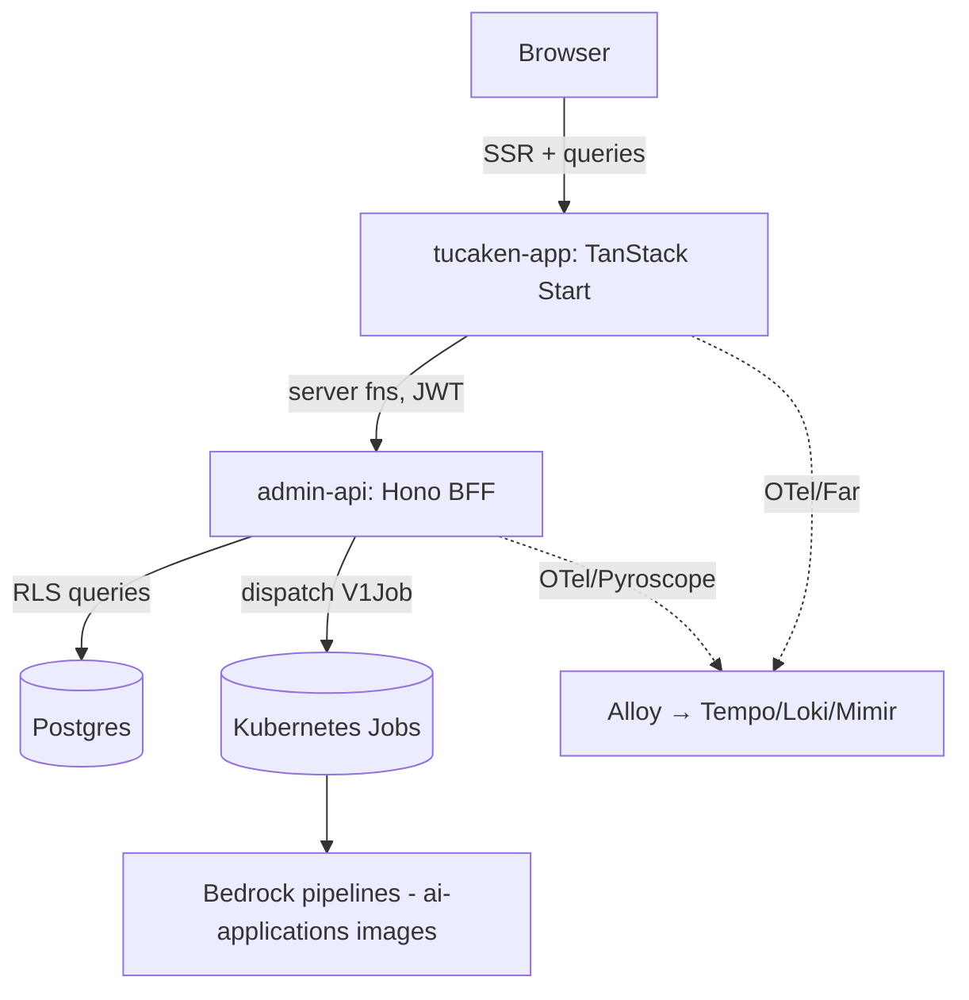

# Tucaken — web app and BFF

Tucaken turns a developer's real work into resumes and career insight that
actually sound like them. It builds a Knowledge Base from a user's own GitHub
repositories, resume imports, and career entries, then reads that data to produce
tailored resumes, an interview-prep workspace, and a profile read of where the
person is and where they are heading. It is for engineers whose real work lives in
GitHub — work that generic resume tools cannot read and end up flattening into
something impersonal.

This repository is the **user-facing web application and its Backend-for-Frontend
(BFF)**: the TanStack Start SSR app users interact with, plus the `admin-api`
service that authenticates requests, owns the Postgres data layer, and dispatches
the heavy AI work. The Bedrock-driven pipelines themselves (ingestion, strategist,
coach) run as Kubernetes Jobs whose worker images live in the sibling
**ai-applications** repository — this repo dispatches and consumes them.

## What it does

- Connects GitHub repositories and imports resumes to build a per-user Knowledge
  Base, scored for readiness so the user can see whether it holds enough quality
  data.
- Generates tailored resumes and an interview-prep workspace organised by hiring
  stage (phone screen, technical, system design, behavioural, bar raiser, final).
- Presents a profile read — what the indexed data reflects, where it suggests the
  user is heading, and where their resume diverges from their real work.
- Handles authentication, billing, and onboarding for the product end to end.

## Architecture



The SSR app calls `admin-api` through TanStack server functions. `admin-api`
verifies Cognito JWTs, runs user-scoped queries under database row-level
security, and dispatches background AI work as Kubernetes Jobs rather than running
it in request handlers. Both runtimes are instrumented with OpenTelemetry,
Prometheus, Pyroscope, and structured logs; the browser adds Grafana Faro RUM.

## Tech stack

- **Web app:** TanStack Start (SSR), TanStack Router / Query / Form, React 19,
  Vite 8, Tailwind CSS v4, Zustand, Zod, Motion.
- **BFF (`admin-api`):** Hono on Node, `pg` (Postgres via PgBouncer), `ioredis`,
  `@kubernetes/client-node`.
- **Auth and payments:** AWS Cognito with `jose` (JWKS verification, M2M), Stripe.
- **Observability:** OpenTelemetry, Pyroscope, Grafana Faro, Prometheus
  (`prom-client`), Pino.
- **Tests:** Vitest (web app), Jest (`admin-api`).

Versions are pinned in [package.json](package.json) and
[admin-api/package.json](admin-api/package.json).

## Key design decisions

Recorded as ADRs and concept docs under [docs/](docs/):

- [API-dispatched Kubernetes Jobs](docs/concepts/api-dispatched-k8s-jobs.md) —
  the API builds Job specs and submits them; workers run the Bedrock pipelines.
- [No Job-level retry for model-invoking Jobs](docs/decisions/0005-no-retry-on-model-jobs.md)
  — `backoffLimit = 0` so a deterministic failure does not re-spend Bedrock.
- [Fail-fast on startup config, fail-soft on async-synced config](docs/decisions/0006-fail-soft-on-async-synced-config.md)
  — crash on missing required env, return 502/503 on not-yet-synced dynamic config.
- [Database-enforced row-level security](docs/patterns/repository-layer-rls.md) —
  per-user isolation via `withUser` and Postgres RLS, not application filtering.

## Repository structure

```text
src/
  app/                 # TanStack Start file-based routes
  features/<domain>/   # feature-sliced UI, hooks, server fns
  components/          # shared UI primitives and layouts
  lib/                 # clients, observability, utilities
  server/              # server-only code (auth, billing, Stripe webhook)
admin-api/             # Hono BFF workspace (routes, repositories, K8s dispatch)
docs/                  # architecture, ADRs, concepts, runbooks
```

## Running locally

Yarn 4 (`packageManager: yarn@4.12.0`); never use npm or pnpm.

```bash
yarn install
yarn dev          # Vite dev server on port 5001
```

Quality gates before a change is done:

```bash
yarn typecheck
yarn lint
yarn test
```

## Deploying

Pushes to `main` build and push the container image to ECR — the web app via
[.github/workflows/deploy.yml](.github/workflows/deploy.yml) and `admin-api` via
[.github/workflows/deploy-admin-api.yml](.github/workflows/deploy-admin-api.yml).
For `admin-api`, ArgoCD Image Updater then picks up the new tag, writes it back to
the kubernetes-bootstrap repo, and ArgoCD reconciles the Rollout — there is no
manual promote step.

## Related repositories

Tucaken is a multi-repo product:

- **tucaken-app** (this repo) — user-facing web app and `admin-api` BFF: the
  product surface, auth, billing, and Job dispatch.
- **ai-applications** — Bedrock worker images and pipelines (ingestion,
  strategist, coach) that this repo dispatches as Kubernetes Jobs.

## Documentation

The [docs/](docs/) tree holds the architecture overview
([admin-api project](docs/projects/admin-api.md)), ADRs, concept docs (K8s
dispatch, distributed tracing, observability, Cognito auth), patterns, runbooks,
and troubleshooting case studies.

## Status

Private project — `package.json` is marked `private`; not published to a registry.
