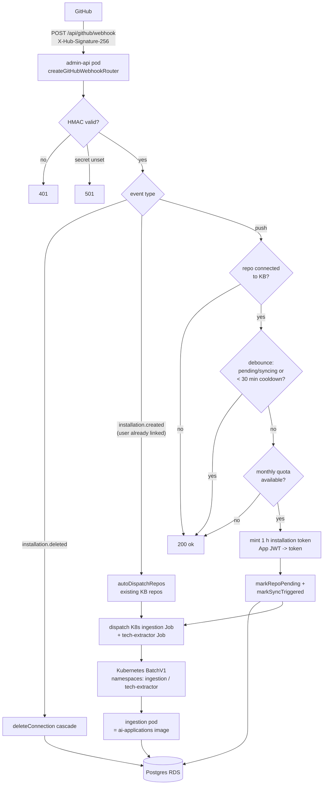
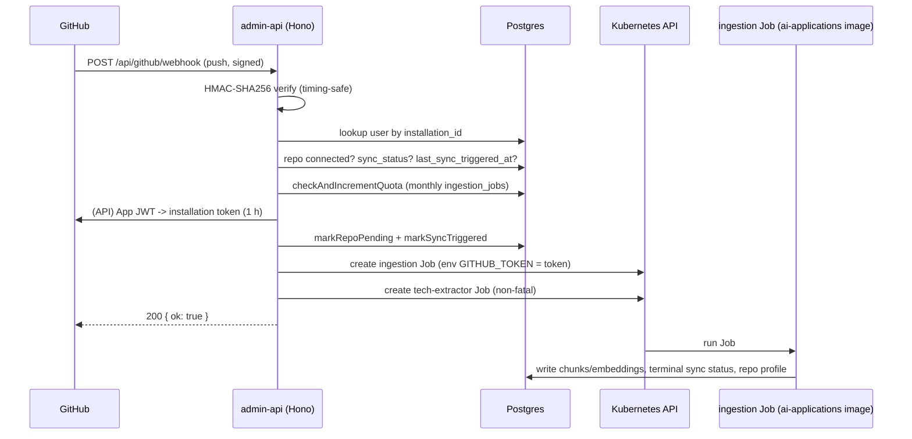
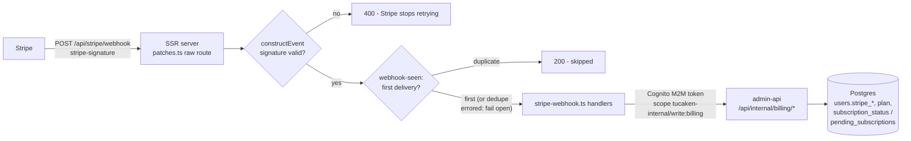

# Webhooks in tucaken-app — GitHub App (admin-api) and Stripe (SSR server)

This document explains the two inbound webhook systems in this repository:

1. the **GitHub App webhook** (`POST /api/github/webhook`, admin-api) — the
   event-driven trigger for the knowledge-base ingestion pipeline; and
2. the **Stripe billing webhook** (`POST /api/stripe/webhook`, SSR server) —
   the subscription-state synchroniser, which calls back into admin-api over
   a machine-to-machine (M2M) channel.

It covers what each does, the problem it solves, why a webhook is the right
mechanism, the concepts applied, exact data formats, dataflow diagrams, the
folder/file structure, and known gaps.

> Companion doc: the **revocation-only** GitHub webhook in the
> `ai-applications` repo (`ai-applications/docs/webhooks/README.md`). Both
> repos receive GitHub `installation` events; this repo does the heavy
> lifting (cascade cleanup, job dispatch), that one only soft-marks the
> `oauth_connections` row.

---

## 1. GitHub App webhook (admin-api)

### 1.1 What it does

`POST /api/github/webhook` receives GitHub App events, authenticated purely by
HMAC-SHA256 signature (no Cognito JWT — the router is mounted **before** the
JWT middleware). Handled events:

| Event / action              | Behaviour                                                                    |
| --------------------------- | ---------------------------------------------------------------------------- |
| `installation.deleted`      | Resolve the user by `installation_id`, then cascade-delete their GitHub data: `document_embeddings`, `repo_sync_state`, `repositories`, `oauth_connections`. Fallback: direct delete of the `oauth_connections` row if no user matches. |
| `installation.created`      | "Option B" safety net. If the user is *already* linked (e.g. a GitHub-initiated reinstall that bypassed the UI), re-dispatch ingestion for their existing KB repos. Fresh installs are a no-op — the UI redirect (Option A, `POST /installation`) owns that path. |
| `installation.suspend` / `unsuspend` | Acknowledged with 200, not processed.                               |
| `push`                      | Incremental re-index of the pushed repo: resolve user → check the repo is connected to the KB → debounce → enforce monthly quota → dispatch a Kubernetes ingestion Job plus a (non-fatal, shadow-mode) tech-extractor Job. |
| anything else               | Acknowledged with `200 { ok: true }`, not processed.                          |

Once the signature verifies, the handler **always returns 200**, even for
unhandled events — GitHub retries any non-2xx, and we do not want retry storms
for events we deliberately ignore.

### 1.2 The problem it solves

The knowledge base must stay current with the user's repositories without the
user pressing "sync" after every commit. Before the `push` handler, a repo's
embeddings went stale until a manual re-sync. This webhook makes ingestion
**event-driven**: GitHub tells us the moment code changes, and the pipeline
re-indexes only then. The `installation.deleted` handler solves the mirror
problem — honouring an uninstall by removing the user's derived data
(embeddings, sync state, repo rows) rather than letting it linger.

### 1.3 Why a webhook?

- **Event-driven beats scheduled.** Polling every user's repos on a timer
  wastes GitHub rate limit and compute on repos that have not changed, and
  still lags behind real pushes. The webhook gives near-real-time freshness
  at zero idle cost.
- **GitHub owns the events.** Pushes and installs happen on GitHub's side;
  only GitHub can initiate the notification.
- **Retries are free.** GitHub redelivers on non-2xx, giving at-least-once
  delivery without us building a retry queue — provided the handler is safe
  to re-run (hence debounce and conditional writes).

### 1.4 Concepts applied

- **HMAC-SHA256 signature auth** over the raw body
  (`X-Hub-Signature-256: sha256=<hex>`), verified by
  `lib/webhook-signature.ts` (`verifyWebhookSignature`): `sha256=` prefix
  required, digest hex-decoded, length-checked (catches malformed hex), then
  `crypto.timingSafeEqual`. Kept semantically identical to ai-applications'
  shared verifier. The webhook secret is the only authenticator; the route
  carries no user identity.
- **Fail-closed configuration:** if `GITHUB_WEBHOOK_SECRET` is unset the
  endpoint answers `501` and does nothing.
- **Debounce / cooldown:** a push is skipped when a sync is already
  `pending`/`syncing`, or when the last trigger was inside
  `PUSH_COOLDOWN_MS` (30 minutes). This absorbs push bursts (e.g. a rebase
  landing ten commits) into at most one job per half hour per repo.
- **Quota enforcement:** `checkAndIncrementQuota` charges the user's monthly
  `ingestion_jobs` allowance *before* dispatch, so webhook-driven work cannot
  exceed the plan any more than UI-driven work can.
- **Short-lived credentials:** each dispatch mints a fresh 1-hour GitHub App
  **installation token** (App JWT → token exchange); tokens are injected into
  the Job as `GITHUB_TOKEN` and never persisted.
- **Asynchronous work offload:** the webhook never ingests inline. It writes
  intent (`repo_sync_state` → `pending`) and dispatches a Kubernetes Job, so
  the HTTP handler stays fast and GitHub's delivery timeout is never at risk.
- **Idempotent-by-effect design:** re-delivery of a push lands in the
  debounce window or the `pending` check, so duplicates do not double-charge
  quota or double-dispatch.

### 1.5 Dataflow



Push-event sequence:



### 1.6 Data formats

Headers:

| Header                | Purpose                                    |
| --------------------- | ------------------------------------------ |
| `X-Hub-Signature-256` | `sha256=<hex>` HMAC-SHA256 of the raw body |
| `X-GitHub-Event`      | `installation`, `push`, ...                |

Payload fields actually read (parsed as `Record<string, unknown>`):

```json
{
  "action": "created | deleted | suspend | unsuspend",
  "installation": { "id": 12345678 },
  "repository":   { "full_name": "owner/name" }
}
```

Responses:

| Condition                  | Status | Body                              |
| -------------------------- | ------ | --------------------------------- |
| `GITHUB_WEBHOOK_SECRET` unset | 501 | `{ "error": "Webhook not configured" }` |
| Invalid signature          | 401    | `{ "error": "Invalid signature" }` |
| Invalid JSON (valid sig)   | 400    | `{ "error": "Invalid JSON payload" }` |
| Everything else            | 200    | `{ "ok": true }`                  |

Note the deliberate coarseness of the 200: skipped-by-debounce,
skipped-by-quota, unknown repo and full dispatch all acknowledge identically,
because GitHub is not the audience for that distinction — the logs and
`repo_sync_state` are.

### 1.7 Security and secrets

| Secret / setting          | Source                                                    |
| ------------------------- | --------------------------------------------------------- |
| `GITHUB_WEBHOOK_SECRET`   | env via the `admin-api-github` ESO Secret → `config.githubWebhookSecret` |
| `GITHUB_APP_ID`, `GITHUB_PRIVATE_KEY` | same ESO Secret; used to mint installation tokens (PKCS#1 key normalised to PKCS#8, RS256) |

- The webhook router is mounted in `admin-api/src/index.ts` **before** the
  Cognito JWT middleware — order is load-bearing.
- `githubWebhookSecret` is redacted in structured logs
  (`lib/observability/logger.ts`).
- Installation tokens live 1 hour, are generated per dispatch, and are never
  written to the database.

### 1.8 Database and infrastructure touchpoints

Tables written on the webhook path: `oauth_connections`, `repositories`,
`repo_sync_state` (pending + `last_sync_triggered_at`), `usage_quotas`
(monthly `ingestion_jobs` counter); on delete, the cascade also removes
`document_embeddings` and `repository_profiles`.

Kubernetes: ingestion Jobs are created in `config.ingestionNamespace`
(default `ingestion`); tech-extractor Jobs in `tech-extractor`. A read-time
reconciler (`reconcileStuckRepos`) squares stuck `repo_sync_state` rows with
live Jobs. No ingress/Helm manifests live in this repo — the route is exposed
by the external GitOps/cluster repo.

### 1.9 Hand-off to ai-applications

The ingestion Job dispatched here runs the **ai-applications ingestion
image** (`getJobImage('ingestion')`, spec built by `lib/ingestion-job.ts`).
The webhook feeds it the repo `full_name` and a per-user installation token;
the ingestion pod then writes embeddings, terminal sync status and repository
profiles into the same RDS database. In other words: **admin-api's webhook is
the trigger; ai-applications is the worker.** Shared tables:
`repositories`, `repo_sync_state`, `document_embeddings`,
`repository_profiles`, `usage_quotas`.

---

## 2. Stripe billing webhook (SSR server → admin-api over M2M)

### 2.1 What it does and why

Stripe is the source of truth for subscription state. When checkouts,
subscription changes or invoice outcomes happen, Stripe delivers events to
`POST /api/stripe/webhook` on the TanStack SSR server. The handler verifies
the signature (`stripe.webhooks.constructEvent` with
`STRIPE_WEBHOOK_SECRET`), claims the event id against the
`webhook_events_seen` idempotency ledger (duplicate deliveries are
acknowledged and skipped — see 2.5), then maps the event to a billing
mutation and calls admin-api's internal billing routes over an authenticated
machine-to-machine channel. Without this webhook, plan changes made in
Stripe (renewals, cancellations, failed payments) would never reach the
application's `users` table.

The route is registered on the **raw Node HTTP server before SSR** so the
framework never parses the body — Stripe's signature, like GitHub's, is over
the exact raw bytes.

### 2.2 Events handled

| Stripe event                      | Effect                                                        |
| --------------------------------- | ------------------------------------------------------------- |
| `checkout.session.completed`      | Known user (`client_reference_id`) → PATCH subscription; guest → POST a `pending_subscriptions` row (drained at signup) |
| `customer.subscription.updated` / `.deleted` | Map `items[0].price.id` → tier, PATCH subscription    |
| `invoice.paid`                    | Status → `active`                                             |
| `invoice.payment_failed`          | Status → `past_due`                                           |
| anything else                     | Logged, acknowledged                                          |

Status contract to Stripe: **400** on signature failure (Stripe gives up),
**500** on downstream failure (Stripe retries), 200 otherwise.

### 2.3 Dataflow



The M2M leg: `_internal-api-client.ts` mints a Cognito client-credentials
token (`cognito-m2m.ts`) and calls `ADMIN_API_URL` (default
`http://admin-api.admin-api:3002`). admin-api validates it with
`cognitoM2MAuth` middleware — `token_use = 'access'` plus the
`tucaken-internal/write:billing` scope — before any billing route runs.

### 2.4 Receiving routes (admin-api)

| Route                                             | Effect                                  |
| ------------------------------------------------- | --------------------------------------- |
| `POST /api/internal/billing/customers`            | set `users.stripe_customer_id`          |
| `PATCH /api/internal/billing/subscription`        | update `users.stripe_*`, `plan`, `subscription_status`, `cancel_at_period_end`, `current_period_end` |
| `GET /api/internal/billing/users/by-customer/:id` | resolve Stripe customer → user          |
| `POST /api/internal/billing/pending`              | upsert `pending_subscriptions` (guest checkout) |
| `POST /api/internal/billing/webhook-seen`         | claim event id in `webhook_events_seen`; reports duplicates |

All bodies are Zod-validated. Full narrative in `docs/billing-integration.md`.

### 2.5 Idempotency

Stripe delivers at-least-once and retries on non-2xx. Before dispatching any
event, the handler POSTs `{ eventId, type }` to
`/api/internal/billing/webhook-seen`; admin-api claims the id in the
`webhook_events_seen` table (migration 108 in platform-rds-bootstrap) with a
single atomic `INSERT ... ON CONFLICT (event_id) DO NOTHING RETURNING`.
Duplicates are acknowledged with 200 and skipped. The check **fails open**:
if the dedupe call errors, the event is processed anyway — the conditional
writes in the subscription sync remain the safety net, and dropping a real
billing event would be worse than a rare reprocess.

---

## 3. Folder / file structure

```text
admin-api/src/
  routes/github.ts               # GitHub App router + the WEBHOOK router.
                                 #   createGitHubWebhookRouter() = the webhook.
  routes/internal-billing.ts     # Stripe -> admin-api M2M billing routes
                                 #   (incl. /webhook-seen idempotency claim)
  lib/webhook-signature.ts       # HMAC-SHA256 verifier (strict: hex-decode +
                                 #   length check + timing-safe compare)
  lib/repositories/webhook-events.ts  # webhook_events_seen claim (dedup ledger)
  lib/github-app.ts              # App JWT, installation tokens, repo list, delete
  lib/ingestion-job.ts           # ingestion K8s Job spec (dispatched by push/install)
  lib/config.ts                  # githubWebhookSecret + GitHub App creds loading
  middleware/m2m-auth.ts         # Cognito M2M token + scope validation (Stripe path)
  index.ts                       # mounts routers; webhook BEFORE JWT middleware

admin-api/__tests__/
  lib/webhook-signature.test.ts       # 10 verifier unit tests
  routes/github-webhook.test.ts       # 16 webhook route tests (gates, cascade,
                                      #   safety net, push debounce/quota)
  routes/internal-billing.test.ts     # /webhook-seen claim + duplicate + 400
admin-api/src/lib/repositories/
  webhook-events.test.ts              # dedup claim unit tests

src/server/                    # TanStack SSR server (not admin-api)
  stripe-webhook.ts            # Stripe signature verify + dedup + event handlers
  patches.ts                   # raw-body /api/stripe/webhook route registration
  _internal-api-client.ts      # M2M client to admin-api
  cognito-m2m.ts               # mints the client-credentials token
src/__tests__/server/
  stripe-webhook.test.ts       # idempotency: skip duplicate, process first,
                               #   fail-open on dedupe error
```

Why the split: the **GitHub** webhook lives in admin-api because that service
already owns the GitHub App credentials, the RDS pool and the Kubernetes
client. The **Stripe** webhook lives in the SSR server because that is the
public HTTPS surface Stripe can reach, and it needs the raw request body
before any framework parsing; it then delegates all persistence to admin-api
so billing writes happen in exactly one service, behind one auth middleware.

---

## 4. Gap history (all closed 2026-07-21)

The gaps flagged in the first revision of this document have been closed:

1. **Webhook test coverage** — done. 16 route tests cover the GitHub webhook
   (`github-webhook.test.ts`: 501/401/400 gates, cascade delete + fallback,
   Option B safety net, push happy path, unconnected-repo skip, running-job
   debounce, 30-minute cooldown both sides, quota exhaustion), 10 unit tests
   cover the verifier, and `stripe-webhook.test.ts` covers the idempotency
   guard (skip duplicate / process first / fail-open).
2. **Stripe idempotency guard** — wired. `lib/repositories/webhook-events.ts`
   claims each event id in `webhook_events_seen` via the new
   `POST /api/internal/billing/webhook-seen` route; the SSR handler skips
   duplicates and fails open on dedupe errors (see 2.5).
3. **`WebhooksSection.tsx` stub** — removed. The Settings page no longer
   advertises outbound webhooks (`Settings.webhooks`, the `Webhook` type and
   the section component were deleted). If outbound webhooks become a real
   feature, they get a backend first.
4. **Duplicated HMAC logic** — unified semantics. admin-api now verifies via
   `lib/webhook-signature.ts`, kept semantically identical to
   ai-applications' shared `verifyWebhookSignature` (the repos do not share a
   package, so the helper is mirrored — like the Mermaid normaliser, keep the
   two copies in lockstep).

Remaining honest caveat: `webhook_events_seen` rows are never pruned (audit
trail by design); revisit if the table ever grows meaningfully.

---

## 5. Related documents

- `docs/billing-integration.md` — full Stripe billing dataflow.
- `ai-applications/docs/webhooks/README.md` — the revocation-only GitHub
  webhook in the companion repo.
- `ai-applications` design spec:
  `docs/superpowers/specs/2026-05-21-github-webhook-and-app-jwt-design.md`.
