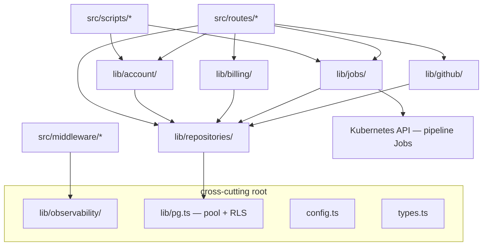

# admin-api lib

Service and data layer behind the [routes](../routes/README.md). Four kinds of
code, arranged so dependencies always point downward: routes → lib groups →
repositories → Postgres.

## Layer model

**Rule: lib never imports from routes.** If a route handler grows logic another
consumer needs (a script, the reconciler, another domain), the logic moves down
into the matching lib group — never sideways into another route.

## Cross-cutting root files

| File | Purpose |
|---|---|
| `config.ts` | Fail-fast env validation (`loadConfig`) + pipeline Job image resolution (`getJobImage`, `isImageConfigured`) |
| `pg.ts` | Lazy Postgres pool singleton, `withUser` RLS wrapper, `Queryable` type |
| `types.ts` | Hono context bindings (`AdminApiBindings`, `requireUserId`) |
| `redis-cache.ts` | Write-side read-cache invalidation (DEL-only, fail-open) — key contract shared with public-api |
| `retry-after.ts` | Retry-After maths for 429 monthly-quota exhaustion |
| `portfolio-revalidate.ts` | Best-effort portfolio ISR revalidation after article publish |
| `market-funnel-ranges.ts` | 2026 job-market typical-range bands for funnel analytics |

## Domain groups

| Group | Contents | Consumed by |
|---|---|---|
| [`github/`](github/README.md) | GitHub App auth, connection teardown, repo-rename healing, sync dedup, SBOM + Croissant builders | `routes/github`, `routes/admin`, scripts |
| [`jobs/`](jobs/README.md) | K8s API clients, Job spec builders, per-pipeline dispatchers, dispatch gates, case-study reconciler | `routes/{github,applications,projects,pipelines,resumes}`, `index.ts`, scripts |
| [`billing/`](billing/README.md) | Plan entitlements, tier-config schema + TTL cache, email-allowlist gates | `routes/{github,projects,pipelines,billing,public,account}` |
| [`account/`](account/README.md) | Cognito admin operations + the hard-delete purge sequence | `routes/{admin,account}`, `scripts/account-sweep` |
| [`repositories/`](repositories/README.md) | SQL data-access layer — one file per table/domain | everything above |
| [`observability/`](observability/README.md) | Pino logger, Prometheus metrics, OTel bootstrap | middleware, routes, lib |

## Conventions

- **Repositories are the only place SQL lives.** Route handlers and lib
  services call repository functions; parameterised queries only.
- **Type-only coupling to `pg.ts`.** Repository files import `type Queryable`
  so they can run against a pool, a client, or an RLS-scoped transaction.
- **Fail-open for side channels.** Cache invalidation, ISR revalidation and
  rollup refresh never fail the user request; they log and continue.
- **No `console.*`** — use `observability/logger.ts` (Pino). Existing console
  calls in route error boundaries predate this rule.
- **Tests** live in per-group `__tests__/` folders beside the code.

## Related

- [`src/routes/README.md`](../routes/README.md) — the HTTP surface these services back
- [`CLAUDE.md`](../../../CLAUDE.md) — repo-wide engineering rules
