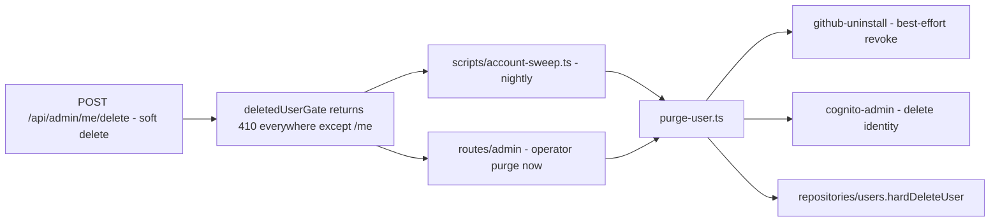

# lib/account

Account lifecycle teardown — the Cognito operations and the hard-delete
sequence. Small on purpose: deleting a user correctly is the most dangerous
code path in the API, so it lives in exactly one place.

## Files

| File | Purpose | Key exports |
|---|---|---|
| `cognito-admin.ts` | Cognito admin operations (disable / enable / delete user) — requires the pod's IAM role to hold the Cognito admin actions | `adminDeleteUser`, disable/enable helpers |
| `purge-user.ts` | **Single source of truth for hard deletion**: revoke GitHub installation → delete Cognito user → hard-delete DB rows | `purgeUser` |

## Deletion model

## Design notes

- **Ordering matters:** external revocations run before the DB hard delete so
  a mid-sequence failure leaves a retryable state, not an orphaned identity.
- GitHub revocation is best-effort (`lib/github/github-uninstall.ts`) — a
  GitHub outage must never block deletion.
- Soft delete is idempotent and reversible (`routes/admin` restore); hard
  purge is not. Anything new that must die with the user belongs in
  `purge-user.ts`, not in a route handler.

## Consumers

`routes/admin/admin-users.ts` (purge now, restore),
`routes/account/me.ts` (Cognito/GitHub state), `scripts/account-sweep.ts`.

## Testing

`__tests__/purge-user.test.ts`; route-level coverage in
`routes/admin/__tests__/admin-users-delete.test.ts`.

## Related

- [lib overview](../README.md) · [routes/admin](../../routes/admin/README.md) · [routes/account](../../routes/account/README.md)
