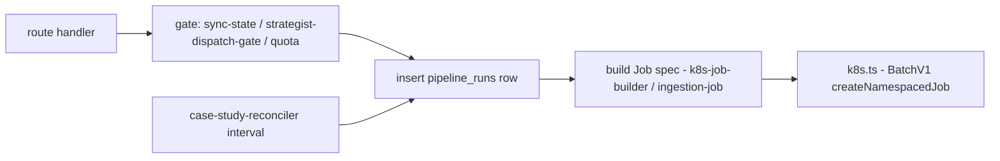

# lib/jobs

Everything that creates Kubernetes pipeline Jobs. The AI pipelines themselves
run in the sibling **ai-applications** repo; this group owns the dispatch
side — spec construction, dedup gates, and the reconciler loop.

## Dispatch flow

## Files

| File | Purpose | Key exports |
|---|---|---|
| `k8s.ts` | Lazy singleton K8s API clients (in-cluster config) | `getBatchApi`, `getCoreApi` |
| `k8s-job-builder.ts` | Shared Job conventions: labels, traceparent, observability + model env, backoff | `buildPipelineJob`, `sanitizeLabel`, `traceParentEnv`, `MODEL_JOB_BACKOFF_LIMIT` |
| `ingestion-job.ts` | Ingestion / re-enrich / rollup Job specs + short-lived token Secrets | `buildIngestionJobSpec`, `buildIngestionTokenSecret`, `buildRollupJobSpec` |
| `case-study-dispatch.ts` | Case-study Job dispatch (discriminated-union result; `REDIS_CACHE_ENV` contract for job-strategist Jobs) | `dispatchCaseStudyJob`, `REDIS_CACHE_ENV` |
| `case-study-reconciler.ts` | Interval loop re-dispatching projects stuck `case_study_status='pending'` (started from `index.ts`, unref'd) | `startCaseStudyReconciler` |
| `coach-dispatch.ts` | Interview-coach dispatch with per-stage in-flight dedup | `dispatchCoach`, `isPrepStage` |
| `dispatch-rollup.ts` | Best-effort rollup-refresh Job (Profile Intelligence without re-ingest) | `dispatchRollupRefresh` |
| `strategist-dispatch-gate.ts` | Race-safe per-user strategist gate (in-flight dedup + throttle) | gate helpers |

## Invariants

- **`pipeline_runs` row first, Job second.** A Job without a run row is
  unobservable and a bug.
- **No retry on model Jobs** (ADR 0005) — backoff limits are set so failed
  LLM Jobs surface instead of silently burning tokens.
- **Image resolution** goes through `config.ts` `getJobImage`/
  `isImageConfigured`; an unconfigured image returns a typed failure (502 at
  the route), never a broken Job.
- Job names embed a sanitised stem + hash suffix (`sanitizeLabel`) to stay
  within K8s 63-char label limits.

## Consumers

`routes/{github,applications,projects,pipelines,resumes}`, `index.ts`
(reconciler), `scripts/reenrich-sweep.ts`.

## Testing

`__tests__/`: `ingestion-job.test.ts`, `k8s-job-builder.test.ts`,
`coach-dispatch.test.ts`, `dispatch-rollup.test.ts`,
`strategist-dispatch-gate.test.ts`, `case-study-reconciler.test.ts`.

## Related

- [lib overview](../README.md) · [routes/pipelines](../../routes/pipelines/README.md) · ai-applications repo (worker images)
