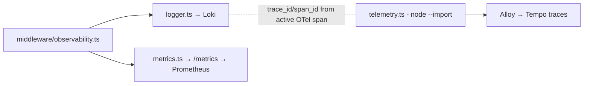

# lib/observability

Structured logging, metrics and tracing bootstrap. Everything downstream of
these files lands in the cluster observability stack (Alloy → Loki / Tempo /
Prometheus → Grafana).

## Files

| File | Purpose |
|---|---|
| `logger.ts` | Pino JSON logger to stdout (collected by Alloy → Loki). Exports the root `logger`; the observability middleware binds a per-request child with `request_id`, `trace_id`, `span_id` |
| `metrics.ts` | Prometheus registry + RED metrics (`httpRequestsTotal`, `httpRequestDurationSeconds`), auth provisioning and cache-invalidation counters. Scraped at `/metrics` |
| `telemetry.ts` | OpenTelemetry NodeSDK bootstrap (OTLP/HTTP → Alloy → Tempo). **Side-effect module with no exports** — loaded via `node --import` in the `start` script and Dockerfile CMD, never imported from code |

## How the pieces connect

## Rules

- **No `console.*` in app code** — use the Pino logger so redaction, levels
  and trace correlation apply. `console` is tolerated only in ops scripts and
  legacy route error boundaries.
- **Never log tokens, request bodies, or PII at info level.** Pino redaction
  is configured centrally here — extend it here, not ad hoc.
- If you move or rename `telemetry.ts`, update `package.json` (`dev`,
  `start`) **and** the Dockerfile CMD — nothing imports it, so tsc will not
  catch a broken path.

## Related

- [lib overview](../README.md) · [middleware](../../middleware/README.md) · Grafana dashboards provisioned from the kubernetes-bootstrap repo
