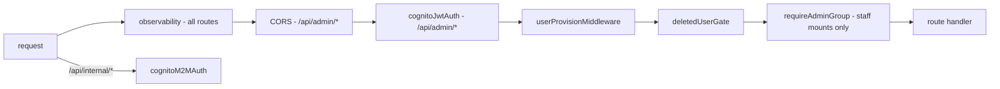

# middleware

Hono middleware applied in [`src/index.ts`](../index.ts). Order is part of the
security model — do not re-order casually.

## Pipeline

## Files

| File | Exports | Purpose |
|---|---|---|
| `observability.ts` | `observabilityMiddleware` | Pino request logging (one line per request), RED metrics, `request_id`, Server-Timing; binds trace context from the active OTel span |
| `auth.ts` | `cognitoJwtAuth`, `requireAdminGroup` | Verifies Cognito user JWTs against the pool's JWKS (`jose`); `requireAdminGroup` gates staff mounts on the `admin` Cognito group |
| `m2m-auth.ts` | `cognitoM2MAuth` | Verifies Cognito client-credentials tokens + required scope (`tucaken-internal/write:billing`) for `/api/internal/*` |
| `user-provision.ts` | `userProvisionMiddleware` | Upserts the `users` row on first request per Cognito sub; caches the resolved `users.id` UUID in context as `userId` |
| `deleted-user-gate.ts` | `deletedUserGate` | Returns 410 Gone for soft-deleted users on all admin routes **except `/api/admin/me/*`** so the frontend can surface deletion state |

## Rules

- **Auth is re-checked server-side on every request** — hidden UI is never
  access control.
- Handlers read the caller through `requireUserId(ctx)`
  ([`lib/types.ts`](../lib/types.ts)); never trust a user id from the payload.
- The GitHub webhook and `/api/public/*` mount **before** the JWT middleware
  on purpose; anything added above the JWT line must be provably safe
  unauthenticated.

## Testing

`admin-api/__tests__/middleware/` + integration coverage in
`__tests__/integration/auth-flow`.

## Related

- [routes overview](../routes/README.md) · [lib/observability](../lib/observability/README.md)
