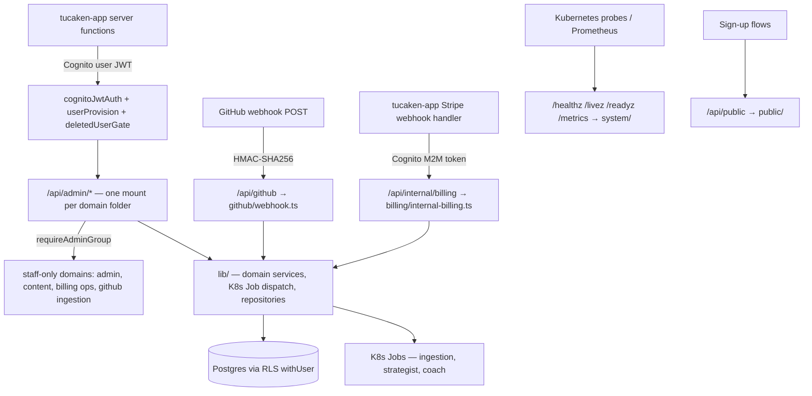

# admin-api routes

HTTP surface of the Tucaken admin-api BFF (Hono, port 3002). Every domain owns
one folder; every folder exposes `create<X>Router(config)` factories that
[`src/index.ts`](../index.ts) mounts under a base path and auth tier.

## Architecture

## Auth tiers

| Tier | Middleware | Applies to |
|---|---|---|
| Unauthenticated | none (probes) / HMAC (webhook) | `system/`, `public/`, `github/webhook.ts` |
| Machine-to-machine | `cognitoM2MAuth` (scope `tucaken-internal/write:billing`) | `billing/internal-billing.ts` |
| User JWT | `cognitoJwtAuth` → `userProvisionMiddleware` → `deletedUserGate` | everything under `/api/admin/*` |
| Staff only | `requireAdminGroup()` on top of user JWT | see Domain map |

## Domain map

| Folder | Mounts (from `index.ts`) | Staff-gated | Purpose |
|---|---|---|---|
| [`system/`](system/README.md) | `/healthz`, `/livez`, `/readyz`, `/metrics` | n/a (unauthenticated) | K8s probes + Prometheus metrics |
| [`public/`](public/README.md) | `/api/public` | n/a (unauthenticated) | Pre-auth reads for sign-up flows |
| [`account/`](account/README.md) | `/api/admin/me`, `/api/admin/profile` | no | Caller's own account + profile summary |
| [`admin/`](admin/README.md) | `/api/admin/users`, `/settings`, `/role-ontology`, `/prompt-feedback` | yes (except prompt-feedback POST) | Operator support tooling |
| [`billing/`](billing/README.md) | `/api/internal/billing`, `/api/admin/tier-config`, `/finops`, `/bedrock-usage` | tier-config, finops, bedrock-usage | Money: Stripe sync, plans, cost reporting |
| [`github/`](github/README.md) | `/api/admin/github`, `/api/github` (webhook), `/api/admin/ingestion` | ingestion only | GitHub App, Connected Repositories, ingestion dispatch |
| [`knowledge-base/`](knowledge-base/README.md) | `/api/admin/kb`, `/api/admin/activity` | no | Knowledge Base health + derived activity |
| [`applications/`](applications/README.md) | `/api/admin/applications` | no | Job-application tracking, stages, coaching, funnel |
| [`projects/`](projects/README.md) | `/api/admin/projects` | no | Projects CRUD, case studies, clustering |
| [`resumes/`](resumes/README.md) | `/api/admin/resumes`, `/api/admin/resume-imports` | no | Resume CRUD + import pipeline |
| [`content/`](content/README.md) | `/api/admin/articles`, `/comments`, `/drafts`, `/assets` | articles, comments, assets | Portfolio content authoring |
| [`pipelines/`](pipelines/README.md) | `/api/admin/pipelines` | no | Pipeline run dispatch + status polling |

## Conventions

- **One folder per domain.** The folder name matches the vocabulary used in
  `lib/repositories/` and the frontend feature slices.
- **Facade pattern for large domains.** `github/`, `applications/` and
  `projects/` split sub-resources into separate router files; the file named
  after the domain (`github.ts`, `applications.ts`, `projects.ts`) composes
  them and re-exports the public symbols, so `index.ts` and tests import from
  one stable path.
- **Mount order matters.** Literal routes (`/scheduled-interviews`,
  `/clustering/*`) are mounted before `/:slug` / `/:id` parameter routers so
  they are never captured as path parameters.
- **Route-private helpers** live beside the routers as `<domain>-shared.ts`.
  Anything shared with `middleware/`, `scripts/` or other domains belongs in
  [`src/lib/`](../lib/README.md) instead — routes never import other routes.
- **RLS everywhere.** Handlers wrap DB work in `withUser(pool, userId, fn)` so
  queries run as the low-privilege `tucaken_app` role with
  `app.current_user_id` set. See [`lib/pg.ts`](../lib/pg.ts).
- **Validation at the boundary.** Every handler validates params/body before
  touching the DB; never trust the client payload.
- **Tests** are colocated per domain in `<domain>/__tests__/`. Run with
  `yarn workspace @repo/admin-api test`.

## Adding a new route

1. Pick the domain folder (or create one if it is genuinely a new domain).
2. Add the handler to the matching sub-router (or the domain's single router).
3. New sub-resource with 3+ endpoints → new file + compose it in the facade.
4. Mount new domains in `src/index.ts` under the correct auth tier.
5. Add tests in `<domain>/__tests__/`, then `yarn typecheck && yarn lint && yarn test`.

## Related

- [`src/lib/README.md`](../lib/README.md) — the service/data layer these routes call
- [`src/middleware/README.md`](../middleware/README.md) — auth and observability middleware
- [`CLAUDE.md`](../../../CLAUDE.md) — repo-wide engineering rules
- [`docs/`](../../docs) — KB docs (decisions, runbooks, patterns)
