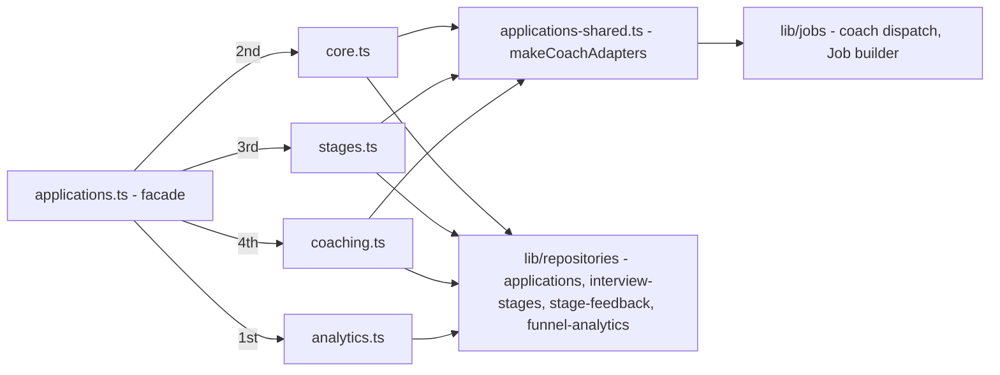

# applications

Job-application tracking: the kanban lifecycle, per-stage interview state,
coach dispatch and funnel analytics. Mounted at `/api/admin/applications`
(user JWT).

## Architecture

**Mount order is load-bearing:** `analytics.ts` registers the literal paths
(`/analytics/funnel`, `/scheduled-interviews`) before `core.ts` registers
`/:slug`, so they are never captured as slugs.

## Files

| File | Router | Purpose |
|---|---|---|
| `applications.ts` | facade | Composes the four sub-routers |
| `core.ts` | `createApplicationsCoreRouter` | List, detail, resume PDF, delete, annotations, cover letter, resume, status |
| `stages.ts` | `createApplicationsStagesRouter` | Per-stage user state, outcome, feedback |
| `coaching.ts` | `createApplicationsCoachingRouter` | Coach Job dispatch + coaching content reads |
| `analytics.ts` | `createApplicationsAnalyticsRouter` | Funnel + scheduled interviews |
| `applications-shared.ts` | — | `makeCoachAdapters` — K8s Job construction shared by coach/status/stages |

## Endpoints

| Method | Path | File | Purpose |
|---|---|---|---|
| GET | `/` | core | List applications (optional `?status=`) |
| GET | `/:slug` | core | Full detail: analysis, stages, coaching, tailored resume |
| GET | `/:slug/resume.pdf` | core | Presigned URL for the canonical ATS text PDF (300 s expiry) |
| DELETE | `/:slug` | core | Delete application |
| PATCH | `/:slug/annotations` | core | Replace user annotations |
| PUT | `/:slug/cover-letter` | core | Persist cover-letter override |
| PUT | `/:slug/resume` | core | Persist edited tailored resume |
| POST | `/:slug/status` | core | Kanban transition (dispatches coach on prep stages) |
| PATCH | `/:slug/stages/:stage` | stages | Per-stage user state / schedule / N-A |
| PATCH | `/:slug/stages/:stage/outcome` | stages | Analytics outcome for the stage |
| PUT | `/:slug/stages/:stage/feedback` | stages | Structured feedback capture |
| POST | `/:slug/coach` | coaching | Schedule the coach K8s Job |
| GET | `/:slug/coaching/:stage` | coaching | Read generated coaching content |
| GET | `/analytics/funnel` | analytics | Funnel rates classified against 2026 market ranges |
| GET | `/scheduled-interviews` | analytics | All scheduled stages, for the calendar |

## Design notes

- **Coach dispatch is deduplicated** per (application, stage) via
  `lib/jobs/coach-dispatch.ts` — status transitions and explicit `/coach`
  calls share `makeCoachAdapters` so Job construction exists once.
- Funnel classification bands come from `lib/market-funnel-ranges.ts`
  (above / typical / below the 2026 market).
- Ghosted-stage detection window is `GHOST_DAYS` (default 21, env-overridable).

## Testing

`__tests__/applications.test.ts` (core), `applications-stages.test.ts`,
`applications-coach.test.ts` — the test split mirrors the file split.

## Related

- [routes overview](../README.md) · [lib/jobs](../../lib/jobs/README.md) · [lib/repositories](../../lib/repositories/README.md)
