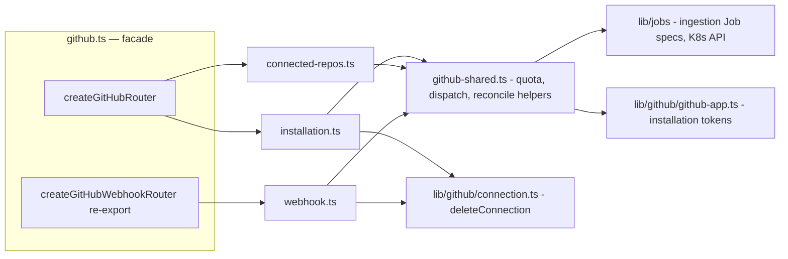

# github

GitHub App integration — installation lifecycle, Connected Repositories, the
HMAC-verified webhook, and ingestion Job dispatch. The largest domain in the
API and the only one exposing **two routers with different auth models**.

## Architecture

## Files

| File | Router | Auth | Purpose |
|---|---|---|---|
| `github.ts` | facade | — | Composes the admin surface; re-exports the domain's public symbols |
| `installation.ts` | `createInstallationRouter` | user JWT | Install lifecycle + repo listing |
| `connected-repos.ts` | `createConnectedReposRouter` | user JWT | Connected Repository sub-resource |
| `webhook.ts` | `createGitHubWebhookRouter` | **HMAC-SHA256, unauthenticated** | `POST /api/github/webhook` |
| `github-shared.ts` | — | — | Route-private helpers: quota, Job dispatch, stuck-repo reconciliation |
| `ingestion.ts` | `createIngestionRouter` | user JWT + staff | Operator ingestion controls at `/api/admin/ingestion` |

## Endpoints (admin surface, `/api/admin/github`)

| Method | Path | Purpose |
|---|---|---|
| GET/POST/DELETE | `/installation` | Check / store / disconnect the GitHub App installation |
| GET | `/repos` | List repos reachable via the installation token |
| GET | `/connected-repos` | List Knowledge Base repos + sync status (reconciles stuck repos) |
| POST | `/connected-repos` | Connect repo → default project → dispatch ingestion Job |
| POST | `/connected-repos/sync` | Re-sync all connected repos |
| POST | `/connected-repos/mark-timed-out` | Operator repair for stuck syncs |
| POST | `/connected-repos/:fullName/retry` | Retry a failed repo |
| PATCH | `/connected-repos/:fullName/featured` | Toggle featured flag |
| GET | `/connected-repos/:fullName/sbom` | CycloneDX 1.6 SBOM download |
| GET | `/connected-repos/:fullName/croissant` | MLCommons Croissant data-card download |
| DELETE | `/connected-repos/:fullName` | Remove repo + embeddings |
| POST | `/api/admin/ingestion/trigger` (staff) | Manual ingestion dispatch |
| POST | `/api/admin/ingestion/rollup-refresh` (staff) | Recompute Profile Intelligence without re-ingest |
| POST | `/api/github/webhook` | installation.created/deleted, repo rename, push re-index |

## Key models

- **Token model:** only `installation_id` is persisted. 1-hour read-only
  installation tokens are minted on demand from the App private key
  ([`lib/github/github-app.ts`](../../lib/github/README.md)). No PAT is ever stored.
- **Quota model:** free plan gets a monthly ingestion-job quota
  (`usage_quotas`); all three dispatch paths (installation auto-sync, connect
  repo, push webhook) go through the same `checkAndIncrementQuota` in
  `github-shared.ts`. 429 responses carry Retry-After from `lib/retry-after.ts`.
- **Push debounce:** webhook re-index skips if a sync ran within the last 30
  minutes (`PUSH_COOLDOWN_MS`) or a job is already in flight
  (`lib/github/sync-state.ts`).
- **Webhook contract:** always return 200 once the signature verifies — GitHub
  retries on non-2xx and unhandled event types must not cause retry storms.
- **Repo renames** heal denormalised `repo_full_name` copies everywhere via
  `lib/github/reconcile-repo-name.ts`, keyed on the immutable `github_repo_id`.

## Testing

`__tests__/github.test.ts` (E2E through both routers),
`connect-repo-creates-project.test.ts`, `ingestion.test.ts`,
`tech-extractor.test.ts` (tech-extract Job spec).

## Related

- [routes overview](../README.md) · [lib/github](../../lib/github/README.md) · [lib/jobs](../../lib/jobs/README.md)
- KB runbook: `github-repo-rename-cutover.md`
