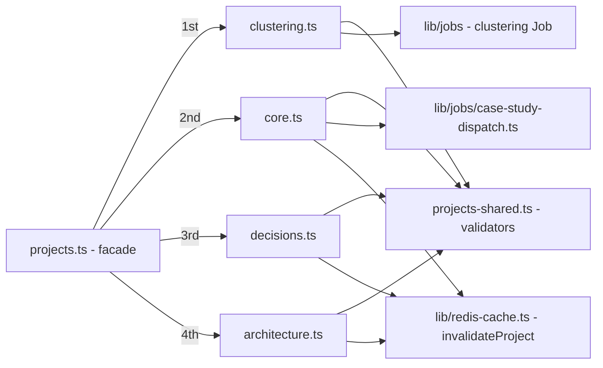

# projects

Projects domain: CRUD and lifecycle (confirm / merge / split), case-study
generation, architecture diagrams, decision records and AI clustering
proposals. Mounted at `/api/admin/projects` (user JWT).

## Architecture

**Mount order is load-bearing:** `clustering.ts` registers `/clustering/*`
literal paths before `core.ts` registers `/:id`.

## Files

| File | Router | Purpose |
|---|---|---|
| `projects.ts` | facade | Composes the four sub-routers |
| `core.ts` | `createProjectsCoreRouter` | List, create, detail, patch, delete, confirm, merge, split, regenerate |
| `architecture.ts` | `createProjectsArchitectureRouter` | Mermaid architecture read/edit |
| `decisions.ts` | `createProjectsDecisionsRouter` | Decision-record reads/edits |
| `clustering.ts` | `createProjectsClusteringRouter` | Proposals list + clustering Job dispatch |
| `projects-shared.ts` | — | Validators (`isUuid`, option sets, `SLUG_REGEX`) |

## Endpoints

| Method | Path | File | Purpose |
|---|---|---|---|
| GET | `/` | core | List (paginated; `?includeArchived`, `?proposalsOnly`) |
| POST | `/` | core | Create manually (plan-limited) |
| GET | `/:id` | core | Full detail incl. case study |
| PATCH | `/:id` | core | Update name / pitch / status / visibility / overrides |
| DELETE | `/:id` | core | Soft delete (`status='archived'`) |
| POST | `/:id/confirm` | core | Confirm an AI proposal → best-effort case-study Job |
| POST | `/:id/regenerate` | core | Strict case-study re-dispatch |
| POST | `/merge` | core | Merge source projects into a target |
| POST | `/:id/split` | core | Split components into a new project |
| GET/PATCH | `/:id/architecture` | architecture | Mermaid source read / user edit (`is_user_edited=true`) |
| GET | `/:id/decisions` | decisions | List decision records |
| PATCH | `/:id/decisions/:did` | decisions | Edit / confirm a decision |
| DELETE | `/:id/decisions/:did` | decisions | Remove a decision |
| GET | `/clustering/proposals` | clustering | Unconfirmed AI proposals |
| POST | `/clustering/run` | clustering | Fire-and-forget clustering K8s Job |

## Design notes

- **Every mutation invalidates the read cache** (`invalidateProject`,
  fail-open DEL against Redis) so the public portfolio surface converges.
- Case-study dispatch lives in
  [`lib/jobs/case-study-dispatch.ts`](../../lib/jobs/README.md) — shared with
  the interval reconciler that retries projects stuck in
  `case_study_status='pending'`. Confirm is best-effort; regenerate is strict.
- All DB work runs RLS-scoped through `withUser`; decision updates are scoped
  by **both** project id and decision id.

## Testing

`__tests__/projects.test.ts`, `__tests__/projects-invalidation.test.ts`
(asserts every mutation calls `invalidateProject`).

## Related

- [routes overview](../README.md) · [lib/jobs](../../lib/jobs/README.md) · [lib/repositories](../../lib/repositories/README.md)
