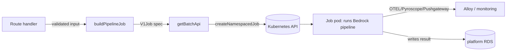

## Overview

The admin-api does not run long, expensive AI pipelines inside its own request
handlers. Instead, a route validates the request, builds a Kubernetes `batch/v1`
Job spec, and submits it to the cluster — the work then runs in a dedicated pod
with its own resource budget and lifecycle. This keeps the API responsive (a
dispatch is a single `createNamespacedJob` call) and isolates each
Bedrock-driven pipeline (ingestion, article, strategist/coach, resume-import,
project case-study, tech-extract) in a pod that can be scheduled, retried, and
cleaned up independently. The shared builder
([admin-api/src/lib/k8s-job-builder.ts](../../admin-api/src/lib/k8s-job-builder.ts))
centralises every Job convention so the seven-plus dispatch sites cannot drift
apart on naming, retry policy, observability wiring, or scheduling guarantees.

## How it works

A route calls `buildPipelineJob` (or the ingestion-specific `buildIngestionJobSpec`)
to produce a `V1Job`, then submits it through the lazily-initialised BatchV1 API
client returned by `getBatchApi`
([admin-api/src/lib/k8s.ts](../../admin-api/src/lib/k8s.ts#L11-L18)), which loads
in-cluster config from the mounted service-account token. The coach pipeline is a
representative example: it builds the Job and dispatches it in one expression
([admin-api/src/routes/applications.ts](../../admin-api/src/routes/applications.ts#L205-L235)).

The builder assembles the pod's environment by merging three layers, with the
caller's env spread last so a route can override a default for nested operations
([k8s-job-builder.ts](../../admin-api/src/lib/k8s-job-builder.ts#L130-L140)): the
shared observability env, the optional `TRACEPARENT` entry, then the route's own
env vars.

## Deterministic Job naming under the 63-char DNS limit

Kubernetes object names are DNS labels capped at 63 characters. The builder
derives a stable 8-char suffix by SHA-1 hashing the caller-supplied
`suffixInput`, prepends a sanitised, length-clamped stem, and clamps the whole
name to `MAX_NAME_LEN`
([k8s-job-builder.ts](../../admin-api/src/lib/k8s-job-builder.ts#L122-L128)).
`sanitizeLabel` downcases, replaces every non-`[a-z0-9-]` character with `-`,
strips leading/trailing dashes, and truncates
([k8s-job-builder.ts](../../admin-api/src/lib/k8s-job-builder.ts#L21-L27)). Label
values run through the same sanitiser and fall back to `unknown` if they reduce
to empty, so user-derived strings (slugs, repo names, interview stages) can never
produce an invalid Job. Because the suffix is hash-derived rather than random,
the same logical run yields the same Job name — useful for idempotency and
debugging.

## Distributed tracing across the API-to-pod boundary

`traceParentEnv` serialises the current OpenTelemetry active span into a W3C
`traceparent` value and returns it as an env var, or `null` when no span is
active (local dev, tests)
([k8s-job-builder.ts](../../admin-api/src/lib/k8s-job-builder.ts#L34-L39)). The
builder injects this into the pod env, so the worker continues the *same*
distributed trace that began in the dispatching request — the API call and the
background pipeline appear as one trace. Every pod also inherits a uniform
observability env block — OTLP endpoint to Alloy, Pyroscope server, Pushgateway,
and `run.id` resource attribute — from `observabilityEnv`
([k8s-job-builder.ts](../../admin-api/src/lib/k8s-job-builder.ts#L91-L102)),
centralised so all dispatch routes carry identical wiring without per-route
copy-paste drift.

## Cost-aware retry policy for model Jobs

All model-invoking Jobs share a single retry constant, `MODEL_JOB_BACKOFF_LIMIT = 0`
([k8s-job-builder.ts](../../admin-api/src/lib/k8s-job-builder.ts#L41-L51)), used as
the default `backoffLimit`
([k8s-job-builder.ts](../../admin-api/src/lib/k8s-job-builder.ts#L148)). The
rationale is financial: re-running a failed pipeline re-spends the expensive
Bedrock calls, and most LLM-pipeline failures are deterministic (schema/parse
errors) so a Job-level retry just wastes money — transient Bedrock throttles are
already retried inside the SDK call. The comment is explicit that every model Job
MUST use this value rather than hardcoding a per-workload `backoffLimit`. This
decision is significant enough to warrant its own ADR (see Deeper detail).

## Scheduling guarantees for long-running pipelines

Each Job sets `ttlSecondsAfterFinished: 3600` and `activeDeadlineSeconds`
(default 1800) with `restartPolicy: 'Never'`
([k8s-job-builder.ts](../../admin-api/src/lib/k8s-job-builder.ts#L146-L161)). The
pod template carries the annotation `karpenter.sh/do-not-disrupt: 'true'` so
Karpenter consolidation cannot evict a long-running Bedrock pipeline (coach ~3
min, strategist, ingestion) mid-run — eviction before the pod persists its result
would leave the Job "Complete" with no data
([k8s-job-builder.ts](../../admin-api/src/lib/k8s-job-builder.ts#L150-L158)).
Pinning is safe because `restartPolicy: Never` plus the TTL releases the pod and
its node hold seconds after the pipeline finishes. Default pod resources are
768Mi/300m requests and 2Gi/1000m limits
([k8s-job-builder.ts](../../admin-api/src/lib/k8s-job-builder.ts#L76-L79)),
overridable per call.

## Implementation in this codebase

The builder lives in
[admin-api/src/lib/k8s-job-builder.ts](../../admin-api/src/lib/k8s-job-builder.ts)
and the cluster client in
[admin-api/src/lib/k8s.ts](../../admin-api/src/lib/k8s.ts). `buildPipelineJob`
serves the article, strategist, and coach pipelines; ingestion has a dedicated
wrapper, `buildIngestionJobSpec`
([admin-api/src/lib/ingestion-job.ts](../../admin-api/src/lib/ingestion-job.ts#L36)),
which reuses the same `traceParentEnv`, `observabilityEnv`, `ingestionModelEnv`,
and `MODEL_JOB_BACKOFF_LIMIT` exports so the GitHub-resync and admin-ingestion
paths cannot diverge. Dispatch happens via `getBatchApi().createNamespacedJob`
across the routes for applications, github, ingestion, pipelines, projects, and
resume-imports — each passing a namespace resolved from config. The ingestion Job
additionally receives all five Bedrock model-id env vars via `ingestionModelEnv`,
because the ingestion pod silently disables profile synthesis if any are absent
([k8s-job-builder.ts](../../admin-api/src/lib/k8s-job-builder.ts#L104-L120)).

## Tradeoffs

Dispatching to Jobs trades request-response simplicity for operational
isolation: callers get no synchronous result and must track progress out-of-band
(pipeline-run rows, polling), but each pipeline gets independent resources,
crash isolation, and a clean cost boundary. Centralising conventions in one
builder removes drift risk but couples every dispatch route to one module's
defaults — intentional, since the comments repeatedly stress "single source of
truth" for retry policy and observability wiring. A standalone `sanitizeLabel`
is re-declared inline in a few routes
([github.ts](../../admin-api/src/routes/github.ts#L399-L401),
[ingestion.ts](../../admin-api/src/routes/ingestion.ts#L29-L30)) rather than
imported everywhere, a minor duplication the builder's exported version could
absorb.

## Deeper detail

- [No Job-level retry for model-invoking Kubernetes Jobs](../decisions/0005-no-retry-on-model-jobs.md)
  — ADR for `backoffLimit = 0`: context (Bedrock cost), the deterministic-failure
  rationale, and the rejected per-workload alternative.
- [Distributed tracing from API request to worker pod](distributed-tracing-api-to-worker.md)
  — how `TRACEPARENT` injection stitches the API span to the worker span
  end-to-end through Alloy/OTel.
- [Single shared Job spec for multi-path dispatch](../patterns/shared-ingestion-job-spec.md)
  — `buildIngestionJobSpec` as the single dispatch spec shared by the
  github-resync and admin-ingestion paths.
- [admin-api — Backend-for-Frontend for tucaken-app](../projects/admin-api.md)
  — project-level overview that this concept links up into.

## Related concepts

- [docs/architecture/repo-structure.md](../architecture/repo-structure.md) —
  where admin-api sits in the workspace.

<!--
Evidence trail (auto-generated):
- Source: admin-api/src/lib/k8s-job-builder.ts (read on 2026-06-16, full file 1-175)
- Source: admin-api/src/lib/k8s.ts (read on 2026-06-16, lines 1-20)
- Source: admin-api/src/lib/ingestion-job.ts (grep on 2026-06-16, lines 6,36,49-50)
- Source: admin-api/src/routes/applications.ts (read on 2026-06-16, lines 200-240)
- Source: admin-api/src/routes/github.ts (grep on 2026-06-16, lines 399-447,424,540)
- Source: admin-api/src/routes/ingestion.ts (grep on 2026-06-16, lines 22-67,129,171)
- Grep: createNamespacedJob/getBatchApi call sites across admin-api/src/routes (2026-06-16)
-->
