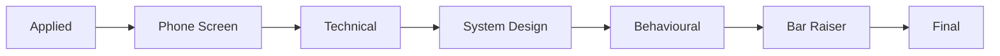

## Overview

The Application Detail view (`/applications/$slug`) presents interview prep as
one **workspace per hiring stage**. Tucaken models a job application as a single
linear pipeline of seven stages — Applied, Phone Screen, Technical, System
Design, Behavioural, Bar Raiser, Final — and renders a dedicated, stage-specific
workspace for whichever stage the user is viewing. The canonical order is the
`STAGE_ORDER` tuple ([stage.ts:11-19](../../src/features/applications/stages/types/stage.ts)).

A key distinction runs through the whole feature: the **Current Stage**
(`detail.interviewStage`, the application's real position) is separate from the
**Active Stage** (the stage the user is viewing, driven by the `?stage` search
param). Navigating between Active Stages never changes the Current Stage — only
"Advance" does ([stage.ts:3-9](../../src/features/applications/stages/types/stage.ts),
[ApplicationDetailContainer.tsx:126-133,154-182](../../src/features/applications/components/ApplicationDetailContainer.tsx)).

Each workspace renders a fragment of summary groups into a shared master-detail
shell, drawing on the Research Agent's evidence and the Coach Agent's
`InterviewPrepOutput` where backed, and on browser-persisted draft state for
interactive fields. Per
[ADR-0002](../decisions/0002-absorb-coach-prep-into-stage-workspaces.md), the
older standalone Coach prep route was retired and folded into these workspaces.

## The stage model

`STAGE_ORDER` is a `readonly InterviewStage[]` and is the single source of
ordering for navigation, progress, and "advance to next"
([stage.ts:11-19](../../src/features/applications/stages/types/stage.ts)). A
`Map` of stage to index backs `stageIndex` and the `isInterviewStage` type guard
([stage.ts:21-31](../../src/features/applications/stages/types/stage.ts)).
`stageProgress(stage, current)` derives a segment state by comparing indices:
earlier than current is `completed`, equal is `current`, later is `upcoming`
([stage.ts:33-50](../../src/features/applications/stages/types/stage.ts)).

Each `InterviewStage` maps to exactly one workspace component via a flat
guard-clause dispatcher, `stageWorkspaceNode`, falling back to a placeholder
([ApplicationDetailContainer.tsx:44-54](../../src/features/applications/components/ApplicationDetailContainer.tsx)).
The workspace components that exist today are:

- `AppliedWorkspace`, `PhoneScreenWorkspace`, `TechnicalWorkspace`,
  `SystemDesignWorkspace`, `BehaviouralWorkspace`, `BarRaiserWorkspace`,
  `FinalWorkspace`
  ([index.ts:20-25](../../src/features/applications/stages/index.ts)).

Two stages also ship a "walkthrough" companion file
(`SystemDesignWalkthrough.tsx`, `BarRaiserWalkthrough.tsx`) alongside their
workspace.

## How a workspace is composed

Every workspace is a `'use client'` component that takes a single
`{ detail: ApplicationDetail }` prop and returns a React fragment of summary
groups — it does not render its own page chrome. The chrome comes from
`WorkspaceShell`, a master-detail layout: a scannable left summary column and a
sticky, tabbed right rail (Detail, Notes, Timeline)
([WorkspaceShell.tsx:22-47](../../src/features/applications/stages/components/workspace-shell/WorkspaceShell.tsx)).
The container places the active workspace node inside the shell, keyed by stage
so the "first group open" collapse registry resets on each stage change
([WorkspaceShell.tsx:34-40](../../src/features/applications/stages/components/workspace-shell/WorkspaceShell.tsx),
[ApplicationDetailContainer.tsx:257-294](../../src/features/applications/components/ApplicationDetailContainer.tsx)).

Workspaces differ entirely in content, grounded in their stage:

- **Phone Screen** surfaces talking points from `research.verifiedMatches`, a
  persisted comp-conversation target, and a deduped merge of the Coach's
  questions-to-ask with generic defaults
  ([PhoneScreenWorkspace.tsx:259-293](../../src/features/applications/stages/workspaces/PhoneScreenWorkspace.tsx)).
- **Technical** is the richest: evidence topics from `researchToTopics`, a DSA /
  Coding flip-card deck calibrated per role and coloured by real-work code
  evidence, a project reference sheet, a prep checklist, difficult questions, and
  DevOps evidence receipts — each section gated on whether the role and data
  warrant it
  ([TechnicalWorkspace.tsx:502-546,652-695](../../src/features/applications/stages/workspaces/TechnicalWorkspace.tsx)).
- **Final / Offer** renders the Coach's grounded pre-final-round prep plus
  editable, persisted decision-factor weight/score sliders that compute a fit
  percentage; compensation figures are intentionally not collected
  ([FinalWorkspace.tsx:172-195](../../src/features/applications/stages/workspaces/FinalWorkspace.tsx)).

The data contract is the `StageWorkspaceData` TypeScript superset
([workspace.ts:86-96](../../src/features/applications/stages/types/workspace.ts)).
In v1, only `questionsToAsk` and the coaching notes are sourced from the real
Coach `InterviewPrepOutput` via `interviewPrepToWorkspace`; evidence/project
fields are filled from the Research Agent where available and otherwise marked
`// BACKEND: follow-on`
([workspace.ts:77-96,182-197](../../src/features/applications/stages/types/workspace.ts)).
`resolveStagePrep(detail, stage)` reads per-stage coaching from
`detail.coaching[stage].topics`, falling back to a legacy top-level shape, and
returns `null` when no coaching has been generated yet
([workspace.ts:207-212](../../src/features/applications/stages/types/workspace.ts)).

## Stage state and navigation

Navigation is the `StageProgressBar`: a horizontal seven-node pipeline rendered
as an ARIA `tablist`, one `role="tab"` button per stage
([StageProgressBar.tsx:86-135](../../src/features/applications/stages/components/StageProgressBar.tsx)).
Each node's display is resolved from the backend's per-stage `StageState`
(`stage_status` of `completed` / `current` / `not_applicable`, plus a `queued`
prep indicator), falling back to index-derived `stageProgress` when no backend
row exists ([StageProgressBar.tsx:24-47](../../src/features/applications/stages/components/StageProgressBar.tsx)).
Selecting a node calls `handleStageSelect`, which navigates with a new `?stage`
search param; the container resolves the Active Stage as `activeStage ??
detail.interviewStage`
([ApplicationDetailContainer.tsx:154-159,236-237](../../src/features/applications/components/ApplicationDetailContainer.tsx)).
"Advance" is the only action that mutates the Current Stage: it computes the next
stage from `STAGE_ORDER`, fires the status mutation with the new
`interviewStage`, and navigates there
([ApplicationDetailContainer.tsx:174-182](../../src/features/applications/components/ApplicationDetailContainer.tsx)).

Per-stage interactive state lives in `useStageDraft`. It treats `localStorage`
(keyed `appstage:<slug>:<stage>`) as the authoritative in-session cache and
debounce-syncs to RDS via `PATCH /stages/:stage` 800ms after the last edit
([useStageDraft.ts:7-42,129-165](../../src/features/applications/stages/hooks/useStageDraft.ts)).
The `StageDraft` shape covers notes, ticked checklist ids, selected story ids, a
schedule time, a format note, and a comp target
([useStageDraft.ts:13-26](../../src/features/applications/stages/hooks/useStageDraft.ts)).
On first load it hydrates from the server's `user_state`, then localStorage wins
in-session; re-hydration runs when slug/stage changes
([useStageDraft.ts:44-66,99-121](../../src/features/applications/stages/hooks/useStageDraft.ts)).
A single instance is shared between the dashboard schedule panel and the
workspace through `StageDraftProvider` / `useStageDraftContext`, so two instances
never clobber each other
([stage-draft-context.tsx:18-32](../../src/features/applications/stages/hooks/stage-draft-context.tsx)).
The container wraps stages in `STAGE_USES_DRAFT_PROVIDER` (phone-screen,
technical, system-design, behavioural, bar-raiser) in this provider
([ApplicationDetailContainer.tsx:42,329-339](../../src/features/applications/components/ApplicationDetailContainer.tsx)).
This localStorage-first design is the explicit v1 boundary recorded in
[ADR-0003](../decisions/0003-v1-stage-state-in-localstorage-typed-superset.md).

## Tradeoffs

The seven-stage `STAGE_ORDER` is a fixed linear model: a single application has
one Current Stage and the progress bar derives "completed/upcoming" from index
position, so non-linear paths (skips, parallel loops) are only partially
represented — `not_applicable` exists as a backend `stage_status` but "skipped"
is noted in code as a future concept
([stage.ts:39-40](../../src/features/applications/stages/types/stage.ts),
[StageProgressBar.tsx:24-47](../../src/features/applications/stages/components/StageProgressBar.tsx)).

Draft state is browser-local first. Per
[ADR-0003](../decisions/0003-v1-stage-state-in-localstorage-typed-superset.md),
this keeps the "notes persist" promise without scaffolding throwaway endpoints,
but the cost is that drafts are per-browser until the debounced RDS sync runs and
the server PATCH is best-effort (failures are swallowed, leaving localStorage as
the cache)
([useStageDraft.ts:131-165](../../src/features/applications/stages/hooks/useStageDraft.ts)).
The `StageWorkspaceData` superset also carries fields that have no backend yet,
flagged inline so the gap is visible rather than silent
([workspace.ts:77-96](../../src/features/applications/stages/types/workspace.ts)).

## Related concepts

- [ADR-0002 — Absorb Coach prep into stage workspaces](../decisions/0002-absorb-coach-prep-into-stage-workspaces.md)
- [ADR-0003 — v1 stage state in localStorage behind a typed superset](../decisions/0003-v1-stage-state-in-localstorage-typed-superset.md)
- [API-dispatched Kubernetes jobs](api-dispatched-k8s-jobs.md) — how the Coach
  and Research agents that feed these workspaces are run.

<!--
Evidence trail (2026-06-16):
- Read src/features/applications/stages/types/stage.ts (STAGE_ORDER, stageIndex, stageProgress, isInterviewStage)
- Read src/features/applications/stages/types/workspace.ts (StageWorkspaceData, interviewPrepToWorkspace, resolveStagePrep, researchToTopics)
- Read src/features/applications/stages/hooks/useStageDraft.ts (StageDraft, localStorage key, 800ms PATCH debounce, hydration)
- Read src/features/applications/stages/hooks/stage-draft-context.tsx (StageDraftProvider / useStageDraftContext)
- Read src/features/applications/stages/components/StageProgressBar.tsx (tablist navigation, resolveSegment, StageState)
- Read src/features/applications/stages/components/workspace-shell/WorkspaceShell.tsx (master-detail shell, keyed by stage)
- Read workspaces PhoneScreenWorkspace.tsx, TechnicalWorkspace.tsx, FinalWorkspace.tsx
- Read src/features/applications/components/ApplicationDetailContainer.tsx (stageWorkspaceNode dispatch, ?stage param, handleAdvance, STAGE_USES_DRAFT_PROVIDER)
- Listed src/features/applications/stages/workspaces/ to enumerate actual workspace files
- Cross-referenced docs/decisions/0002 and 0003
- Did NOT verify: AppliedWorkspace/SystemDesign/Behavioural/BarRaiser internals (listed only, not read in full)
-->
