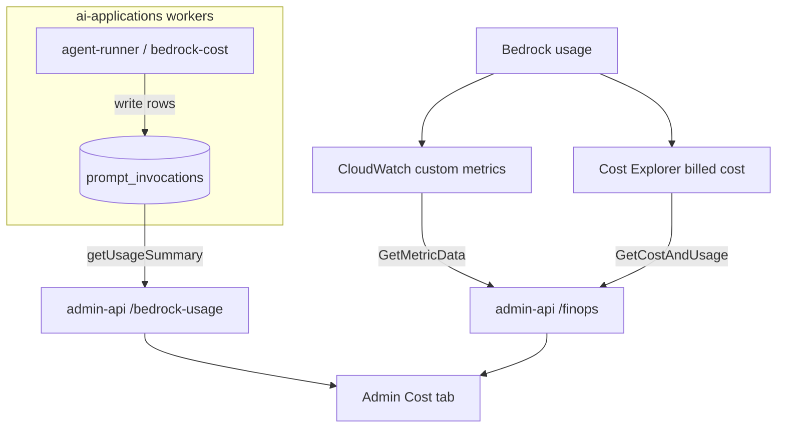

## Overview

LLM spend is the dominant variable cost in this product, so admin-api exposes two
independent views of it to the admin dashboard: an **application-level** estimate
recorded per invocation, and an **AWS-level** view from CloudWatch metrics and
penny-accurate Cost Explorer billing. The two answer different questions — "which
pipeline and which user spent what" versus "what did AWS actually bill" — and
together they let a per-invocation estimate be reconciled against the real bill.
Both surfaces are read-only and admin-gated.

## Two layers of cost visibility

The application layer attributes cost to product entities (user, pipeline, model)
from rows the worker writes at invocation time; it is an estimate computed from
token counts. The AWS layer reports what CloudWatch observed and what Cost
Explorer billed, attributed to AWS tags and inference profiles. The application
estimate is immediate and finely attributed but approximate; the AWS bill is
authoritative but coarser and lags. Keeping both lets the cheap real-time
estimate be trusted day to day and audited against the bill periodically.

## AWS-level: CloudWatch metrics and Cost Explorer

The FinOps routes
([finops.ts](../../admin-api/src/routes/finops.ts)) read AWS directly using
credentials from the EC2 Instance Profile (IMDS) — no secrets in the pod
([finops.ts](../../admin-api/src/routes/finops.ts#L17-L18)). `GET /realtime`,
`/chatbot`, and `/self-healing` pull token-usage and latency metrics from custom
CloudWatch namespaces (`BedrockMultiAgent`, `BedrockChatbot`,
`self-healing-development/SelfHealing`) via `GetMetricData`, collapsing each
time-series to a flat stats record
([finops.ts](../../admin-api/src/routes/finops.ts#L119-L197)). `GET /costs` calls
Cost Explorer's `GetCostAndUsage` for `UnblendedCost`, filtered to the `Project=bedrock`
tag and grouped by the `aws:bedrock:inference-profile` tag
([finops.ts](../../admin-api/src/routes/finops.ts#L207-L232)). Cost Explorer is a
global service, so its client is pinned to `us-east-1`
([finops.ts](../../admin-api/src/routes/finops.ts#L41-L47)); a query failure
degrades to an empty result rather than erroring the dashboard
([finops.ts](../../admin-api/src/routes/finops.ts#L227-L231)). Every route clamps
`?days=` to 1–365 (default 7)
([finops.ts](../../admin-api/src/routes/finops.ts#L57-L61)).

## Application-level: per-invocation cost and per-user budgets

The Bedrock-usage routes
([bedrock-usage.ts](../../admin-api/src/routes/bedrock-usage.ts)) read the
`prompt_invocations` table (migrations 013 + 082) for the Cost tab. `GET /summary`
returns the most recent 500 invocation rows plus aggregates, optionally filtered
by `userId` and `month`
([bedrock-usage.ts](../../admin-api/src/routes/bedrock-usage.ts#L32-L45),
[bedrock-usage repo](../../admin-api/src/lib/repositories/bedrock-usage.ts)).
Two of the aggregates are row-derived from those 500 rows (`byPipeline`,
`byModel` — a recency-biased view); the rest are **accurate SQL roll-ups**
computed with `GROUP BY` over the whole window, so they are not capped at 500:
`byUser` (joined to `users.email`), `byRepo` (repo-sync spend per repository,
split by `sync_kind`), `byApplication` (job-strategist spend per job application,
joined to `job_applications.company`/`role`), and `byProject`
(project-case-study spend, joined to `projects.name`). `totalCents` is the sum of
`byUser`, so the headline figure stays accurate beyond 500 rows. Each detail row
carries user, email, pipeline, agent, model id, input/output tokens, `repo_name`,
`sync_kind`, and `totalCostCents`. `GET`/`PUT /budget/:userId` read and upsert a
per-user monthly limit (`monthlyLimitCents`, 0–100,000) and `alertThresholdPct`
(1–100), validated as integers in range
([bedrock-usage.ts](../../admin-api/src/routes/bedrock-usage.ts#L65-L96)).

### Granular attribution columns (migration 082)

`prompt_invocations` gained three nullable columns the worker populates only
where the id is in scope at the call site: `application_id` (FK
`job_applications`, set by the job-strategist pipeline from `env.applicationId`),
`project_id` (FK `projects`, set by the project-case-study pipeline from
`env.projectId`), and `sync_kind` (set by repo-sync rows to the `syncType`
ingestion already computes: `initial` | `full_reindex` | `incremental`, surfaced
in the UI as initial-sync vs resync). Both FKs use `ON DELETE SET NULL` so
deleting a job application or project never deletes its audit-trail cost rows.
**Attribution is forward-only**: the migration does not backfill, so rows written
before it has no application/project/sync attribution and the Cost tab groups
them under an "Unattributed"/"Unclassified" bucket.

## How the estimate is produced and reconciled

The `prompt_invocations` rows are **written by the worker, not by admin-api** —
`agent-runner.ts onInvocationComplete` for Converse-API pipelines and
`bedrock-cost.ts recordBedrockCost` for direct `InvokeModel` pipelines, both in
the sibling **ai-applications** repo
([bedrock-usage repo](../../admin-api/src/lib/repositories/bedrock-usage.ts#L6-L11)).
Direct `InvokeModel` rows store `system_prompt_tokens = 0` and
`user_message_tokens = inputTokens`, and the summary query sums both so the
"tokens in" figure is consistent across both write patterns
([bedrock-usage repo](../../admin-api/src/lib/repositories/bedrock-usage.ts#L9-L11)).
The granular attribution travels the same write path: `recordInvocationToRds`
takes an optional context (`applicationId`/`projectId`/`syncKind`) that the
Converse pipelines pass at their entrypoint, and the repo-sync cost contexts
(Titan embeddings + chunk enricher) carry `syncKind` through to each row.
admin-api only **reads** these rows. The AWS-level `/costs` view is the
reconciliation anchor: the application estimate (sum of `totalCostCents`) can be
compared against Cost Explorer's billed `UnblendedCost` for the same window.

## Access control

The Bedrock-usage routes are admin-only — mounted under `requireAdminGroup`
([bedrock-usage.ts](../../admin-api/src/routes/bedrock-usage.ts#L3-L9)) — and the
FinOps routes sit behind the Cognito JWT middleware at the parent level
([finops.ts](../../admin-api/src/routes/finops.ts#L6-L7)). See
[Cognito JWT verification](cognito-jwks-verification.md) for the authorisation
layers.

## Tradeoffs

Maintaining two cost views costs a little duplication — the same spend is
represented once as a token-derived estimate and once as an AWS bill — but each
view answers a question the other cannot: fine-grained per-user/per-pipeline
attribution for product decisions, versus authoritative billed totals for
finance. The application estimate depends on the worker writing accurate
`totalCostCents`; the AWS view depends on correct cost-allocation tags
(`Project`, `aws:bedrock:inference-profile`). Cost Explorer's query lag and
coarser granularity are accepted because it is the audit anchor, not the
day-to-day signal.

## Related concepts

- [No Job-level retry for model-invoking Kubernetes Jobs](../decisions/0005-no-retry-on-model-jobs.md)
  — the cost-control decision this observability measures.
- [Four-pillar observability](four-pillars-observability.md) — the broader
  metrics/traces/logs/profiles stack these cost surfaces sit beside.
- [admin-api — Backend-for-Frontend](../projects/admin-api.md) — the service that
  hosts these routes.
- [FinOps /costs returns zero despite real Bedrock spend](../troubleshooting/finops-costs-empty-untagged-bedrock.md)
  — verified gap: the `Project=bedrock` tag filter matches no actual spend in dev.

<!--
Evidence trail (auto-generated):
- Source: admin-api/src/routes/finops.ts (read on 2026-06-16, full file 1-389)
- Source: admin-api/src/routes/bedrock-usage.ts (read on 2026-06-16, full file 1-100)
- Source: admin-api/src/lib/repositories/bedrock-usage.ts (granular SQL roll-ups
  byUser/byRepo/byApplication/byProject + email/join columns, updated 2026-06-16)
- Source: src/features/reports/components/BedrockCostTab.tsx (user filter + four
  breakdown tables, updated 2026-06-16)
- Migration: ai-applications .../migrations/082_prompt_invocations_attribution.sql
  (application_id, project_id, sync_kind + indexes)
- Note: prompt_invocations writers (agent-runner.ts, bedrock-cost.ts,
  recordInvocationToRds context) live in the sibling ai-applications repo;
  application_id/project_id/sync_kind are populated there.
-->
