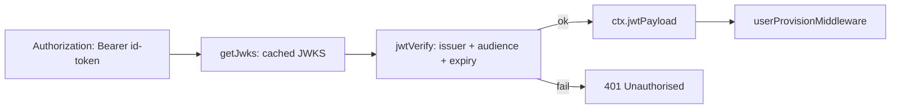

## Overview

admin-api authenticates every request by verifying a Cognito-issued JWT against
the User Pool's JWKS — there are no API keys or shared secrets in the request
path. Two distinct token shapes flow through two middlewares: end-user ID tokens
on `/api/admin/*` ([auth.ts](../../admin-api/src/middleware/auth.ts#L47-L85)) and
service-account access tokens on `/api/internal/*`
([m2m-auth.ts](../../admin-api/src/middleware/m2m-auth.ts#L59-L118)). Both fetch
the same JWKS from Cognito and verify signature, issuer, and expiry with the
`jose` library; they differ in what claims they require, which encodes the
trust boundary between "a logged-in human" and "another Tucaken pod".

## Two token types from one User Pool

Both middlewares verify tokens minted by the same Cognito User Pool, so they
share an identical `getJwks` helper that builds the well-known JWKS URL and
caches the remote key set per pool id to avoid redundant fetches
([auth.ts](../../admin-api/src/middleware/auth.ts#L23-L34),
[m2m-auth.ts](../../admin-api/src/middleware/m2m-auth.ts#L26-L36)). The tokens
diverge in their claims: a user **ID token** carries `email`/`sub` (the user) and
`token_use: 'id'`; an **access token** from the `client_credentials` grant has
`token_use: 'access'`, no user claims (its `sub` is the app client id), and a
space-separated `scope` claim
([m2m-auth.ts](../../admin-api/src/middleware/m2m-auth.ts#L9-L18)).

## Verifying user ID tokens

`cognitoJwtAuth` extracts the `Bearer` token, fetches the cached JWKS, and calls
`jwtVerify` asserting both `issuer` and `audience` (the app client id)
([auth.ts](../../admin-api/src/middleware/auth.ts#L63-L85)). Any valid, unexpired
token from the correct pool is accepted — both SaaS end users and staff — because
the human-vs-staff distinction lives in `users.role` in RDS, not in the token
([auth.ts](../../admin-api/src/middleware/auth.ts#L5-L7)). On success the decoded
payload is attached as `ctx.set('jwtPayload', ...)` for downstream handlers and
provisioning; verification failure returns 401 with the jose error detail.

## Verifying M2M service tokens

`cognitoM2MAuth` guards `/api/internal/*`, called by other Tucaken pods — today
the tucaken-app SSR webhook handler, which has no user session to forward
([m2m-auth.ts](../../admin-api/src/middleware/m2m-auth.ts#L5-L7)). It verifies the
token against the same JWKS and issuer, then enforces two extra constraints a
user token would fail: `token_use` must equal `'access'` (a forwarded ID token is
rejected with 401), and the token's `scope` claim must contain the configured
`requiredScope` such as `tucaken-internal/write:billing` (else 403)
([m2m-auth.ts](../../admin-api/src/middleware/m2m-auth.ts#L90-L112)). No user
provisioning runs — a service token has no user attached.

## Why M2M skips audience validation

The M2M middleware intentionally does **not** validate `audience`. For the
`client_credentials` grant, Cognito populates `client_id` rather than `aud`, and
that value is the M2M app client which varies per environment
([m2m-auth.ts](../../admin-api/src/middleware/m2m-auth.ts#L75-L79)). Asserting
`audience` would therefore reject valid service tokens. Authorisation is instead
enforced by the required-scope check, which is the claim Cognito guarantees for
client-credentials tokens. This is a deliberate trade documented in the source
comment, not an oversight.

## Authorization layers after authentication

Authentication only proves identity; the wiring in
[index.ts](../../admin-api/src/index.ts#L148-L177) layers authorisation on top.
After `cognitoJwtAuth`, `userProvisionMiddleware` upserts the Cognito sub into
`users`/`user_identities` and caches the resolved id for the pod lifetime —
detecting federated providers from the `identities` claim and defaulting native
users to `email`
([user-provision.ts](../../admin-api/src/middleware/user-provision.ts#L1-L21)).
A `deletedUserGate` then returns 410 for deleted users, and `requireAdminGroup`
restricts sensitive surfaces (bedrock-usage, finops, ingestion, users,
role-ontology) to the Cognito `admin` group
([index.ts](../../admin-api/src/index.ts#L170-L177),
[auth.ts](../../admin-api/src/middleware/auth.ts#L92-L105)).

## Implementation in this codebase

Verification lives in
[admin-api/src/middleware/auth.ts](../../admin-api/src/middleware/auth.ts) and
[admin-api/src/middleware/m2m-auth.ts](../../admin-api/src/middleware/m2m-auth.ts),
both using `createRemoteJWKSet` + `jwtVerify` from `jose`. The minting side of
M2M lives in the frontend at
[src/server/cognito-m2m.ts](../../src/server/cognito-m2m.ts), which authenticates
as the `tucaken-app-service` Cognito app client, requests the
`tucaken-internal/write:billing` scope, caches the 1-hour token in-process, and
refreshes ~60s before expiry with a single in-flight promise to avoid a
cold-start thundering herd
([cognito-m2m.ts](../../src/server/cognito-m2m.ts#L1-L40)). Setup env is created
by `scripts/setup-cognito-m2m.ts`.

## Tradeoffs

Verifying against JWKS rather than a shared secret means admin-api holds no
long-lived credential and key rotation is handled by Cognito; the cost is a
remote JWKS fetch, mitigated by jose's in-memory cache keyed per pool. Accepting
any valid pool token and deferring role checks to RDS keeps the token small and
the auth middleware simple, at the price of an extra DB-backed authorisation
layer. Skipping `audience` on M2M tokens is the one place strictness is
deliberately relaxed, compensated by the mandatory `token_use` and `scope`
assertions.

## Deeper detail

- [docs/billing-integration.md](../billing-integration.md) — full M2M
  service-to-service architecture, setup, and token-rotation guidance.

## Related concepts

- [admin-api — Backend-for-Frontend for tucaken-app](../projects/admin-api.md) —
  the service these middlewares protect.

<!--
Evidence trail (auto-generated):
- Source: admin-api/src/middleware/auth.ts (read on 2026-06-16, full file 1-105)
- Source: admin-api/src/middleware/m2m-auth.ts (read on 2026-06-16, full file 1-118)
- Source: admin-api/src/middleware/user-provision.ts (read on 2026-06-16, lines 1-30)
- Source: admin-api/src/index.ts (grep on 2026-06-16, lines 89-197)
- Source: src/server/cognito-m2m.ts (read on 2026-06-16, lines 1-40)
-->
