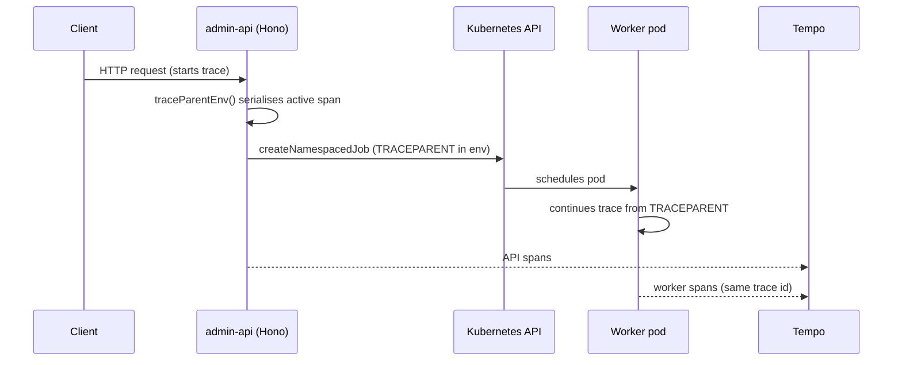

## Overview

When admin-api dispatches a background pipeline to a Kubernetes Job, the work
leaves the request's process entirely — yet the API call and the worker pod
appear as one continuous distributed trace. This is achieved by serialising the
in-flight OpenTelemetry span context into a W3C `traceparent` env var on the Job
spec, which the worker reads to continue the same trace. The result is a single
trace in Tempo spanning the HTTP request, the `createNamespacedJob` call, and the
entire Bedrock pipeline running minutes later in a different pod.

## How context propagates across the boundary

`traceParentEnv` injects the current OTel active context into a carrier and reads
back the `traceparent` key, returning it as an env var entry or `null` when no
span is active
([k8s-job-builder.ts](../../admin-api/src/lib/k8s-job-builder.ts#L34-L39)). Both
job builders add this entry to the pod's env when present — `buildPipelineJob`
merges it between the observability env and the caller env
([k8s-job-builder.ts](../../admin-api/src/lib/k8s-job-builder.ts#L135-L140)), and
`buildIngestionJobSpec` appends it to the worker container env
([ingestion-job.ts](../../admin-api/src/lib/ingestion-job.ts#L50-L103)). The
worker process reads `TRACEPARENT` at startup and uses it as the parent context
for its own spans, so its trace id matches the dispatching request's.

## What every traced process emits

The admin-api OTel SDK is bootstrapped before any instrumented module via
`node --import telemetry.js`, exporting OTLP/HTTP to an Alloy DaemonSet which
forwards to Tempo
([telemetry.ts](../../admin-api/src/lib/observability/telemetry.ts#L1-L48)). Auto
instrumentation covers http, pg (sanitised SQL, never bind values), and aws-sdk;
dns and fs spans are disabled as noise, and `/healthz`, `/livez`, `/readyz`,
`/metrics` are dropped from incoming traces
([telemetry.ts](../../admin-api/src/lib/observability/telemetry.ts#L50-L64)). Job
pods inherit the OTLP endpoint and a `run.id` resource attribute from the shared
`observabilityEnv` block
([k8s-job-builder.ts](../../admin-api/src/lib/k8s-job-builder.ts#L91-L102)), so a
worker's spans are searchable by the unique run identifier.

## Correlating logs and RUM to traces

The Hono observability middleware binds the active span's `trace_id` onto a pino
child logger, so every structured log line for a request carries its trace id
([observability.ts](../../admin-api/src/middleware/observability.ts#L33-L43)). It
also emits a `Server-Timing` header so Grafana Faro RUM can correlate a browser
interaction back to the server trace in Tempo
([observability.ts](../../admin-api/src/middleware/observability.ts#L1-L11),
[#L62](../../admin-api/src/middleware/observability.ts#L62)). Together with the
`TRACEPARENT` injection, this gives one correlation key — the trace id — from
browser RUM through the API request down into the worker pod.

## Tradeoffs

Propagation is one-directional and best-effort: `traceParentEnv` returns `null`
in local dev and tests where no span is active, so workers there simply start a
fresh trace rather than failing. Passing context as a plain env var keeps the
mechanism dependency-free and works regardless of when the pod is scheduled, but
it captures the trace context only at dispatch time — it cannot reflect sampling
decisions made later. The payoff is end-to-end visibility across an async
process boundary that would otherwise show up as two disconnected traces.

## Related concepts

- [API-dispatched Kubernetes Jobs](api-dispatched-k8s-jobs.md) — the dispatch
  mechanism this tracing rides on top of.

<!--
Evidence trail (auto-generated):
- Source: admin-api/src/lib/k8s-job-builder.ts (read on 2026-06-16, lines 34-39,91-102,135-140)
- Source: admin-api/src/lib/ingestion-job.ts (read on 2026-06-16, lines 50-103)
- Source: admin-api/src/lib/observability/telemetry.ts (read on 2026-06-16, lines 1-80)
- Source: admin-api/src/middleware/observability.ts (read on 2026-06-16, lines 1-63)
-->
