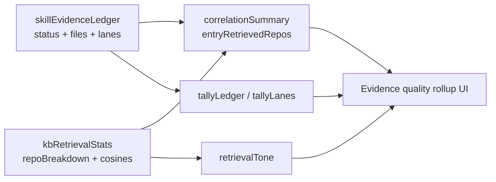

## Overview

When Tucaken finishes researching a job application it produces two independent
"evidence" signals for the role's required tools:

1. A **Skill Evidence Ledger** — a deterministic, per-JD-tool verdict
   (`verified` / `transferable` / `gap`) with file citations, persisted on
   `pipeline_runs.metadata.research.skillEvidenceLedger`
   ([applications.types.ts:379-395](../../src/lib/types/applications.types.ts)).
2. A **retrieval snapshot** (`kbRetrievalStats`) — RAG quality numbers for the
   same run: passage count, cosine scores and a per-repo breakdown
   ([applications.types.ts:341-354](../../src/lib/types/applications.types.ts)).

These were previously surfaced in separate panels. PR #126 (commit `e47884f`)
added an **Evidence quality** rollup that correlates the two, plus **source-lane
provenance** ("Evidence from: Repos N · Projects N · Résumé N") so the user can
see whether a verdict came from a standalone repo, a documented project, or
their résumé.

This document covers the **consumer / UI side that lives in this repo** plus the
**admin-api read path** that serves the data. The scoring and lane assignment
themselves are computed in the sibling **ai-applications** worker repo; that
boundary is flagged explicitly below and its internals are not described here.

## What the UI presents

The rollup is rendered by `EvidenceQualityOverview`
([EvidenceQualityOverview.tsx:80-169](../../src/features/applications/stages/components/EvidenceQualityOverview.tsx)),
mounted in the applied-stage workspace above the detail panels
([AppliedWorkspace.tsx:250-266](../../src/features/applications/stages/workspaces/AppliedWorkspace.tsx)).
It returns `null` when there is no ledger, so older runs degrade silently
([EvidenceQualityOverview.tsx:81](../../src/features/applications/stages/components/EvidenceQualityOverview.tsx)).

It shows four things:

- **Evidence coverage** — a segmented verified / transferable / gap bar across
  the JD's named tools, headlined "{withEvidence} of {total} JD tools". The
  section is deliberately titled "Evidence coverage", not "Skill coverage", to
  disambiguate it from the matcher's broader skill-assessment donut, which
  counts a different universe of skills
  ([EvidenceQualityOverview.tsx:96-112](../../src/features/applications/stages/components/EvidenceQualityOverview.tsx)).
- **Retrieval relevance** — a coarse verdict (Strong / Moderate / Weak / None)
  plus best cosine and "{passageCount} passages above floor". Labelled
  "relevance", not "match", because it only measures RAG passage relevance, not
  candidate-to-role fit
  ([EvidenceQualityOverview.tsx:114-136](../../src/features/applications/stages/components/EvidenceQualityOverview.tsx)).
- **Evidence from** — the source-lane summary row (Repos / Projects / Résumé),
  shown only when at least one entry carried lane data
  ([EvidenceQualityOverview.tsx:139-151](../../src/features/applications/stages/components/EvidenceQualityOverview.tsx)).
- **Cross-check line** — "{verifiedRetrieved} of {verifiedWithRepos} verified
  skills cite a repo that also surfaced in semantic retrieval", shown only when
  some verified entry cites a repo-scoped file
  ([EvidenceQualityOverview.tsx:153-166](../../src/features/applications/stages/components/EvidenceQualityOverview.tsx)).

The detail panel below (`SkillEvidenceLedgerPanel`) reuses the same helpers: a
status-tally header
([SkillEvidenceLedgerPanel.tsx:181-198](../../src/features/applications/stages/components/SkillEvidenceLedgerPanel.tsx)),
per-row source-lane chips
([SkillEvidenceLedgerPanel.tsx:125-142](../../src/features/applications/stages/components/SkillEvidenceLedgerPanel.tsx)),
and an "also retrieved · N" chip on verified rows whose cited repo overlaps
retrieval
([SkillEvidenceLedgerPanel.tsx:99-117,152](../../src/features/applications/stages/components/SkillEvidenceLedgerPanel.tsx)).
The retrieval panel itself renders the `repoBreakdown` as "Retrieved from" bars
([KnowledgeBaseHealthPanel.tsx:176-181](../../src/components/kb/KnowledgeBaseHealthPanel.tsx)).

## How evidence-quality is derived in the UI

All correlation logic lives in a pure, framework-free, unit-tested module
([evidence-quality.ts](../../src/features/applications/stages/lib/evidence-quality.ts);
tests in
[evidence-quality.test.ts](../../src/__tests__/features/evidence-quality.test.ts)).
It is important to be precise about what the UI **computes client-side** versus
what it **reads from the worker's output**:

The UI **reads** (does not compute) the per-tool `status`, the `evidenceFiles`,
the `sourceLanes`, and every number inside `kbRetrievalStats` (cosines, passage
count, `repoBreakdown`). These all arrive from the worker via admin-api.

The UI **computes client-side** these rollups over that data:

- `tallyLedger` — counts entries by status and derives `withEvidence`
  (`verified + transferable`)
  ([evidence-quality.ts:33-43](../../src/features/applications/stages/lib/evidence-quality.ts)).
- `repoFromEvidenceFile` — parses an `owner/repo` slug out of an
  `owner/repo/path/file.ts` citation, returning `null` for non-repo paths
  ([evidence-quality.ts:50-59](../../src/features/applications/stages/lib/evidence-quality.ts)).
- `retrievalRepoCounts` — turns `repoBreakdown` into a `Map<repo, count>`
  ([evidence-quality.ts:66-71](../../src/features/applications/stages/lib/evidence-quality.ts)).
- `entryRetrievedRepos` — for one entry, the distinct cited repos that also
  appear in retrieval, with their passage counts
  ([evidence-quality.ts:84-99](../../src/features/applications/stages/lib/evidence-quality.ts)).
- `correlationSummary` — across the ledger, how many `verified` entries that
  cite a repo-scoped file are double-confirmed by retrieval
  ([evidence-quality.ts:114-128](../../src/features/applications/stages/lib/evidence-quality.ts)).
- `retrievalTone` — maps `maxCosine` to a coarse tone: `>= 0.4` strong,
  `>= 0.25` moderate, else weak; `none` when there are no passages
  ([evidence-quality.ts:134-139](../../src/features/applications/stages/lib/evidence-quality.ts)).
- `tallyLanes` — counts entries per lane (an entry with several lanes counts
  toward each) and reports `hasLanes` for graceful degradation
  ([evidence-quality.ts:163-175](../../src/features/applications/stages/lib/evidence-quality.ts)).

The module's own header comment states the conceptual model: the ledger
(structural `technology_evidence`) and the retrieval snapshot (semantic RAG) are
produced by different mechanisms, so the trustworthy signal is the **overlap** —
a verified skill whose cited repo also surfaced in retrieval is double-confirmed
([evidence-quality.ts:1-13](../../src/features/applications/stages/lib/evidence-quality.ts)).
Display constants `STATUS_LABEL`, `LANE_LABEL` (note: `career` surfaces as
"Résumé"), and `LANE_ORDER` also live here
([evidence-quality.ts:142-156](../../src/features/applications/stages/lib/evidence-quality.ts)).

## Where the data comes from

Both signals originate in the **ai-applications** worker (the research/matcher
pipeline) and are persisted on the run. They are **not computed in this repo** —
this repo only correlates and renders them.

admin-api reads the stored research object and passes the two fields through to
the client in `normaliseResearch`
([applications.ts:124-178](../../admin-api/src/routes/applications.ts)):

- `skillEvidenceLedger` defaults to `[]` when absent
  ([applications.ts:159](../../admin-api/src/routes/applications.ts)).
- `kbRetrievalStats` is passed through **verbatim** only when present, so older
  runs simply omit it
  ([applications.ts:172-175](../../admin-api/src/routes/applications.ts)).

The shapes are typed in `ResearchOutput`, where both fields are optional and
documented as "present only on" post-feature runs
([applications.types.ts:410-417](../../src/lib/types/applications.types.ts)).
The applied workspace then hands those fields to the components and derives the
shared repo-count map once
([AppliedWorkspace.tsx:250-266](../../src/features/applications/stages/workspaces/AppliedWorkspace.tsx)).
This data reaches the client through the standard loader-prefetch plus
SSR-hydrated query path (see [ssr-query-hydration.md](./ssr-query-hydration.md)),
served by the admin-api read route (see [admin-api.md](../projects/admin-api.md)).

> Boundary: the meaning of `verified` / `transferable` / `gap`, how
> `sourceLanes` are assigned, and how cosine / `repoBreakdown` are produced all
> live in the ai-applications worker and are out of scope for this repo. This
> document does not describe that scoring.

## Tradeoffs and limits

- **Two universes, one screen.** Evidence coverage (JD named tools) and the
  matcher's skill donut count different sets; the UI names them differently and
  adds an inline note rather than reconciling them
  ([EvidenceQualityOverview.tsx:97-111](../../src/features/applications/stages/components/EvidenceQualityOverview.tsx)).
- **Correlation depends on path shape.** Overlap detection relies on evidence
  files starting `owner/repo/...`; a citation with fewer than two path segments
  yields no repo and never counts as "retrieved"
  ([evidence-quality.ts:50-59](../../src/features/applications/stages/lib/evidence-quality.ts)).
- **Tone is coarse.** Retrieval relevance collapses to four buckets from a
  single `maxCosine` threshold pair; it intentionally is not a fit verdict
  ([evidence-quality.ts:134-139](../../src/features/applications/stages/lib/evidence-quality.ts)).
- **Graceful degradation, not back-fill.** Runs predating these features show no
  lane chips, no cross-check line, and no retrieval block — the UI hides those
  rather than synthesising values
  ([evidence-quality.ts:170-171](../../src/features/applications/stages/lib/evidence-quality.ts),
  [EvidenceQualityOverview.tsx:140,154](../../src/features/applications/stages/components/EvidenceQualityOverview.tsx)).
- **Read-only client.** Nothing here recomputes scores; if the worker's output
  is stale or wrong, the UI faithfully reflects it.

## Related concepts

- [ssr-query-hydration.md](./ssr-query-hydration.md) — how research data is
  prefetched in the loader and hydrated into the client query cache.
- [admin-api.md](../projects/admin-api.md) — the read service that normalises
  and serves the research object.
- [application-stage-workspaces.md](./application-stage-workspaces.md) — the
  workspace that mounts the Evidence-quality rollup and ledger panel.

<!--
Evidence trail (verified against working tree, 2026-06-16):
- src/features/applications/stages/lib/evidence-quality.ts:1-176 (read fully) — tallyLedger, repoFromEvidenceFile, retrievalRepoCounts, entryRetrievedRepos, correlationSummary, retrievalTone (0.4/0.25 thresholds), tallyLanes, STATUS_LABEL/LANE_LABEL (career->Résumé)/LANE_ORDER.
- src/features/applications/stages/components/EvidenceQualityOverview.tsx:1-169 — null guard, Evidence coverage bar, Retrieval relevance, Evidence from lane row, cross-check line.
- src/features/applications/stages/components/SkillEvidenceLedgerPanel.tsx:95-224 — RetrievedChip "also retrieved · N", LaneChips, StatusTally, Transferable foundation row.
- src/features/applications/stages/workspaces/AppliedWorkspace.tsx:250-266 — mounts overview + ledger; derives retrievalRepoCounts.
- src/lib/types/applications.types.ts:341-424 — KbRetrievalStats, EvidenceStatus, SkillEvidenceLane, SkillEvidenceEntry (sourceLanes optional), ResearchOutput.kbRetrievalStats/skillEvidenceLedger.
- admin-api/src/routes/applications.ts:124-178 — normaliseResearch: skillEvidenceLedger default [], kbRetrievalStats verbatim pass-through.
- src/components/kb/KnowledgeBaseHealthPanel.tsx:176-181 — "Retrieved from" repoBreakdown bars.
- src/__tests__/features/evidence-quality.test.ts — pure-helper unit tests (21 it/describe).
- git show -s e47884f — PR #126 commit body (correlated overview, source lanes, metric disambiguation).
- Boundary NOT documented (lives in ai-applications worker): scoring of status verdicts, sourceLane assignment, cosine/repoBreakdown computation.
-->
