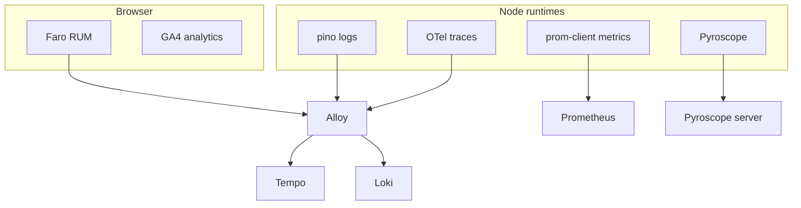

## Overview

Both runtimes — the tucaken-app SSR Node process and the admin-api BFF — are
instrumented across four telemetry signals: distributed traces, metrics, logs,
and continuous profiles, all feeding a Grafana stack via an Alloy collector. A
fifth, browser-side layer adds Grafana Faro RUM and GA4 product analytics. The
defining property is correlation: every log line carries the active trace's id,
so a Loki log pivots to its Tempo trace, which links to the Pyroscope profile and
the Prometheus metrics for the same service — one incident, one set of
cross-linked evidence rather than four disconnected dashboards.

## Traces — OpenTelemetry to Tempo via Alloy

The admin-api OTel SDK is bootstrapped before any instrumented module via
`node --import telemetry.js`, exporting OTLP/HTTP to an Alloy DaemonSet that
forwards to Tempo
([telemetry.ts](../../admin-api/src/lib/observability/telemetry.ts#L1-L48)). Auto
instrumentation covers http, pg, and aws-sdk; dns and fs spans are disabled as
noise and health/metrics endpoints are dropped from incoming traces
([telemetry.ts](../../admin-api/src/lib/observability/telemetry.ts#L50-L64)). The
same trace context is propagated into dispatched Kubernetes Jobs — see
[Distributed tracing from API request to worker pod](distributed-tracing-api-to-worker.md).

## Metrics — Prometheus RED with low cardinality

Each runtime owns a `prom-client` registry with default Node metrics (process,
event-loop lag, heap, GC) plus HTTP RED counters and latency histograms
([admin-api metrics.ts](../../admin-api/src/lib/observability/metrics.ts#L1-L44),
[SSR metrics.ts](../../src/lib/observability/metrics.ts#L1-L34)). Cardinality is
deliberately bounded: the `route` label is the matched Hono path pattern (e.g.
`/api/admin/articles/:id`), never the raw URL with ids, to avoid a Prometheus
series explosion
([admin-api metrics.ts](../../admin-api/src/lib/observability/metrics.ts#L9-L13)).
Latency buckets are tuned for an in-cluster BFF — most calls under 250ms, 10s+
should already be paging
([admin-api metrics.ts](../../admin-api/src/lib/observability/metrics.ts#L38-L41)).
The SSR process additionally tracks outbound admin-api call RED to spot upstream
5xx storms ([SSR metrics.ts](../../src/lib/observability/metrics.ts#L36-L44)).

## Logs — pino to Loki, correlated to traces

Both services log JSON via pino to stdout, picked up by Alloy and shipped to
Loki ([admin-api logger.ts](../../admin-api/src/lib/observability/logger.ts#L1-L12)).
A pino `mixin` injects the active OTel span's `trace_id`/`span_id` into every
record, so Grafana's "Logs to Trace" pivot works without any manual id threading
in user code
([admin-api logger.ts](../../admin-api/src/lib/observability/logger.ts#L25-L31),
[SSR logger.ts](../../src/lib/observability/logger.ts#L26-L32)). Both loggers
redact secrets at source — authorization/cookie headers and token/password/key
fields are censored to `[REDACTED]`
([admin-api logger.ts](../../admin-api/src/lib/observability/logger.ts#L38-L45),
[SSR logger.ts](../../src/lib/observability/logger.ts#L35-L46)). Browser code must
not import the SSR logger (pino is Node-only); RUM logs go through Faro instead
([SSR logger.ts](../../src/lib/observability/logger.ts#L4-L9)).

## Profiles — Pyroscope continuous profiling

The admin-api telemetry bootstrap also starts Pyroscope when
`PYROSCOPE_SERVER_ADDRESS` is set, pushing CPU and heap pprof samples every ~10s
at roughly 1–2% overhead, and disabling itself in local dev when the address is
unset
([telemetry.ts](../../admin-api/src/lib/observability/telemetry.ts#L67-L80)).
Profiles are tagged with env, version, and namespace so a CPU regression can be
attributed to a specific deploy. Dispatched Job pods inherit the Pyroscope server
address through the shared observability env block, so background pipelines are
profiled the same way as the API.

## Browser layer — Faro RUM and GA4

The dashboard initialises Grafana Faro RUM through a thin wrapper that reads
Vite-style `VITE_FARO_*` env vars (not Next.js `NEXT_PUBLIC_*`), guards against
SSR and React strict-mode double-init with a singleton, and returns `null` when
`VITE_FARO_ENABLED === 'false'`
([faro-admin.ts](../../src/lib/observability/faro-admin.ts#L1-L45)). Faro adds web
instrumentations plus tracing, sending RUM data through the same Alloy collector
so browser sessions correlate to server traces. Product-analytics events
(article/project views, form submissions) are intentionally kept separate in GA4
rather than Prometheus, which focuses on infrastructure and application health
([analytics.ts](../../src/lib/observability/analytics.ts#L1-L13)).

## Tradeoffs

Running four signals plus RUM is more wiring than a single APM agent, but each
pillar is best-of-breed and open (Tempo/Loki/Mimir/Pyroscope/Grafana) with no
vendor lock-in, and the trace-id correlation built into logging makes the set
behave as one. The discipline costs vigilance: low-cardinality labels and span
noise filtering are enforced by hand in code, and secret redaction lives in the
logger config rather than a central proxy — both are explicit choices documented
in the source comments. Profiling adds ~1–2% runtime overhead, accepted for the
ability to attribute regressions to a deploy.

## Related concepts

- [Distributed tracing from API request to worker pod](distributed-tracing-api-to-worker.md)
  — trace propagation across the async Job boundary.
- [admin-api — Backend-for-Frontend for tucaken-app](../projects/admin-api.md) —
  one of the two instrumented runtimes.

<!--
Evidence trail (auto-generated):
- Source: admin-api/src/lib/observability/telemetry.ts (read on 2026-06-16, lines 1-80)
- Source: admin-api/src/lib/observability/logger.ts (read on 2026-06-16, lines 1-45)
- Source: admin-api/src/lib/observability/metrics.ts (read on 2026-06-16, lines 1-44)
- Source: src/lib/observability/logger.ts (read on 2026-06-16, lines 1-46)
- Source: src/lib/observability/metrics.ts (read on 2026-06-16, lines 1-44)
- Source: src/lib/observability/faro-admin.ts (read on 2026-06-16, lines 1-45)
- Source: src/lib/observability/analytics.ts (read on 2026-06-16, lines 1-13)
-->
