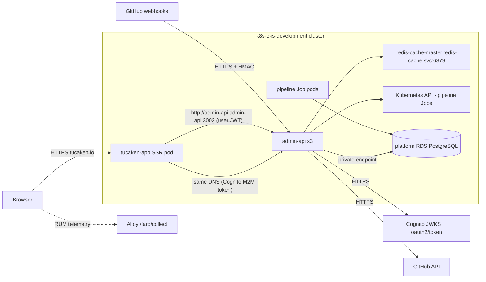

# Networking architecture — tucaken-app and admin-api

How traffic moves through the Tucaken product surface: the browser talks
only to the tucaken-app SSR server; every data call happens pod-to-pod
inside the EKS cluster over Kubernetes service DNS. This doc covers each
side separately — the tucaken-app (frontend/SSR) networking model first,
then admin-api's listener, trust tiers and egress paths.

## Network topology overview



The load-bearing property: **the browser never calls admin-api directly**.
All API calls originate from tucaken-app server functions running in the
cluster, so admin-api's CORS policy is defence-in-depth rather than a
functional dependency
([admin-api/src/index.ts](../../admin-api/src/index.ts#L102-L105)).

## tucaken-app: domains and edge behaviour

The canonical origin is `https://tucaken.io`, and the live edge is the
shared internet-facing ALB — **not CloudFront**. The CloudFront + NLB +
Traefik edge was retired (no distribution exists in the account,
[verified via `aws cloudfront list-distributions` on 2026-07-14]); the
comments in [admin-api/src/index.ts](../../admin-api/src/index.ts#L96-L110)
describing CloudFront-edge 301 redirects predate that migration. Today
all four hosts (`tucaken.io`, `www.tucaken.io`, `tucaken.com`,
`www.tucaken.com`) route to the same tucaken-app target group with no
canonical-host redirect — the redirect is a planned ALB-actions
enhancement. Full edge path (DNS, ACM, WAF, listener rules):
[request lifecycle — browser to pod](./request-lifecycle-browser-to-pod.md).
This repo's contract with the edge is the origin allowlist and the
`x-request-id` header it may forward
([src/server/_api-client.ts](../../src/server/_api-client.ts#L70-L74)).

## tucaken-app: BFF calls over Kubernetes service DNS

Server functions are the only data path. The API client resolves admin-api
through the in-cluster service name with an env override:

```ts
const ADMIN_API_URL =
  process.env['ADMIN_API_URL'] ?? 'http://admin-api.admin-api:3002';
```

`admin-api.admin-api` is Kubernetes `<service>.<namespace>` DNS — plain
HTTP is acceptable because the hop never leaves the cluster network
([src/server/_api-client.ts](../../src/server/_api-client.ts#L29-L30)).
Each request carries three things
([src/server/_api-client.ts](../../src/server/_api-client.ts#L64-L83)):

- the caller's Cognito JWT, read from the `__session` cookie and forwarded
  as `Authorization: Bearer` — the SSR server holds no API credentials of
  its own for user-scoped calls;
- an `x-request-id`, reused from the upstream request when Faro/CDN
  forwarded one, otherwise minted;
- W3C trace context (`traceparent`/`tracestate`) injected by the OTel
  propagator, so a browser action correlates across app, API and any
  dispatched pipeline Job (see
  [distributed tracing](./distributed-tracing-api-to-worker.md)).

## tucaken-app: machine-to-machine path for billing webhooks

The Stripe webhook handler runs inside tucaken-app's SSR server but must
write subscription state — a privilege user JWTs never get. It uses a
separate client that authenticates with a Cognito client-credentials
token instead of a session cookie
([src/server/_internal-api-client.ts](../../src/server/_internal-api-client.ts#L19-L69)).
The token is fetched from `https://${COGNITO_DOMAIN}/oauth2/token` using
HTTP Basic auth
([src/server/cognito-m2m.ts](../../src/server/cognito-m2m.ts#L49-L62)),
then presented to admin-api's `/api/internal/billing` surface, which is
mounted behind M2M verification with the required scope
`tucaken-internal/write:billing`
([admin-api/src/index.ts](../../admin-api/src/index.ts#L140-L151)).
Same pod-to-pod DNS, different trust tier.

## tucaken-app: browser security headers and CSP allowlists

Outbound browser networking is constrained by a strict Content-Security-Policy
built in
[src/server/security-header-values.ts](../../src/server/security-header-values.ts):

- Document responses get a per-request **nonce** on `script-src` with no
  `unsafe-inline`; the production server injects the same nonce into every
  SSR `<script>` so hydration runs while injected scripts do not.
- `connect-src` is the browser's egress allowlist: `'self'`,
  `*.nelsonlamounier.com`, `*.amazonaws.com`, `*.amazoncognito.com`,
  `api.stripe.com` and the Google Analytics endpoints.
- `frame-ancestors 'none'` plus `X-Frame-Options: DENY`, HSTS with
  `includeSubDomains`, `nosniff`, and a restrictive Permissions-Policy
  ship on every response via `SECURITY_HEADERS`.

Any new third-party endpoint the browser must reach has to be added to
`connect-src` here — requests to unlisted hosts fail in the browser, by
design.

## tucaken-app: RUM and local development networking

Real-user monitoring posts from the browser to a Grafana Faro collector
whose URL is inlined at build time from `VITE_FARO_URL`; when the variable
is absent, RUM is disabled entirely
([src/lib/observability/faro-admin.ts](../../src/lib/observability/faro-admin.ts#L46-L52)).

Local development has two networking modes
([docs/runbooks/local-development.md](../runbooks/local-development.md)):
the Vite dev server on port 5001 (`yarn dev`,
[package.json](../../package.json#L16)) against a local or mocked API, and
cluster mode, where `kubectl port-forward` exposes the in-cluster
`svc/admin-api` on `localhost:3002` and the containerised app reaches it
via `host.docker.internal`. The dev origins `http://localhost:3000` and
`http://localhost:5001` are the only non-production entries in admin-api's
CORS allowlist
([admin-api/src/index.ts](../../admin-api/src/index.ts#L106-L110)).

## admin-api: single listener, four trust tiers

admin-api is a Hono server on port 3002 (public-api owns 3001)
([admin-api/src/index.ts](../../admin-api/src/index.ts#L11)). One listener
serves four network trust tiers, distinguished by mount order and
middleware, not by separate ports:

| Tier | Mounts | Network expectation |
| --- | --- | --- |
| Unauthenticated probes | `/healthz`, `/livez`, `/readyz`, `/metrics` | K8s probes and Prometheus cannot send JWTs; `/metrics` is intended to be restricted to the monitoring namespace by NetworkPolicy ([index.ts](../../admin-api/src/index.ts#L117-L123)) |
| HMAC webhook | `/api/github/webhook` | GitHub posts from the public internet; authenticity is a signature check, not a network boundary ([index.ts](../../admin-api/src/index.ts#L125-L128)) |
| Cognito M2M | `/api/internal/billing` | Tucaken-owned pods only, client-credentials token with a required scope ([index.ts](../../admin-api/src/index.ts#L140-L151)) |
| Cognito user JWT | `/api/admin/*` | Pod-to-pod calls from tucaken-app server functions ([index.ts](../../admin-api/src/index.ts#L153-L166)) |

Webhook and public mounts are registered **before** the JWT middleware —
ordering is part of the security model
([middleware README](../../admin-api/src/middleware/README.md)).

## admin-api: CORS as defence-in-depth

The CORS allowlist admits exactly three origins: `https://tucaken.io`,
`http://localhost:3000` and `http://localhost:5001`
([admin-api/src/index.ts](../../admin-api/src/index.ts#L93-L115)). Because
all production calls arrive pod-to-pod from server functions, the browser
never sends admin-api a cross-origin request — the config exists to
constrain any future client-side fetch, and the inline comments say so
explicitly. Treat a CORS error in production as a signal that something
is calling the API from the wrong place, not as a config to loosen.

## admin-api: egress paths

Everything admin-api dials out to, with the code that owns each path:

- **PostgreSQL (platform RDS)** — reached through a private endpoint; the
  connection coordinates come from the `platform-rds-credentials` secret
  (keys `PG_HOST`, `PG_PORT`, `PG_DATABASE`, `PG_USER`, `PG_PASSWORD`),
  which exists in the `admin-api` namespace
  ([verified via `kubectl get secret platform-rds-credentials -n admin-api` on 2026-07-14]).
  The pool is a lazy singleton in
  [admin-api/src/lib/pg.ts](../../admin-api/src/lib/pg.ts).
- **Redis cache** — write-side invalidation DELs to
  `redis-cache-master.redis-cache.svc.cluster.local:6379`, TLS off inside
  the cluster, password mounted separately; the contract is fail-open, so
  a Redis outage degrades to uncached reads and never breaks a request
  ([admin-api/src/lib/jobs/case-study-dispatch.ts](../../admin-api/src/lib/jobs/case-study-dispatch.ts#L29-L37),
  [admin-api/src/lib/redis-cache.ts](../../admin-api/src/lib/redis-cache.ts)).
- **Kubernetes API** — pipeline Job creation uses in-cluster config via
  lazy BatchV1/CoreV1 clients
  ([admin-api/src/lib/jobs/k8s.ts](../../admin-api/src/lib/jobs/k8s.ts)).
- **Cognito** — JWT verification fetches the pool's JWKS over HTTPS from
  the issuer URL ([auth middleware](../../admin-api/src/middleware/auth.ts);
  concept: [Cognito JWKS verification](./cognito-jwks-verification.md)).
- **GitHub API** — installation tokens and repo listings over raw Node
  `https` with no SDK
  ([admin-api/src/lib/github/github-app.ts](../../admin-api/src/lib/github/github-app.ts)).
- **AWS service APIs** — S3 presigning, Cognito admin calls, Cost Explorer
  and Bedrock usage, with credentials from the pod's identity rather than
  static keys ([admin-api/src/index.ts](../../admin-api/src/index.ts#L10)).

## admin-api: pipeline Job pod networking contracts

Jobs dispatched by admin-api inherit their network coordinates through the
Job spec, not through code: `envFromSecretRefs` mounts
`platform-rds-credentials` (database) and `job-strategist-redis-cache`
(cache password), while non-secret Redis coordinates travel as plain env
vars in the spec
([admin-api/src/lib/jobs/case-study-dispatch.ts](../../admin-api/src/lib/jobs/case-study-dispatch.ts#L72-L98)).
A Job pod therefore reaches RDS and Redis exactly the way admin-api does,
without admin-api ever forwarding its own connections. The cluster ran 3
admin-api replicas plus completed Job/CronJob pods in the `admin-api`
namespace when checked
([verified via `kubectl get pods -n admin-api` on 2026-07-14]).

## Deeper detail

- [Cognito JWKS verification](./cognito-jwks-verification.md) — how the
  JWT trust tier validates tokens against the pool's JWKS.
- [Distributed tracing: API to worker](./distributed-tracing-api-to-worker.md)
  — the trace-context propagation that rides on these network hops.
- [SSR query hydration](./ssr-query-hydration.md) — how server-function
  data reaches the browser without a second fetch.
- [admin-api routes README](../../admin-api/src/routes/README.md) — the
  full mount table and auth-tier map.
- [Request lifecycle — browser to pod](./request-lifecycle-browser-to-pod.md)
  — the full edge path: ExternalDNS, ALB, WAFv2, ACM SNI, IP-mode target
  groups, blue-green active services.
- [CORS error in production](../troubleshooting/cors-error-in-production.md)
  — what a production CORS failure actually indicates given the
  pod-to-pod model.

<!--
Evidence trail (auto-generated):
- Source: src/server/_api-client.ts (read on 2026-07-14)
- Source: src/server/_internal-api-client.ts (read on 2026-07-14)
- Source: src/server/cognito-m2m.ts (read on 2026-07-14)
- Source: src/server/security-header-values.ts (read on 2026-07-14)
- Source: src/lib/observability/faro-admin.ts (read on 2026-07-14)
- Source: admin-api/src/index.ts (read on 2026-07-14)
- Source: admin-api/src/lib/jobs/k8s.ts, case-study-dispatch.ts (read on 2026-07-14)
- Source: docs/runbooks/local-development.md (read on 2026-07-14)
- Live: kubectl get pods -n admin-api (run on 2026-07-14)
- Live: kubectl get secret platform-rds-credentials -n admin-api (keys only, run on 2026-07-14)
-->
