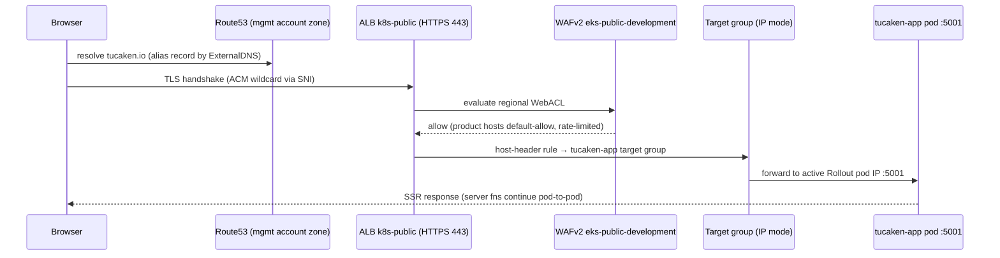

# Request lifecycle — browser to pod

The full path a request to `https://tucaken.io` travels before it reaches a
tucaken-app pod: DNS, the shared ALB edge, WAF, TLS, listener routing, and
the IP-mode hop into Kubernetes. Companion to
[networking architecture](./networking-architecture.md), which picks up at
the pod. Evidence comes from the sibling `tucaken-infra` and
`kubernetes-bootstrap` repos (cited with repo-qualified paths) and from the
live dev account on 2026-07-14.

## The edge is the ALB, not CloudFront

The CloudFront + NLB + Traefik edge was retired: the decision is recorded in
`tucaken-infra/docs/decisions/0010-alb-wafv2-edge-over-cloudfront-nlb.md`,
the edge stacks were deleted
(`tucaken-infra/infra/lib/projects/kubernetes/factory.ts:304-312`, "EDGE /
TUCAKEN-EDGE STACKS REMOVED"), and the only CloudFront code left is an
uninstantiated generic construct plus files under `deprecated/`. Live
confirmation: `aws cloudfront list-distributions` returns no distributions,
and the single internet-facing load balancer is the application LB
`k8s-public-f8655bfb7e`
([verified via AWS CLI, dev account, on 2026-07-14]).

Consequence: **there is currently no `.com` → `.io` 301 redirect**. All four
hosts (`tucaken.io`, `www.tucaken.io`, `tucaken.com`, `www.tucaken.com`)
route to the same backend
(`kubernetes-bootstrap/charts/tucaken-app/chart/templates/ingress.yaml:1-56`);
the redirect is noted as a future enhancement via
`alb.ingress.kubernetes.io/actions.*` annotations
(`kubernetes-bootstrap/charts/tucaken-app/tucaken-app-values-eks.yaml:8-10`).
Comments in `admin-api/src/index.ts` describing CloudFront-edge redirects
predate this migration and describe retired behaviour.

## End-to-end path

## DNS: ExternalDNS writes records into a management-account zone

No static DNS record exists in either repo. ExternalDNS creates alias
records from the `external-dns.alpha.kubernetes.io/hostname` annotation on
the tucaken-app Ingress
(`kubernetes-bootstrap/charts/tucaken-app/chart/templates/ingress.yaml:30`),
assuming a cross-account role into the zone's owner. The hosted zones for
`tucaken.io`/`tucaken.com` live in the management account and are referenced
by ID only through SSM parameters `/org/route53/tucaken-io-zone-id` and
`/org/route53/tucaken-com-zone-id`
(`tucaken-infra/infra/lib/config/ssm-paths.ts:587-603`). The dev account
itself holds only the private `k8s.internal.` zone
([verified via `aws route53 list-hosted-zones` on 2026-07-14]).

## TLS: ACM wildcards, SNI selection, forced HTTPS

TLS terminates at the ALB. `EksAlbCertsStack` provisions eu-west-1 ACM
wildcards for `*.tucaken.io`, `*.tucaken.com` and `*.nelsonlamounier.com`
(plus apexes), DNS-01 validated cross-account, with ARNs published to SSM
(`tucaken-infra/infra/lib/stacks/kubernetes/eks-alb-certs-stack.ts:63-129`).
The Ingresses carry no cert ARN — the AWS Load Balancer Controller
auto-discovers the matching certificate by Host-SAN and serves it via SNI
(`kubernetes-bootstrap/charts/admin-api/chart/templates/ingress.yaml:7-10`).
The live listener is HTTPS 443 only, and
`alb.ingress.kubernetes.io/ssl-redirect: "443"` upgrades any plain-HTTP
attempt ([listener verified via `aws elbv2 describe-listeners` on 2026-07-14]).

## WAF: one regional WebACL, targeted exemptions

The REGIONAL WebACL `eks-public-development` is attached to the shared ALB
([verified via `aws wafv2 list-web-acls --scope REGIONAL` on 2026-07-14]).
Its rule logic lives in
`tucaken-infra/infra/lib/constructs/security/eks-public-waf.ts`, with the
per-environment wiring in
`tucaken-infra/infra/lib/projects/kubernetes/factory.ts:429-472`:

- Product hosts (`tucaken.io` family) are default-allow with a 2000
  requests / 5 min per-IP rate limit; only `admin.nelsonlamounier.com` and
  `ops.nelsonlamounier.com` remain IP-allowlisted.
- `/api/github/webhook` is exempt from the IP allowlist and body-inspecting
  managed rules — it authenticates itself via HMAC (codifies the 2026-07-02
  live WAF fix; see the webhook tier in
  [networking architecture](./networking-architecture.md)).
- `/_serverfn/` on product hosts is exempt from the 8 KB
  `SizeRestrictions_BODY` cap so TanStack server-function payloads pass.

The WAF ARN reaches the Ingress via a `waf-annotator` PostSync Job that
reads SSM and patches `alb.ingress.kubernetes.io/wafv2-acl-arn`
(`kubernetes-bootstrap/charts/admin-api/chart/templates/waf-annotator-job.yaml:42-98`).

## Listener routing: one ALB, host-header rules per surface

All public surfaces share the ALB through Ingress `group.name: public`,
ordered by `group.order`. The live rule table
([verified via `aws elbv2 describe-rules` on 2026-07-14]):

| Host (+ path) | Target group | Backend |
| --- | --- | --- |
| `admin.nelsonlamounier.com` | `k8s-adminapi-…` :3002, hc `/readyz` | admin-api (staff surface + GitHub webhook) |
| `api.nelsonlamounier.com` | `k8s-publicap-…` | public-api |
| `tucaken.io`, `www.tucaken.io`, `tucaken.com`, `www.tucaken.com` | `k8s-tucakena-…` | tucaken-app |
| `/faro`, `/faro/*` (any host) | `k8s-monitori-faroprox-…` | Faro RUM collector proxy |
| `ops.nelsonlamounier.com` + `/grafana`, `/prometheus`, `/argocd`, `/headlamp` | monitoring TGs | ops tooling |
| `nelsonlamounier.com` | `k8s-nextjsap-…` | portfolio Next.js |

This table is why browser RUM posts to `/faro/collect` work from the product
domain: the path rule is host-agnostic.

## Cluster hop: pod IPs as targets, blue-green active service

Both product Ingresses use `alb.ingress.kubernetes.io/target-type: ip`, so
the ALB registers **pod IPs directly** as targets — no NodePort hop
(`kubernetes-bootstrap/charts/tucaken-app/chart/templates/ingress.yaml:20`).
ALB health checks hit `/readyz`
(`kubernetes-bootstrap/charts/tucaken-app/tucaken-app-values-eks.yaml:26`),
the same DB-aware readiness endpoint Kubernetes probes use
([admin-api/src/routes/system/observability.ts](../../admin-api/src/routes/system/observability.ts)).

Deployments are Argo Rollouts blue-green: the Ingress targets the **active**
Service (`tucaken-app`, port 5001; `admin-api`, port 3002), while a preview
Service receives the new version until manual promotion after a Prometheus
analysis run
(`kubernetes-bootstrap/charts/tucaken-app/chart/templates/rollout.yaml:28-42`,
`charts/admin-api/chart/templates/rollout.yaml:35-49`). admin-api is
additionally fenced by a default-deny NetworkPolicy admitting only ALB
source ranges, the monitoring namespace (Prometheus `/metrics` scrape) and
the tucaken-app namespace for BFF calls
(`kubernetes-bootstrap/charts/admin-api/chart/templates/networkpolicy.yaml:32-68`).

## Deeper detail

- [Networking architecture — tucaken-app and admin-api](./networking-architecture.md)
  — continues from the pod inward: BFF calls, trust tiers, egress paths.
- [CORS error in production](../troubleshooting/cors-error-in-production.md)
  — what a CORS failure means given this edge model.
- `tucaken-infra/docs/decisions/0010-alb-wafv2-edge-over-cloudfront-nlb.md`
  — the ADR behind the CloudFront retirement (sibling repo).

<!--
Evidence trail (auto-generated):
- Source: tucaken-infra — factory.ts, eks-alb-certs-stack.ts, eks-public-waf-stack.ts,
  constructs/security/eks-public-waf.ts, config/ssm-paths.ts, docs/decisions/0010,
  docs/troubleshooting/edge-is-alb-not-cloudfront.md (read on 2026-07-14)
- Source: kubernetes-bootstrap — charts/tucaken-app/{ingress,rollout,service}.yaml +
  values-eks.yaml, charts/admin-api/{ingress,rollout,networkpolicy,waf-annotator-job}.yaml
  (read on 2026-07-14)
- Live: aws cloudfront list-distributions; elbv2 describe-load-balancers/listeners/
  target-groups/rules; route53 list-hosted-zones; wafv2 list-web-acls
  (dev account 771826808455, eu-west-1, run on 2026-07-14)
-->
