## Overview

Tucaken's admin dashboard fetches data through a single pipeline: a typed,
auth-guarded server function (`createServerFn`) is wrapped in a reusable
`queryOptions` descriptor, prefetched in a route `loader` via
`ensureQueryData`, then read in the component with `useQuery`. Because the
router and the React tree share **one** `QueryClient` instance, data the loader
warms during SSR is already in the client cache on hydration — the component
renders from cache with no second network round-trip.

The shared client is created once in
[query-client.ts](../../src/lib/query-client.ts#L9-L15) and its own comment
states the intent: "Same instance on both sides keeps loader-prefetched data
hydrated into the client-side cache without a duplicate fetch."

## How it works

```mermaid
sequenceDiagram
    participant B as Browser
    participant R as TanStack Router (loader)
    participant QC as Shared QueryClient
    participant SF as createServerFn handler
    participant API as admin-api

    B->>R: Navigate to /projects/:id
    R->>QC: ensureQueryData(projectsQueries.detail(id))
    QC->>SF: queryFn -> getProjectDetailFn({ data: id })
    SF->>SF: requireAuth() + Zod inputValidator
    SF->>API: apiFetch('/projects/:id') (traceparent injected)
    API-->>SF: ProjectDetail JSON
    SF-->>QC: cached under ['projects','detail',id]
    QC-->>R: data resolved, SSR render proceeds
    R-->>B: HTML + serialised cache
    B->>QC: hydrate (same instance via QueryClientProvider)
    B->>QC: useQuery(projectsQueries.detail(id)) -> cache hit, no refetch
```



The pieces:

- **Shared client as router context** —
  [router.tsx](../../src/router.tsx#L4) imports the singleton `queryClient` and
  passes it into `createTanStackRouter` context
  ([router.tsx](../../src/router.tsx#L16-L19)), where `RouterContext` types it as
  `QueryClient` ([router.tsx](../../src/router.tsx#L7-L10)). Loaders receive it as
  `context.queryClient`.
- **Same client in the React tree** —
  [__root.tsx](../../src/app/__root.tsx#L130-L135) mounts
  `<QueryClientProvider client={queryClient}>` using the same import
  ([__root.tsx](../../src/app/__root.tsx#L15)). One instance bridges SSR and
  client.
- **Default freshness** — the client sets a global `staleTime` of five minutes
  ([query-client.ts](../../src/lib/query-client.ts#L9-L15)), so hydrated data is
  considered fresh and is not immediately refetched after mount.

## Implementation in this codebase

**1. Server function** — `getProjectDetailFn` is a `GET` server fn with a Zod
`inputValidator` (a UUID regex), an auth guard, and a forward to admin-api via
the shared `apiFetch` client
([projects.ts](../../src/server/projects.ts#L43-L51)). The validator runs at the
server boundary, satisfying the "validate every server boundary with Zod" rule.
`apiFetch` injects a W3C `traceparent` so the call joins the same OTel trace as
admin-api ([_api-client.ts](../../src/server/_api-client.ts#L5-L11)).

**2. queryOptions descriptor** — the feature colocates its query factory in
[queries.ts](../../src/features/projects/server/queries.ts#L12-L17). Each entry
returns `queryOptions({ queryKey, queryFn, staleTime })` so the exact same object
is reusable by both the loader and the component:

```ts
detail: (id: string) =>
  queryOptions({
    queryKey: ['projects', 'detail', id],
    queryFn:  () => getProjectDetailFn({ data: id }),
    staleTime: 30 * 1000,
  }),
```

Note the per-query `staleTime` of 30s overrides the client default for this
descriptor.

**3. Route loader prefetch** — the route calls `ensureQueryData` with that same
descriptor ([$id.tsx](../../src/app/_dashboard/projects/$id.tsx#L8-L10)):

```tsx
loader: async ({ context, params }) => {
  await context.queryClient.ensureQueryData(projectsQueries.detail(params.id))
},
```

`ensureQueryData` resolves from cache if present, otherwise runs `queryFn` and
caches the result — exactly what the CLAUDE.md loader guidance prescribes.

**4. Component read** — `ProjectDetail` calls
`useQuery(projectsQueries.detail(projectId))`
([ProjectDetail.tsx](../../src/features/projects/components/detail/ProjectDetail.tsx#L15)),
reusing the identical descriptor. Because the key and client match what the
loader warmed, this is a cache hit on first render.

Other routes follow the same shape — for example
[_dashboard.calendar.tsx](../../src/app/_dashboard.calendar.tsx) and the projects
edit/review routes also prefetch via `context.queryClient.ensureQueryData`.

## Tradeoffs

- **One shared client instance vs per-request isolation.** Using a module-level
  singleton ([query-client.ts](../../src/lib/query-client.ts#L9)) is what makes
  loader-warmed data appear in the client cache without an explicit
  dehydrate/rehydrate step. The repo does **not** import
  `@tanstack/react-router-ssr-query` anywhere in `src/`, despite it being a
  dependency in [package.json](../../package.json#L48) — hydration here relies on
  the shared instance plus `QueryClientProvider`, not that helper's automatic
  dehydration. A single server-side instance shared across concurrent requests
  is acceptable for this internal admin dashboard but would risk cross-request
  cache bleed in a high-traffic multi-tenant SSR app.
- **`ensureQueryData` resolves before render.** The loader `await`s the fetch, so
  navigation blocks until data is ready (no loading flash), at the cost of a
  slower transition for slow upstreams. `defaultPreload: 'intent'`
  ([router.tsx](../../src/router.tsx#L21)) softens this by prefetching on hover.
- **`staleTime` discipline.** With a 5-minute client default
  ([query-client.ts](../../src/lib/query-client.ts#L12)) and shorter per-query
  overrides (30s for projects), hydrated data is treated as fresh — fewer
  refetches, but stale reads if the override is too generous for fast-changing
  data.
- **`useQuery` vs `useSuspenseQuery`.** `ProjectDetail` uses `useQuery` and
  handles `isPending`/`isError` itself
  ([ProjectDetail.tsx](../../src/features/projects/components/detail/ProjectDetail.tsx#L15)),
  rather than `useSuspenseQuery`. Since the loader has already warmed the cache,
  the pending state is effectively skipped on the happy path but still guards
  client-side cache misses.

## Related concepts

- [Cognito JWT verification](./cognito-jwks-verification.md) — the `requireAuth`
  guard inside each server fn rests on this verification path.
- [Distributed tracing — API to worker](./distributed-tracing-api-to-worker.md)
  — `apiFetch` injects `traceparent` so the server-fn call joins the same trace.
- [admin-api project](../projects/admin-api.md) — every projects server fn
  forwards to admin-api routes (e.g. `/api/admin/projects/*`); admin-api is the
  upstream that ultimately serves the cached data.

<!--
Evidence trail (2026-06-16):
- src/router.tsx#L4,L7-L10,L16-L19,L21 — shared queryClient imported into router context; RouterContext.queryClient: QueryClient; defaultPreload 'intent'
- src/lib/query-client.ts#L9-L15 — singleton QueryClient, staleTime 5min, comment on shared-instance hydration
- src/app/__root.tsx#L15,L130-L135 — same queryClient import + QueryClientProvider in React tree
- src/server/projects.ts#L43-L51 — getProjectDetailFn: createServerFn GET + Zod UUID inputValidator + requireAuth + apiFetch('/projects/:id')
- src/features/projects/server/queries.ts#L12-L17 — projectsQueries.detail returns queryOptions(queryKey ['projects','detail',id], queryFn getProjectDetailFn, staleTime 30s)
- src/app/_dashboard/projects/$id.tsx#L8-L10 — loader awaits context.queryClient.ensureQueryData(projectsQueries.detail(params.id))
- src/features/projects/components/detail/ProjectDetail.tsx#L1,L15 — useQuery(projectsQueries.detail(projectId)) (verified via grep)
- src/server/_api-client.ts#L5-L11,L20-L21 — apiFetch injects traceparent; uses node:crypto + @tanstack/react-start/server
- package.json#L44,L46,L48,L49 — @tanstack/react-query ^5.96.2, react-router latest, react-router-ssr-query latest, react-start latest
- VERIFIED: grep "react-router-ssr-query" over src/ returns NO matches — ssr-query helper is a dep but unused in app code; hydration via shared instance only
- OMITTED: no dehydrate/HydrationBoundary/setupRouterSsrQueryIntegration usage found anywhere in src/, so no claims made about automatic dehydration serialisation mechanics
-->
