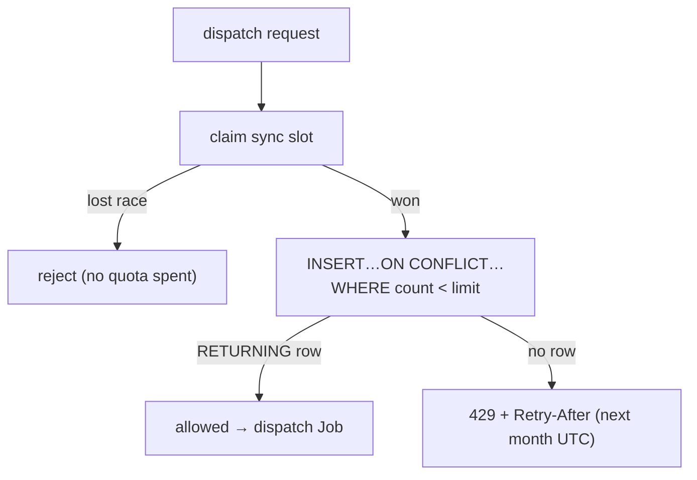

## Overview

Free-tier actions are metered per user per calendar month against a single
`usage_quotas` table. The enforcement is **atomic and race-free**: the check and
the increment happen in one SQL statement, so two concurrent requests can never
both slip past the limit. Quotas reset at the first instant of the next UTC month,
and an exhausted quota returns `429` with an RFC 6585 `Retry-After`.

## The quota table

`usage_quotas` is keyed by `(user_id, feature, period_month)` with a `count`. The
`period_month` is `DATE_TRUNC('month', NOW())::date`, so each calendar month is a
fresh row — the quota "resets" simply by the period key advancing
([users.ts:318-327](../../admin-api/src/lib/repositories/users.ts#L318-L327)).
Features are independent counters (e.g. `resume_generations`, `job_applications`,
`coach_runs`, and `ingestion_jobs`).

## Atomic check-and-increment (no TOCTOU)

The gated variant used on ingestion dispatch increments only while under the limit,
in a single statement — there is no read-then-write gap two requests could race
through
([github.ts:267-289](../../admin-api/src/routes/github.ts#L267-L289)):

```sql
INSERT INTO usage_quotas (user_id, feature, period_month, count)
VALUES ($1, $2, DATE_TRUNC('month', NOW())::date, 1)
ON CONFLICT (user_id, feature, period_month)
  DO UPDATE SET count = usage_quotas.count + 1, updated_at = NOW()
  WHERE usage_quotas.count < $limit
RETURNING count;
```

If `RETURNING` yields no row, the `WHERE count < limit` guard rejected the update →
the quota is full. An unlimited (Pro) plan passes `Infinity`, short-circuited by an
`isFinite(limit)` check before any SQL runs
([github.ts:279](../../admin-api/src/routes/github.ts#L279)). A simpler
unconditional `incrementUsageQuota` exists for features metered after the fact
([users.ts:312-328](../../admin-api/src/lib/repositories/users.ts#L312-L328)).

## Plans

- **Free:** 3 ingestion jobs per calendar month (`ingestion_jobs` feature).
- **Pro:** unlimited.

All ingestion entry points (auto-dispatch on App install, and the push webhook)
enforce the same quota via `checkAndIncrementQuota()`
([github.ts:24-28](../../admin-api/src/routes/github.ts#L24-L28)).

## Ordering — claim the sync slot before consuming quota

A duplicate dispatch must never burn a monthly credit. The sync-state claim lock is
taken **before** the quota is consumed, so a request that loses the claim race (a
duplicate) is rejected without decrementing anyone's remaining quota
([sync-state.ts:28](../../admin-api/src/lib/sync-state.ts#L28)). See the
[duplicate-ingestion-jobs](../troubleshooting/duplicate-ingestion-jobs.md)
troubleshooting note for the claim lock itself.

## 429 + Retry-After

When a quota is exhausted, the API responds `429` with a `Retry-After` computed by
`secondsUntilNextMonthUTC()` — whole seconds until `00:00:00 UTC` on the first of
next month, always `>= 1` (RFC 6585), matching the `DATE_TRUNC('month')` reset
([retry-after.ts:1-19](../../admin-api/src/lib/retry-after.ts#L1-L19)).



## Implementation in this codebase

| Concern | File |
| :- | :- |
| Gated atomic check-and-increment | `admin-api/src/routes/github.ts` |
| Generic increment + read | `admin-api/src/lib/repositories/users.ts` |
| Retry-After (monthly reset) | `admin-api/src/lib/retry-after.ts` |
| Claim-before-quota ordering | `admin-api/src/lib/sync-state.ts` |

## Tradeoffs

Doing the limit check inside the `INSERT … ON CONFLICT … WHERE` makes enforcement
race-free without an advisory lock or a transaction, at the cost of expressing the
business rule in SQL rather than application code. A monthly `DATE_TRUNC` period
gives free, self-resetting windows (no cron to reset counters) but means quotas are
calendar-month, not rolling-30-day. Claiming the sync slot before consuming quota
costs one extra round-trip but guarantees a duplicate never spends a credit.

## Related concepts

- [api-dispatched-k8s-jobs](api-dispatched-k8s-jobs.md)
- [duplicate-ingestion-jobs](../troubleshooting/duplicate-ingestion-jobs.md)

<!--
Evidence trail (auto-generated):
- Source: admin-api/src/routes/github.ts (read on 2026-06-16, lines 24-28, 267-289)
- Source: admin-api/src/lib/repositories/users.ts (read on 2026-06-16, lines 312-345)
- Source: admin-api/src/lib/retry-after.ts (read on 2026-06-16, lines 1-19)
- Source: admin-api/src/lib/sync-state.ts (read on 2026-06-16, line 28)
-->
