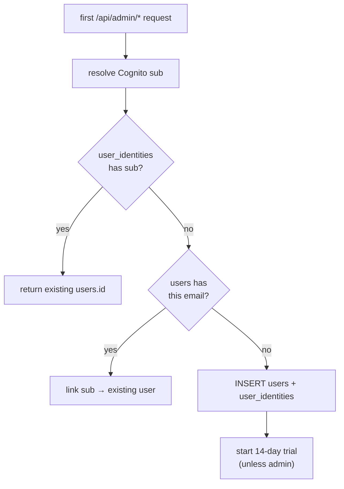

## Overview

A platform `users` row is created **lazily, on the user's first authenticated
request** — not by a Cognito Lambda trigger. Admin-api middleware runs after JWT
auth, resolves the caller's Cognito sub to a `users.id` (creating the row if
needed), and caches the mapping for the pod's lifetime. The upsert is idempotent,
so a pod restart safely re-runs it.

## When it runs

`user-provision.ts` runs after `cognitoJwtAuth` on every `/api/admin/*` request.
On the first request for a given Cognito sub it upserts `users` + `user_identities`
and caches the resolved `users.id` (sub → id never changes after provisioning)
([user-provision.ts:1-22](../../admin-api/src/middleware/user-provision.ts#L1-L22)).

Failure is **logged but never blocks the request** — if provisioning fails, a
child-table insert later hits the FK constraint and surfaces as a 500 from the
relevant route, rather than silently corrupting data
([user-provision.ts:18-22](../../admin-api/src/middleware/user-provision.ts#L18-L22)).

## Provider detection

Cognito embeds an `identities` claim for federated users (Google/GitHub); native
email/password users have none. The middleware reads it to set the provider —
`google` / `github` / `email`
([user-provision.ts:4-12](../../admin-api/src/middleware/user-provision.ts#L4-L12)).

## The three-step upsert

`upsertUserInTransaction()` resolves the caller to a `users.id`
([users.ts:88](../../admin-api/src/lib/repositories/users.ts#L88)):

1. **Known identity** — `SELECT user_id FROM user_identities WHERE cognito_sub = $1`.
   If found, return the existing `users.id` and refresh profile fields
   ([users.ts:94](../../admin-api/src/lib/repositories/users.ts#L94)).
2. **Same email, new provider** — `SELECT id FROM users WHERE email = $1`. If found,
   link the new Cognito sub to that user (avoids duplicate accounts when someone
   signs in with Google after email/password)
   ([users.ts:116](../../admin-api/src/lib/repositories/users.ts#L116)).
3. **Brand-new user** — `INSERT INTO users (...)` then link the identity
   ([users.ts:142-159](../../admin-api/src/lib/repositories/users.ts#L142-L159),
   [users.ts:184](../../admin-api/src/lib/repositories/users.ts#L184)).

## What is created

- **`users`** — `email`, `full_name`, `avatar_url`, `auth_provider`, `role`,
  `trial_started_at`, `trial_ends_at`, timestamps. A non-admin gets a **14-day
  trial** (`trial_ends_at = NOW() + 14 days`); an admin gets `NULL` trial dates
  ([users.ts:142-159](../../admin-api/src/lib/repositories/users.ts#L142-L159)).
- **`user_identities`** — one row linking the Cognito sub to `users.id` (per
  provider).
- **`plan_events`** — a `trial_started` audit row for non-admins.

Everything else (`usage_quotas`, `job_applications`, `resumes`, …) is created
**lazily** when the user first uses that feature — no bulk default rows at signup.

## Implementation in this codebase

| Concern | File |
| :- | :- |
| Provisioning middleware (cache, provider detection) | `admin-api/src/middleware/user-provision.ts` |
| Three-step upsert + trial | `admin-api/src/lib/repositories/users.ts` |

The `users` table and the schema itself are created by the `platform-rds-bootstrap`
service in the sibling `ai-applications` repo (documented there).

## Tradeoffs

Provisioning on first request (vs a Cognito post-confirmation Lambda) keeps user
creation in one place with the rest of the request transaction and avoids a second
deploy surface — at the cost of a one-time upsert on the first call (mitigated by
the per-pod cache). The same-email merge prevents duplicate accounts across
providers, at the cost of an extra `SELECT` on the cold path. Fail-open
provisioning never blocks a request, trading a clean error for resilience (the FK
constraint still prevents orphaned child rows).

## Related concepts

- [usage-quota-enforcement](usage-quota-enforcement.md)
- [cognito-jwks-verification](cognito-jwks-verification.md)

<!--
Evidence trail (auto-generated):
- Source: admin-api/src/middleware/user-provision.ts (read on 2026-06-16, lines 1-22)
- Source: admin-api/src/lib/repositories/users.ts (read on 2026-06-16, lines 88, 94, 116, 142-159, 184)
-->
