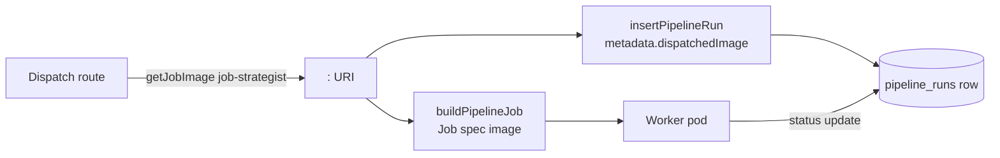

## Status

Accepted — shipped in [PR #122](https://github.com/Nelson-Lamounier/tucaken-app/pull/122) (commit `e671f6c`).

## Context

Tucaken dispatches its long-running AI pipelines as Kubernetes `batch/v1` Jobs
rather than running them inside admin-api request handlers — see
[API-dispatched Kubernetes Jobs](../concepts/api-dispatched-k8s-jobs.md). Each
dispatch first INSERTs a `pipeline_runs` row at trigger time, then submits the
Job; the worker pod later updates that same row's status.

The image a Job runs is resolved at dispatch time by `getJobImage(name)`
([config.ts#L93-L116](../../admin-api/src/lib/config.ts)), which reads the full
`<repo>:<tag>` URI from a file mount (the `JOB_IMAGES_DIR` directory, default
`/etc/admin-api/images`, populated by ESO from the chart Secret), falling back
to an env var in local dev ([config.ts#L57-L69](../../admin-api/src/lib/config.ts)).
The image tag is the git SHA of the worker build, so the resolved URI uniquely
identifies the code version that will execute.

Before this change the resolved URI was used only to build the Job spec — it was
never persisted. The `pipeline_runs` row recorded no code version at all, so
answering "which job-strategist build executed this run?" required inferring the
answer from deployment timelines. The commit body for `e671f6c` records that
this inference once misattributed an observed behaviour to a PR whose image was
in fact built *after* the run executed.

## Decision

At run-insert time, stamp the resolved image URI into the run's `metadata`
JSONB under a `dispatchedImage` key, at every job-dispatch site. The stamp is
the same URI value that is also passed to the Job spec, so the recorded version
is exactly what runs.

Three call sites were updated:

- **strategist** — `pipelines.ts` writes `dispatchedImage: strategistPipelineImage`
  ([pipelines.ts#L229](../../admin-api/src/routes/pipelines.ts)), where
  `strategistPipelineImage = getJobImage('job-strategist')`
  ([pipelines.ts#L171](../../admin-api/src/routes/pipelines.ts)) is also the
  `image` field of the dispatched Job ([pipelines.ts#L239](../../admin-api/src/routes/pipelines.ts)).
- **clustering** — `projects.ts` writes `dispatchedImage: image` for the
  `clustering` pipeline type
  ([projects.ts#L570](../../admin-api/src/routes/projects.ts)), where
  `image = getJobImage('job-strategist')`
  ([projects.ts#L555](../../admin-api/src/routes/projects.ts)).
- **case_study** — the shared dispatch helper writes
  `dispatchedImage: image` for the `case_study` pipeline type
  ([projects.ts#L712](../../admin-api/src/routes/projects.ts)), with the same
  `getJobImage('job-strategist')` resolution
  ([projects.ts#L699](../../admin-api/src/routes/projects.ts)).

All three flow through `insertPipelineRun`, which serialises the metadata object
and writes it to the `metadata` column on the `queued` row
([pipeline-runs.ts#L48-L63](../../admin-api/src/lib/repositories/pipeline-runs.ts)).

## Consequences

- Every run's exact code version is directly queryable from
  `pipeline_runs.metadata->>'dispatchedImage'` — never inferred from deploy
  timelines, which removes the misattribution failure mode.
- The stamp is written at trigger time, before the worker starts, so it is
  present even for runs that fail early or never report completion.
- It captures the *dispatched* image — the URI admin-api resolved and sent to
  the Job spec. If the cluster substituted a different image at pod-admission
  time (e.g. a mutating webhook), the stamp would not reflect that; nothing in
  this repo verifies the running pod's image against the stamp.
- `metadata` is untyped JSONB (`Record<string, unknown>` in `PipelineRun`,
  [pipeline-runs.ts#L9-L19](../../admin-api/src/lib/repositories/pipeline-runs.ts)),
  so the `dispatchedImage` key is a soft convention, not a schema constraint —
  readers must handle its absence on older rows.
- **Stamp survival to the final record is out of scope for this repo.** The
  commit body states the job runners merge their completion metadata with the
  jsonb `||` operator so the stamp survives, but that merge happens in the
  worker (ai-applications), not here. This repo's `insertPipelineRun` writes the
  initial metadata and `getPipelineRun` only SELECTs it
  ([pipeline-runs.ts#L65-L72](../../admin-api/src/lib/repositories/pipeline-runs.ts));
  no `||` merge exists in this tree, so the survival guarantee cannot be
  verified here.

## Alternatives considered

- **Infer the code version from deploy timelines** — the prior implicit
  behaviour. Rejected: it is the failure mode that motivated this change, having
  already produced a real misattribution.
- **Pass the SHA into the Job as an env var only** — would record the version in
  pod logs/spec but not in the run row, leaving the queryable run history blind
  to it and offering nothing for runs that fail before producing logs.
- **Add a typed `dispatched_image` column to `pipeline_runs`** — stronger schema
  guarantee, but requires a migration and changes to the insert/select shape.
  The existing JSONB `metadata` column already carries per-run context, so the
  stamp was added there for the lowest-friction change.

<!--
Evidence trail (verified against working tree, 2026-06-16):
- admin-api/src/routes/pipelines.ts:171 strategistPipelineImage = getJobImage('job-strategist'); :229 metadata { dispatchedImage }; :239 Job spec image.
- admin-api/src/routes/projects.ts:555,570 clustering; :699,712 case_study; both getJobImage('job-strategist').
- admin-api/src/lib/repositories/pipeline-runs.ts:9-19 PipelineRun (metadata Record<string,unknown>); :48-63 insertPipelineRun INSERT; :65-72 getPipelineRun SELECT. No jsonb '||' merge in this repo.
- admin-api/src/lib/config.ts:54-55 JobImageName; :57-69 ENV_FALLBACK; :93-116 getJobImage file-mount -> env fallback -> sentinel.
- git show -s --format='%b' e671f6c — rationale (post-image misattribution), and the jsonb '||' merge-survival note (located in the worker, not this repo).
-->
