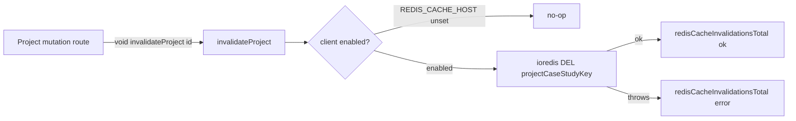

## Intent

The admin-api owns a thin Redis abstraction whose only job is to **invalidate**
(delete) cross-app read-cache entries when a project mutation lands. admin-api
is explicitly the **writer** for the shared cache entity: the module header
states it "only DELs keys (no read-through here)"
([redis-cache.ts:1-8](../../admin-api/src/lib/redis-cache.ts)). The read-through
side lives in another app (the public read path); this module never sets or
reads cached values, it only evicts them so the next public read repopulates
fresh data.

## When to apply

Apply this pattern when:

- One service **writes** data that a *different* service **caches** for reads,
  and the writer must keep the cache coherent without owning the read path.
- Cache coherence must never come at the cost of write availability — a
  down or slow Redis must not fail or stall the write. The module is built
  **fail-open**: `del` errors are swallowed and a disabled Redis is a no-op
  ([redis-cache.ts:40-59](../../admin-api/src/lib/redis-cache.ts)).
- The cache key is a **cross-repo contract** that both sides must agree on
  byte-for-byte. Here `projectCaseStudyKey` mirrors `@bedrock/shared`'s key and
  is locked by a test
  ([redis-cache.ts:5-7,17-19](../../admin-api/src/lib/redis-cache.ts);
  [redis-cache.test.ts:4-8](../../admin-api/src/lib/redis-cache.test.ts)).

## Structure



## Implementation in this codebase

### Key strategy

A single cache is managed, named `project_case_study`
([redis-cache.ts:13](../../admin-api/src/lib/redis-cache.ts)). The key format is:

```ts
function projectCaseStudyKey(projectId: string): string {
  return `shared:project:case_study:${projectId}:v1`;
}
```

([redis-cache.ts:17-19](../../admin-api/src/lib/redis-cache.ts)). The `:v1`
suffix is a schema version embedded in the key, and the `shared:` prefix marks
it as the cross-app namespace. The format is asserted exactly by test:
`projectCaseStudyKey('abc-123')` must equal
`shared:project:case_study:abc-123:v1`
([redis-cache.test.ts:4-8](../../admin-api/src/lib/redis-cache.test.ts)).

### TTL

This module sets **no TTL** — it only issues `DEL`
([redis-cache.ts:54](../../admin-api/src/lib/redis-cache.ts)). TTL (if any) is
owned by the read-through writer in the other app and is not visible here, so no
TTL value is documented.

### Connection and lazy enablement

The client is constructed lazily on first use and memoised via module-level
`_client` / `_enabled` ([redis-cache.ts:21-45](../../admin-api/src/lib/redis-cache.ts)).
Enablement is gated on `REDIS_CACHE_HOST`: if it is empty the cache is disabled
and every invalidation becomes a no-op
([redis-cache.ts:25-27,44,52](../../admin-api/src/lib/redis-cache.ts)). The
ioredis options are tuned for fail-open behaviour rather than durability:

```ts
const opts: RedisOptions = {
  host,
  port: Number(process.env['REDIS_CACHE_PORT'] ?? '6379'),
  password: process.env['REDIS_CACHE_PASSWORD'] || undefined,
  enableOfflineQueue: false,
  maxRetriesPerRequest: 1,
  connectTimeout: 1000,
  commandTimeout: 200,
  ...((process.env['REDIS_CACHE_TLS'] ?? 'false') === 'true' ? { tls: {} } : {}),
};
```

([redis-cache.ts:29-39](../../admin-api/src/lib/redis-cache.ts)). The short
`commandTimeout` of 200 ms, single retry, and disabled offline queue all serve
the rule that Redis latency must not pad or fail the write. The error handler is
intentionally empty (`c.on('error', () => {})`) to keep the process fail-open
([redis-cache.ts:40](../../admin-api/src/lib/redis-cache.ts)).

### Invalidation and fail-open guarantee

`invalidateProject` delegates to `invalidateProjectWith`, which guards a
disabled client, issues the `DEL`, and counts the outcome. A throwing client is
caught and counted as `error` rather than propagated
([redis-cache.ts:47-66](../../admin-api/src/lib/redis-cache.ts)):

```ts
async function invalidateProjectWith(c, projectId, count) {
  if (!c) return; // disabled — no-op
  try {
    await c.del(projectCaseStudyKey(projectId));
    count({ cache: CACHE_NAME, result: 'ok' });
  } catch {
    count({ cache: CACHE_NAME, result: 'error' });
  }
}
```

The test confirms a throwing `del` resolves to `undefined` (never throws) and
records `result: 'error'`
([redis-cache.test.ts:20-27](../../admin-api/src/lib/redis-cache.test.ts)).

### Where invalidation is triggered

Project mutation routes call `invalidateProject` **fire-and-forget** with `void`
so Redis latency or faults never pad or fail the write
([projects.ts:265](../../admin-api/src/routes/projects.ts) and its comment
"fire-and-forget — Redis latency/faults must never pad or fail the write" at
[projects.ts:264-265](../../admin-api/src/routes/projects.ts)). Invalidation
fires only after the mutation actually changed a row — routes return 404 when
`updated === 0` *before* invalidating
([projects.ts:263-265](../../admin-api/src/routes/projects.ts)). Operations that
affect two projects invalidate both via `Promise.all`:

- merge: `[targetId, ...sourceIds].map(invalidateProject)`
  ([projects.ts:491](../../admin-api/src/routes/projects.ts)).
- split: `[id, result.newProjectId].map(invalidateProject)`
  ([projects.ts:527](../../admin-api/src/routes/projects.ts)).

The router test enumerates the mutating routes and their expected invalidation
counts (PATCH/DELETE/confirm/regenerate/decision-patch/decision-delete/
architecture = 1; split and merge = 2), and asserts that `POST /` (create) does
**not** invalidate
([projects-invalidation.test.ts:88-144](../../admin-api/src/routes/projects-invalidation.test.ts)).

### Observability

Every invalidation increments the Prometheus counter
`redis_cache_invalidations_total`, labelled `cache` and `result` (`ok` | `error`)
([metrics.ts:67-75](../../admin-api/src/lib/observability/metrics.ts);
[redis-cache.ts:11,63-65](../../admin-api/src/lib/redis-cache.ts)). This makes
silent fail-open evictions observable: a rising `error` series signals a Redis
problem even though writes keep succeeding.

## Variants

- **Disabled in dev / unconfigured environments.** With `REDIS_CACHE_HOST`
  unset the whole abstraction degrades to a no-op, so the admin-api runs without
  a Redis dependency
  ([redis-cache.ts:25-27,52](../../admin-api/src/lib/redis-cache.ts)).
- **Multi-target invalidation.** Single-project routes pass one id; merge and
  split fan out over all affected project ids with `Promise.all`
  ([projects.ts:491,527](../../admin-api/src/routes/projects.ts)).
- **Test seam.** `__test` exports `projectCaseStudyKey` and the injectable
  `invalidateProjectWith` (which takes the client and the counter callback) so
  behaviour is unit-testable without a live Redis or the real metric
  ([redis-cache.ts:68](../../admin-api/src/lib/redis-cache.ts);
  [redis-cache.test.ts:1-28](../../admin-api/src/lib/redis-cache.test.ts)).

<!--
Evidence trail — 2026-06-16
- Read admin-api/src/lib/redis-cache.ts (full, 69 lines): CACHE_NAME, key format,
  lazy client w/ REDIS_CACHE_* env, ioredis opts, fail-open del, __test exports.
- Read admin-api/src/lib/redis-cache.test.ts (full): key-format contract + ok/error counting.
- Read admin-api/src/routes/projects-invalidation.test.ts (full): mutating-route invalidation counts, create does NOT invalidate.
- Read admin-api/src/lib/observability/metrics.ts:60-75: redis_cache_invalidations_total counter, labels cache/result.
- grep + read admin-api/src/routes/projects.ts: invalidateProject import (line 59) and 10 call sites incl. void fire-and-forget and Promise.all fan-out (merge 491, split 527).
Omitted / uncertain:
- TTL value: not set in this module (DEL-only); owned by the read-through writer in another app — not documented to avoid invention.
- docs/decisions/redis-read-cache-shared-key-invalidation.md referenced in the source header was NOT found under docs/decisions/ or admin-api/docs/decisions/ at write time; mentioned only as a referenced contract, not linked.
- @bedrock/shared projectCaseStudyKey: named in the source header as the cross-repo counterpart; its source was not read (out of repo), so only the contract relationship is stated.
-->
