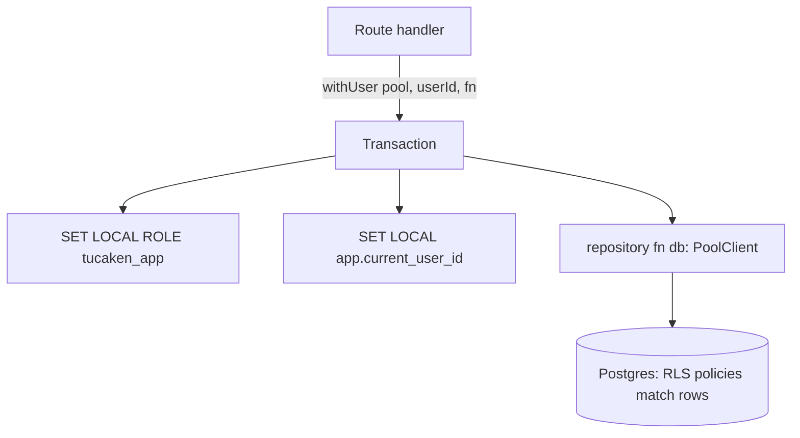

## Intent

Keep all SQL in per-domain repository modules that take a generic `Queryable`,
and enforce per-user data isolation at the **database** tier via Postgres
row-level security (RLS) rather than in application code. A repository never
resolves or filters on `user_id` itself — RLS does — so a forgotten `WHERE
user_id = …` cannot leak another tenant's rows.

## When to apply

Apply for any user-scoped read or write in admin-api: list/detail projections
and small user-edit writers belong in a repository module
([projects.ts](../../admin-api/src/lib/repositories/projects.ts#L1-L13)). Use the
RLS wrapper `withUser` whenever the query must be confined to one user's rows. Do
**not** wrap superuser operations that legitimately span users — provisioning and
article writes run outside `withUser` and bypass RLS by design
([pg.ts](../../admin-api/src/lib/pg.ts#L11-L17)).

## Structure

Repository functions accept a `Queryable` — the shared interface satisfied by
both `Pool` and `PoolClient`
([pg.ts](../../admin-api/src/lib/pg.ts#L22)) — so the route layer owns the
transaction boundary and can compose multiple repository calls into one atomic
unit. For user-scoped work, the route wraps those calls in `withUser`.

`withUser` acquires a client, opens a transaction, demotes to the low-privilege
`tucaken_app` role so RLS policies apply, and sets `app.current_user_id` to drive
the isolation policies — both settings are transaction-local and revert
automatically on commit or rollback
([pg.ts](../../admin-api/src/lib/pg.ts#L41-L60)).

## Implementation in this codebase

The pattern lives in [admin-api/src/lib/pg.ts](../../admin-api/src/lib/pg.ts)
(the `Queryable` type, `getPool`, and `withUser`) and the per-domain modules
under [admin-api/src/lib/repositories/](../../admin-api/src/lib/repositories/) —
applications, articles, projects, resumes, users, pipeline-runs, career-history,
interview-stages, and more. Each module documents that it runs against the
caller's `Queryable` and never resolves the user id, leaving isolation to RLS
([projects.ts](../../admin-api/src/lib/repositories/projects.ts#L5-L13)). The pool
connects as superuser through PgBouncer in transaction mode (max 5 client
connections multiplexed to ≤20 server connections)
([pg.ts](../../admin-api/src/lib/pg.ts#L4-L9)); `withUser` is what steps each
user-scoped transaction down to the RLS-bound role.

## Variants

- **Superuser (RLS-bypassing) queries** — provisioning and article writes run
  directly against the `Pool` outside `withUser`, intentionally spanning users
  ([pg.ts](../../admin-api/src/lib/pg.ts#L11-L17)).
- **Caller-owned transactions** — writers like `ensureDefaultProject` take a
  `Queryable` so the route can commit a repo insert and a project create together
  in one transaction
  ([projects.ts](../../admin-api/src/lib/repositories/projects.ts#L30-L40)).

<!--
Evidence trail (auto-generated):
- Source: admin-api/src/lib/pg.ts (read on 2026-06-16, lines 1-60)
- Source: admin-api/src/lib/repositories/projects.ts (read on 2026-06-16, lines 1-40)
-->
