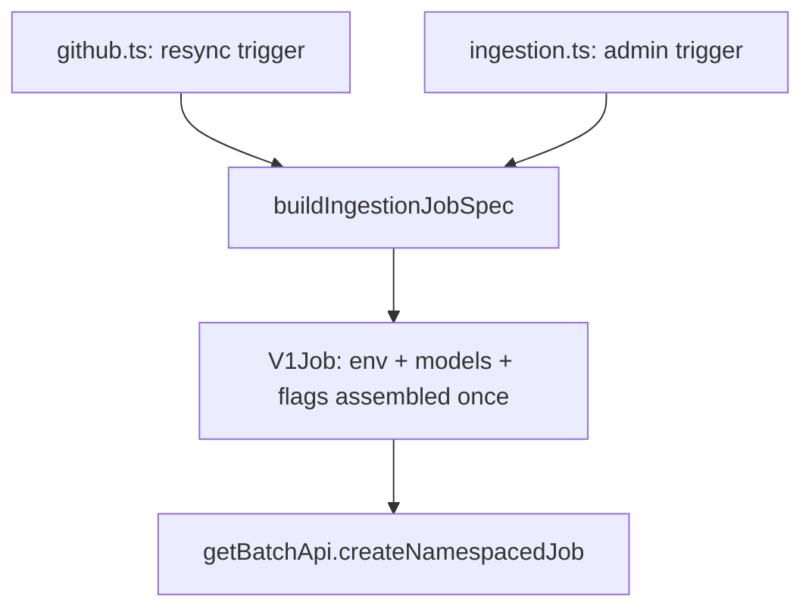

## Intent

When two or more code paths dispatch the *same* background workload from
different triggers, build the Job spec in exactly one function so an env var,
flag, or model id added for one trigger can never be silently absent from the
other. The ingestion worker has two triggers — user-facing resync and admin
trigger — and a single builder, `buildIngestionJobSpec`, owns the spec for both
([ingestion-job.ts](../../admin-api/src/lib/ingestion-job.ts#L24-L44)).

## When to apply

Apply when multiple entrypoints produce the same kind of background Job and the
spec carries correctness-critical env (model ids, feature flags) where an
omission fails silently rather than loudly. This pattern directly addresses a
real drift incident: `DEFER_ENRICHMENT` shipped to the admin path but not the
live resync path because each route built the spec inline
([ingestion-job.ts](../../admin-api/src/lib/ingestion-job.ts#L24-L35)). Do *not*
reach for it when two workloads merely look similar but have genuinely divergent
lifecycles — forcing unlike specs through one function adds branching that is
worse than two clear builders.

## Structure

The shared builder takes the common arguments plus a small options object for the
per-path differences, and assembles the env, labels, annotations, retry policy,
and resources once.

Per-path variation is parameterised through `IngestionJobOptions` —
`githubToken` (resync supplies the per-user installation token),
`extraSecretRefs`, and `extraAnnotations`
([ingestion-job.ts](../../admin-api/src/lib/ingestion-job.ts#L15-L22)). Everything
correctness-critical — `DEFER_ENRICHMENT`, `ENRICHMENT_MODEL_ID`,
`RETRIEVAL_PROBE_MODEL_ID`, the profile-synthesis model ids via
`ingestionModelEnv`, observability env, and `MODEL_JOB_BACKOFF_LIMIT` — is
assembled inside the builder so neither path can omit it
([ingestion-job.ts](../../admin-api/src/lib/ingestion-job.ts#L82-L104)).

## Implementation in this codebase

The builder lives in
[admin-api/src/lib/ingestion-job.ts](../../admin-api/src/lib/ingestion-job.ts).
The resync path calls it from
[routes/github.ts](../../admin-api/src/routes/github.ts#L418) (POST
`/github/connected-repos`) and the admin path from
[routes/ingestion.ts](../../admin-api/src/routes/ingestion.ts#L38-L48) (POST
`/ingestion/trigger`), both then dispatching via
`getBatchApi().createNamespacedJob` into `cfg.ingestionNamespace`. Labels are
lossily sanitised, so the builder also writes the unsanitised user id and repo
full name into Job annotations
([ingestion-job.ts](../../admin-api/src/lib/ingestion-job.ts#L59-L67)) so a
terminally-failed Job can be mapped back to its `repo_sync_state` row by the
platform-job-watcher sweep — a detail both trigger paths get for free.

## Variants

The broader `buildPipelineJob`
([k8s-job-builder.ts](../../admin-api/src/lib/k8s-job-builder.ts#L122-L175)) is
the generalised form of this pattern for the article, strategist, and coach
pipelines, taking a full `BuildJobInput` rather than ingestion-specific
arguments. Both share the same exported helpers (`traceParentEnv`,
`observabilityEnv`, `MODEL_JOB_BACKOFF_LIMIT`); `buildIngestionJobSpec` is the
specialised variant for the one workload with two triggers and a fixed env shape.

<!--
Evidence trail (auto-generated):
- Source: admin-api/src/lib/ingestion-job.ts (read on 2026-06-16, full file 1-118)
- Source: admin-api/src/routes/github.ts (grep on 2026-06-16, line 418)
- Source: admin-api/src/routes/ingestion.ts (grep on 2026-06-16, lines 38-48)
- Source: admin-api/src/lib/k8s-job-builder.ts (read on 2026-06-16, lines 122-175)
-->
