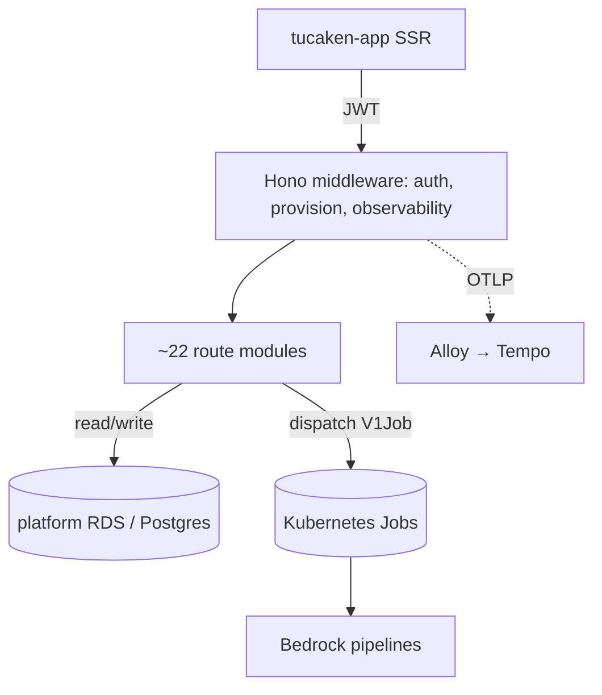

## What it does

admin-api is the Backend-for-Frontend (BFF) for the tucaken-app TanStack
application — a Hono service on Node that provides the write-heavy REST
endpoints the SSR frontend cannot serve directly
([admin-api/package.json](../../admin-api/package.json#L4)). Its distinctive job
is orchestration: rather than running long Bedrock pipelines in its own request
handlers, it validates a request and dispatches the work as a Kubernetes Job
(ingestion, article, strategist/coach, resume-import, project case-study). It
owns Cognito-authenticated APIs, the Postgres data layer, GitHub App
integration, and the observability wiring those background Jobs inherit.

## Architecture



The Hono app entrypoint wires global middleware then mounts the route modules
([index.ts](../../admin-api/src/index.ts#L19-L53)). Requests under
`/api/admin/*` are protected by Cognito JWT middleware; `/healthz` is exempt
because Kubernetes probes cannot send JWTs
([index.ts](../../admin-api/src/index.ts#L6-L11)). Routes either touch Postgres
through the repository layer or build a Job spec and submit it to the cluster.

## Runtime contract

Configuration is validated at startup by `loadConfig()`, which throws
immediately if any required env var is absent — misconfiguration surfaces as a
CrashLoopBackOff visible in ArgoCD rather than a runtime error on the first
request ([index.ts](../../admin-api/src/index.ts#L55-L60)). AWS SDK credentials
come from **EKS Pod Identity** — the `admin-api` service account is mapped to a
dedicated IAM role, so no AWS secrets live in the pod
([verified via `aws eks list-pod-identity-associations` on 2026-06-16]; note the
`index.ts` comment at L6-L16 still says "EC2 Instance Profile (IMDS)", which is
stale — the pod does not use the node instance profile). It listens on port 3002,
talks to Postgres (`pg`), Redis (`ioredis`), the Kubernetes BatchV1 API
(`@kubernetes/client-node`), Cognito, S3, CloudWatch, and Cost Explorer
([admin-api/package.json](../../admin-api/package.json#L19-L40)). Uncaught
rejections are logged with full context and the process exits non-zero so
Kubernetes restarts a clean pod ([index.ts](../../admin-api/src/index.ts#L62-L70)).

## Repository layout

```text
admin-api/src/
  index.ts        # Hono entrypoint, startup validation, crash safety nets
  routes/         # ~22 route modules (applications, github, ingestion, ...)
  lib/            # k8s job builders, config, pg, redis-cache, repositories/
  middleware/     # cognito auth, m2m auth, user-provision, observability
  scripts/        # operational scripts (reconcile github installations, ...)
```

## How to run locally

```bash
yarn workspace @repo/admin-api dev   # tsx watch with telemetry preloaded
```

The `dev` script loads OTel telemetry via `--import` before the app starts
([admin-api/package.json](../../admin-api/package.json#L8)). A helper script
`admin-api/scripts/local-admin-api.sh` also exists for local bring-up.

## Deploy

Pushes to `main` that touch `admin-api/**` trigger the
[deploy-admin-api workflow](../../.github/workflows/deploy-admin-api.yml), which
builds and pushes the image to ECR. ArgoCD Image Updater then picks up the new
tag, writes it back to the kubernetes-bootstrap repo, and ArgoCD reconciles the
admin-api Rollout — there is no CI promote step; Image Updater fully owns
post-push deployment
([.github/workflows/deploy-admin-api.yml](../../.github/workflows/deploy-admin-api.yml#L1-L20)).

## Related projects

- **tucaken-app** (this repo's root) — the TanStack Start SSR frontend admin-api
  serves.
- **ai-applications** (sibling repo) — houses the Bedrock worker images
  (`run-ingestion.js`, `run-coach.js`, strategist) that admin-api dispatches as
  Jobs; their internals are documented there, not here.

## Deeper detail

- [API-dispatched Kubernetes Jobs](../concepts/api-dispatched-k8s-jobs.md) —
  how routes build and submit Job specs.
- [Distributed tracing from API request to worker pod](../concepts/distributed-tracing-api-to-worker.md)
  — TRACEPARENT propagation across the async boundary.
- [Four-pillar observability — traces, metrics, logs, profiles](../concepts/four-pillars-observability.md)
  — OTel/Prometheus/Loki/Pyroscope wiring and trace correlation.
- [Bedrock cost observability — estimated vs billed](../concepts/bedrock-cost-observability.md)
  — CloudWatch + Cost Explorer and per-invocation `prompt_invocations` cost.
- [Single shared Job spec for multi-path dispatch](../patterns/shared-ingestion-job-spec.md)
  — the multi-trigger ingestion builder.
- [No Job-level retry for model-invoking Kubernetes Jobs](../decisions/0005-no-retry-on-model-jobs.md)
  — the Bedrock cost-control retry decision.
- [Cognito JWT verification — user and service (M2M) tokens](../concepts/cognito-jwks-verification.md)
  — server-side JWKS verification, M2M scope enforcement, authorisation layers.
- [Repository layer with database-enforced row-level security](../patterns/repository-layer-rls.md)
  — `withUser` + Postgres RLS for per-tenant data isolation.
- [Fail-fast on startup config, fail-soft on async-synced config](../decisions/0006-fail-soft-on-async-synced-config.md)
  — 502/503 guards for ESO-synced Job images vs CrashLoop on missing required env.
- [Duplicate ingestion Jobs for the same repo](../troubleshooting/duplicate-ingestion-jobs.md)
  — current read-then-mark dedup, its TOCTOU gap, and the atomic-claim hardening.
- [Cognito User Pool provisioning and updates](../runbooks/cognito-setup.md)
  — the provider/M2M/password-auth/prod-URL setup scripts.
- [Run the strategist matcher on Sonnet, decoupled from the article model](../decisions/0009-sonnet-strategist-matcher.md)
  — per-stage model selection.
- [Stamp the dispatched Job image onto pipeline runs](../decisions/0010-pipeline-image-sha-stamping.md)
  — provenance: which image produced which run.
- [Redis cache invalidation](../patterns/redis-cache.md)
  — fail-open project-cache invalidator (admin-api is the writer).
- [Validate every server boundary](../patterns/server-boundary-validation.md)
  — Zod in server fns; mixed Zod/manual guards in admin-api routes.
- [Pyroscope continuous profiling](../tools/pyroscope-profiling.md)
  — CPU/heap profiling config and enablement.
- [FinOps /costs returns zero despite real Bedrock spend](../troubleshooting/finops-costs-empty-untagged-bedrock.md)
  — live-verified `Project=bedrock` tag-filter gap.

<!--
Evidence trail (auto-generated):
- Source: admin-api/src/index.ts (read on 2026-06-16, lines 1-70)
- Source: admin-api/package.json (read on 2026-06-16, full file)
- Source: .github/workflows/deploy-admin-api.yml (read on 2026-06-16, lines 1-30)
-->
