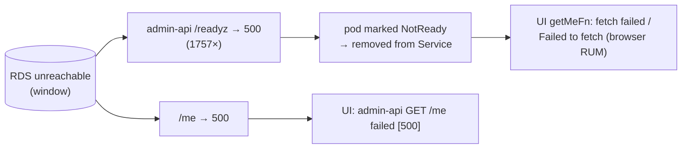

## Scope & method

Live review of the **`portfolio-admin`** telemetry — the browser-facing tucaken
UI (Faro `app_name="portfolio-admin"`) and its backend **`admin-api`** — read
from the shared Grafana stack on **2026-07-04**. Windows: RUM over **7 days**,
admin-api over **24 hours**. Both halves live in the **same repository**
(`tucaken-app`): the Vite/TanStack UI at the repo root, the Hono BFF under
`admin-api/`. This report reviews their metrics and errors, identifies gaps, and
assesses whether the two need to be **decoupled**.

> The industry bars are Google's Core Web Vitals thresholds and standard SRE
> norms (error budget, RED). Traffic is low (50 UI sessions / ~42k admin-api
> requests in-window), so treat percentages as directional.

## Executive summary

| Area | Verdict |
|:-----|:--------|
| tucaken UI loading (LCP/INP) | 🟢 Good — LCP 140 ms, INP 64 ms |
| tucaken UI **TTFB / FCP** | 🔴 **Poor — TTFB 2.4 s, FCP 2.9 s** (SSR/auth on the critical path) |
| tucaken UI visual stability (CLS) | 🟡 72.9% good (< 75% bar); comments/ai-agent/billing pages shift |
| tucaken UI **errors** | 🔴 **58 JS errors, ~all `getMeFn` → admin-api `/me` failures** |
| admin-api RED + runtime | 🟢 Well-instrumented; p95 0.42 s; event-loop lag 10 ms |
| admin-api **`/readyz` reliability** | 🔴 **1757 `500`s/24 h** (DB-reachability flapping; currently recovered) |
| Instrumentation coverage | 🟢 Strong — both sides expose `/metrics`, traces, RUM |
| **Decoupling** | **Not needed** — already runtime-decoupled; problems are reliability, not repo structure |

The headline: **instrumentation is excellent, reliability is the problem.** The
UI errors and the admin-api `/readyz` failures are two ends of **one** causal
chain.

---

## Part A — tucaken UI (`portfolio-admin`) RUM

### Volume & Core Web Vitals (p75, 7 d)

| Metric | What it should be | What it is | Rating |
|:-------|:------------------|:-----------|:------:|
| LCP | ≤ 2500 ms | **140 ms** | 🟢 |
| INP | ≤ 200 ms | **64 ms** | 🟢 |
| CLS | ≤ 0.10 | 0.026 agg (72.9% good / 22% ni / 5.1% poor) | 🟡 |
| **TTFB** | ≤ 800 ms | **2431 ms** | 🔴 poor |
| **FCP** | ≤ 1800 ms | **2914 ms** | 🔴 needs-improvement→poor |

Volume: 11 102 RUM events, 50 sessions, 56 page loads.

**Read:** once bytes arrive the app is fast (LCP/INP excellent), but **TTFB 2.4 s**
means the server takes ~2.4 s to send the first byte — SSR auth/session work
(and likely a DB round-trip via admin-api) sits on the critical path, and FCP
inherits the delay. This is the opposite of the portfolio site (TTFB 40 ms) and
is tucaken's single biggest performance gap. **CLS** is below the 75%-good bar;
the offenders (from the RUM dashboard) are `tucaken.io/comments` (0.13),
`/ai-agent` (0.32), `/billing` (0.22) — late-loading content without reserved
space.

### Errors — the dominant signal

**58 JS errors** in 7 days, almost all the **same failure**: the dashboard's
`getMeFn` (current-user fetch to `admin-api /me`) failing.

| Count | Error |
|------:|:------|
| 16 | `getMeFn failed: No session cookie found` |
| 14 | `getMeFn failed: fetch failed` |
| 10 | `fetch failed` |
| 8 | `getMeFn failed: admin-api GET /me failed [500] — Internal…` |
| 4 | `getMeFn failed: Failed to fetch` |

Two distinct causes are mixed here:

1. **Expected-unauthenticated** (`No session cookie found`) — logged as
   `console.error` and therefore captured by Faro as an *exception*. A visitor
   with no session is **not an error**; this inflates the error count and
   trains you to ignore the panel.
2. **Real backend unavailability** (`fetch failed`, `Failed to fetch`, `[500]`)
   — the browser could not reach a healthy admin-api. This correlates directly
   with Part B.

---

## Part B — admin-api backend

### RED & runtime (24 h) — the instrumentation is good

| Metric | What it should be | What it is | Rating |
|:-------|:------------------|:-----------|:------:|
| Request rate | — | ~0.49 req/s | — |
| p95 duration | < 500 ms | **422 ms** | 🟢 |
| Event-loop lag p90 | < 50 ms | **10 ms** | 🟢 |
| Heap used | < 80% limit | 79 MB | 🟢 |

admin-api exposes full **RED** (`http_requests_total`,
`http_request_duration_seconds`), an **auth funnel** (`auth_provision_total`),
Node runtime, **OTel traces**, and already has observability alert rules
(`AuthProvisionMetricAbsent`, etc.). This is a mature, well-instrumented
service — notably *better* instrumented than the portfolio's Next.js pod (which
has no HTTP RED).

### The reliability gap — `/readyz` is flapping

Status-code breakdown (24 h): `200`: 40 269 · `202`: 3 · **`500`: 1836**. Where
the 500s land:

| Route | 500s (24 h) | Meaning |
|:------|:-----------:|:--------|
| **`/readyz`** | **1757** | Readiness probe — **"DB reachable"** — failing ~20% of probes |
| `/api/admin/applications/:slug` | 78 | Real application errors |
| `/api/admin/me` | 1 | The `/me` 500 the UI reported |

`/readyz` checks DB reachability. **1757 failures/24 h** means the DB was
unreachable for a sustained window, so Kubernetes marked the pod **NotReady** and
pulled it from the Service — which is exactly what produces the UI's
`getMeFn: fetch failed` / `Failed to fetch` burst. **Currently `/readyz` 500 =
0** in the last hour, so this was an *episode* (a DB restart, connection-pool
exhaustion, or a transient network/credentials window), not a steady state — but
it is unalerted and it cascaded into user-visible failures.

---

## Part C — the causal chain (why this is one problem)

The admin-api `/readyz` metric (server) and the tucaken `getMeFn` errors
(browser RUM) are the **same incident** seen from two ends. Neither side alone
tells the story; correlating them does.

---

## Gaps identified (prioritised)

1. **No alert on admin-api readiness / DB reachability.** 1757 `/readyz` 500s
   went unpaged. Add `AdminApiNotReady` (`/readyz` 5xx rate > 0 for N min) and a
   DB-reachability alert, so the next episode pages instead of surfacing as UI
   errors. **Highest leverage.**
2. **`getMeFn` conflates "unauthenticated" with "failure."** Stop
   `console.error`-ing the expected `No session cookie` case (return an
   anonymous state); reserve error logging for genuine failures. This alone
   removes ~16/58 errors and de-noises the RUM error panel.
3. **UI has no resilience on the `/me` call.** Add retry-with-backoff and a
   graceful degraded state when admin-api is briefly unavailable, so a pod
   restart doesn't become a visible error.
4. **TTFB 2.4 s / FCP 2.9 s.** Get the DB/auth round-trip off the SSR critical
   path (cache the session/`/me` result, warm the pod, or defer non-critical
   data), targeting TTFB < 800 ms.
5. **CLS < 75% good** on comments/ai-agent/billing — reserve space for
   late-loading content (images, embeds, fonts).
6. **UI SSR RED metrics not clearly populated.** The UI server registers
   prom-client HTTP counters and appears in Prometheus as `service="tucaken-app"`,
   but `http_requests_total{service="tucaken-app"}` returned no rate — verify the
   SSR request metrics are actually incremented and scraped (the browser RUM is
   fine; this is the *server* side of the UI).
7. **No combined UI↔admin-api view.** A dashboard row correlating RUM `getMeFn`
   errors with admin-api `/me` + `/readyz` 5xx would make Part C's chain visible
   at a glance.

---

## Decoupling assessment — is a split needed?

**Current state:** one repo (`tucaken-app`), but the two halves are **already
runtime-decoupled**:

- separate build artifacts (root `Dockerfile` for the UI, `admin-api/` its own),
- **separate deploy pipelines** (`deploy.yml` and `deploy-admin-api.yml`),
- separate Kubernetes Services and preview envs (`tucaken-app`,
  `tucaken-app-preview`, `admin-api`, `admin-api-preview`),
- separate metrics/traces (`service="tucaken-app"` vs `service="admin-api"`).

**Recommendation: keep the monorepo — do not split.**

- The coupling that actually matters — **deploy, scale, and failure isolation** —
  is *already* separate. A pod-level fault in admin-api does not require
  rebuilding or redeploying the UI.
- The problems in this review (readiness flapping, `/me` resilience, SSR TTFB)
  are **reliability and contract-resilience** issues. **Splitting the repo would
  not fix any of them** and would *add* overhead: the UI↔API contract (the `/me`,
  applications shapes) would need to be published/duplicated across repos, and
  cross-cutting changes would need coordinated two-repo PRs.
- At a solo/small-team scale with a shared, co-evolving contract, a monorepo with
  clean module boundaries is the lower-friction choice.

**What to harden instead of splitting:**

- Make the UI↔admin-api contract explicit (a shared types module/package inside
  the monorepo) so the boundary is enforced in code, not just by folder.
- Add the resilience layer at the UI→admin-api boundary (gaps 2–3) — this is the
  real "decoupling" that reduces blast radius.

**Revisit a repo split only if:** admin-api gains other consumers, needs an
independent release cadence or a separate compliance/ownership boundary, or the
combined CI becomes a bottleneck. None apply today.

## Related

- [Four-pillar observability](../concepts/four-pillars-observability.md)
- [admin-api — Backend-for-Frontend](../projects/admin-api.md)

<!--
Evidence trail (live 2026-07-04):
- RUM portfolio-admin 7d: 11102 events, 50 sessions, 56 page loads, 58 JS errors
- CWV p75: LCP 140ms, INP 64ms, CLS 0.026 agg (72.9/22.0/5.1), TTFB 2431ms, FCP 2914ms
- Top errors: getMeFn No session cookie 16, fetch failed 14+10, /me 500 8, Failed to fetch 4
- admin-api 24h: req/s 0.49; status 200=40269, 202=3, 500=1836; p95 0.422s; eventloop p90 10ms; heap 79MB
- 5xx routes: /readyz 1757, /api/admin/applications/:slug 78, /api/admin/me 1; /readyz 500 last 1h = 0
- Prometheus service label values: admin-api(-preview), portfolio-admin, portfolio-frontend, tucaken-app(-preview)
- Repo: root Vite UI + admin-api/ subdir; pipelines deploy.yml + deploy-admin-api.yml; /readyz = DB-reachable (admin-api/src/routes/observability.ts)
-->
