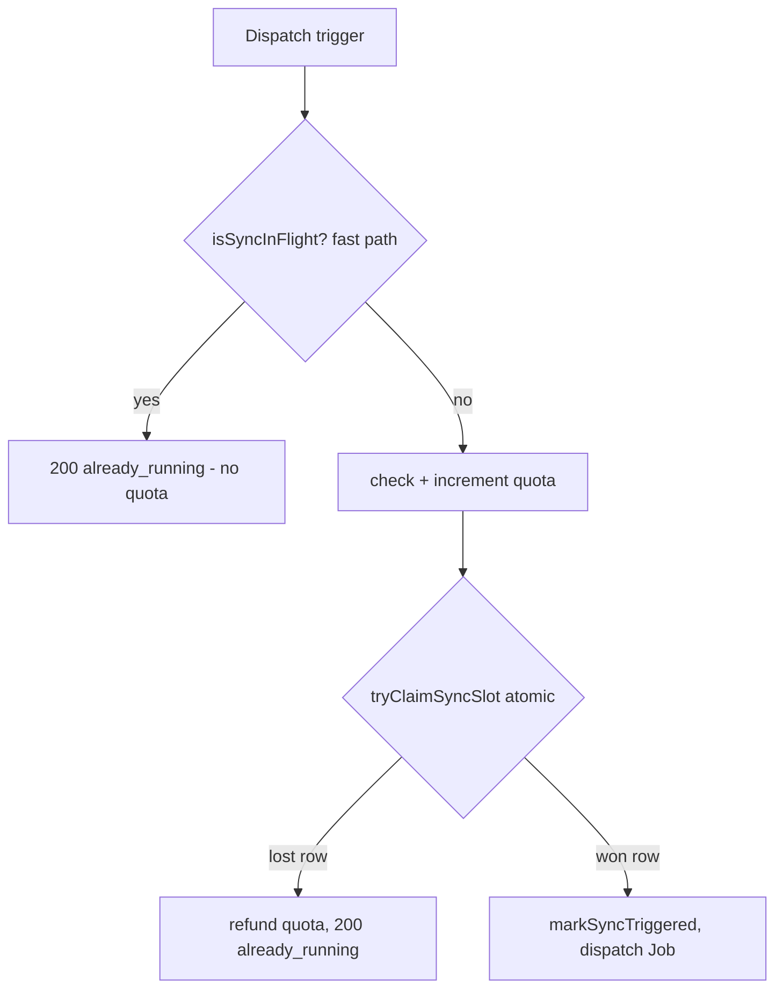

## Symptom

Two ingestion Jobs are dispatched for the same `(user_id, repo_full_name)` at
nearly the same time. Triggers seen in practice: a user double-clicking "add
repo", or a GitHub push webhook firing while a manual sync for the same repo is
already in flight. The two Jobs then run the same pipeline concurrently and race
their writes on `document_embeddings`. A duplicate dispatch also risks
double-charging the monthly ingestion quota.

## Root cause

Job dispatch is fire-and-forget: the handler returns `202` and never awaits the
Job ([sync-state.ts](../../admin-api/src/lib/sync-state.ts#L14-L19)). A naive
guard that reads `sync_status` and then acts has a check-then-act (TOCTOU) gap —
two rapid triggers can both read a stale `complete` status and both dispatch.
Because `repo_sync_state` has a primary key of `(user_id, repo_full_name)` —
exactly one row per repo — the fix is to make the state transition itself the
lock rather than relying on a separate read.

## How it was fixed (PR #113)

A single source of truth for the claim, `admin-api/src/lib/sync-state.ts`, with
two functions used by every dispatch site so the SQL cannot drift:

- **`tryClaimSyncSlot`** — atomically claims the slot with one statement:
  `INSERT … ON CONFLICT (user_id, repo_full_name) DO UPDATE SET sync_status =
  'pending' … WHERE repo_sync_state.sync_status NOT IN ('pending','syncing')
  RETURNING …`. The conditional `UPDATE` is the lock: a caller that gets no row
  back lost the race and MUST skip dispatch
  ([sync-state.ts](../../admin-api/src/lib/sync-state.ts#L54-L69)).
- **`isSyncInFlight`** — a cheap, non-mutating pre-check used as a fast path
  before quota is consumed, so a duplicate never burns a monthly credit; it is
  not race-free on its own and is always paired with the atomic claim
  ([sync-state.ts](../../admin-api/src/lib/sync-state.ts#L31-L43)).



The guard is wired into every non-pending dispatch path:

- **`POST /connected-repos`** — `isSyncInFlight` fast path returns
  `already_running` without consuming quota
  ([github.ts](../../admin-api/src/routes/github.ts#L929-L931)); after the quota
  increment, `tryClaimSyncSlot` is the race-free backstop, and a lost claim
  refunds the quota and returns `already_running`
  ([github.ts](../../admin-api/src/routes/github.ts#L956-L961)).
- **`POST /connected-repos/:fullName/retry`** — `tryClaimSyncSlot` makes a racing
  second retry a no-op; retry charges no new quota so there is nothing to refund
  ([github.ts](../../admin-api/src/routes/github.ts#L1087-L1089)).
- **Push webhook** — after the cooldown/status checks (themselves check-then-act),
  `tryClaimSyncSlot` is the real gate; a lost claim refunds quota and skips
  ([github.ts](../../admin-api/src/routes/github.ts#L1367-L1372)).
- **Admin trigger (`/ingestion`)** — guarded by `tryClaimSyncSlot` before dispatch
  ([ingestion.ts](../../admin-api/src/routes/ingestion.ts#L175)).

The deferred-sync path is **intentionally excluded**: `deferSync` parks repos in
`sync_status = 'pending'` *before* dispatch, so claiming there would reject its
own queue. It dedups on the `last_sync_triggered_at IS NULL` predicate instead
([sync-state.ts](../../admin-api/src/lib/sync-state.ts#L8-L12)).

## How to diagnose

If duplicate Jobs are still suspected, check the authoritative state row (the
dedup key) and the live Jobs:

```bash
# The repo_sync_state row — PK (user_id, repo_full_name); the claim sets it 'pending'
psql "$PG_URL" -c "SELECT sync_status, last_sync_triggered_at, updated_at \
  FROM repo_sync_state WHERE user_id = '<uuid>' AND repo_full_name = '<owner/repo>';"

# Jobs for that repo (labels are sanitised owner-repo + user id)
kubectl get jobs -n <ingestion-namespace> -l app=ingestion-worker --show-labels | grep <repo-slug>
```

A repo stuck in `pending`/`syncing` with a stale `updated_at` indicates a Job that
died without writing a terminal status; the next dispatch is then correctly
rejected by the claim until the row is reconciled to a terminal state (the
read-time reconcile / `mark-timed-out` path resets it).

## How to prevent

- **Make the state transition the lock.** A conditional `UPDATE` guarded by the
  current status (`WHERE sync_status NOT IN (...)`) is race-free where a separate
  `SELECT` then `UPDATE` is not. Keep the claim SQL in one shared module so no
  dispatch site reintroduces a check-then-act gap.
- **Claim before side effects, refund on loss.** Run the cheap `isSyncInFlight`
  read before charging quota, and refund quota whenever the atomic claim is lost,
  so a duplicate trigger never costs the user a credit.
- **Be explicit about exclusions.** The deferred-sync queue opts out by design;
  document why so it is not "fixed" into rejecting its own pending rows.

## Related

- [Single shared Job spec for multi-path dispatch](../patterns/shared-ingestion-job-spec.md)
  — the builder these dispatch sites use once the claim is won.

<!--
Evidence trail (auto-generated):
- Source: admin-api/src/lib/sync-state.ts (read on 2026-06-16, full file 1-72)
- Source: admin-api/src/routes/github.ts (read on 2026-06-16, lines 924-975, 1080-1095, 1355-1375)
- Source: admin-api/src/routes/ingestion.ts (grep on 2026-06-16, line 175)
- Verified on 2026-06-16: sync-state.ts present; tryClaimSyncSlot/isSyncInFlight
  wired into github.ts (929,956,1087,1367) and ingestion.ts (175). PR #113
  (commit 1b48657) is an ancestor of HEAD (rebased onto origin/main).
- Supersedes the earlier draft of this doc, which (written against a stale
  pre-rebase base) wrongly stated the atomic claim was absent.
-->
