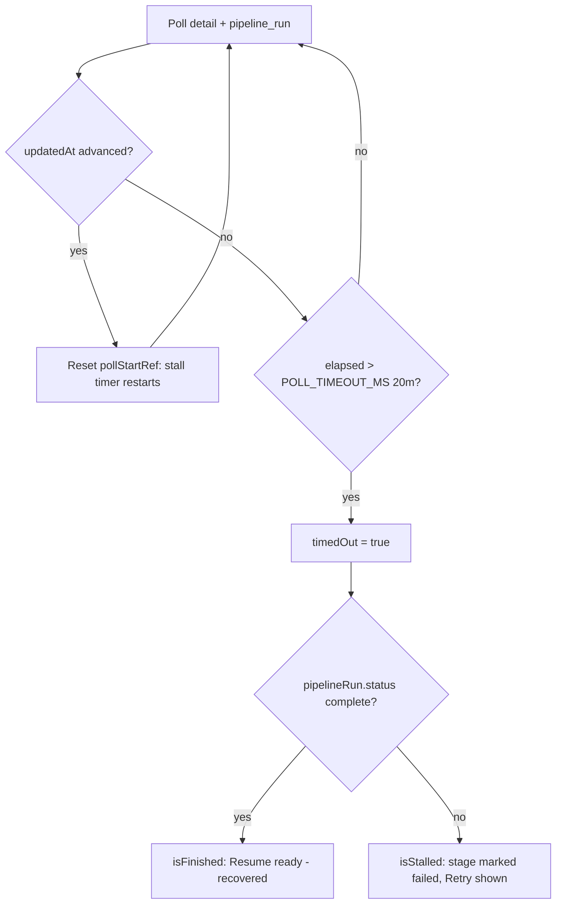

The Tucaken Strategist pipeline (job-description analysis then resume build) runs
as a Kubernetes Job and is tracked from the browser by polling. The run is
rendered as a multi-stage stepper in `ProgressBars`. This is a **resolved** issue,
fixed by PR #128 (commits `f8fac5b` and `d4f175c`). It covers two defects on that
surface: a long-but-healthy or already-finished run being declared "Build timed
out", and the stepper spinner continuing to spin on a terminal state. The current
working tree contains the fix; the citations below point at the post-fix code.

## Symptom

What users saw before the fix, all on the in-flight run modal:

- A successful run that took about 10m46s displayed as "Build timed out". The UI's
  poll had a hard 10-minute wall-clock cap from poll-start; once it tripped it
  stopped polling forever, so the run finishing roughly 46s later was never seen
  (commit `f8fac5b`).
- A timed-out run (`pipeline_runs` not literally `failed`, application status still
  `analysing`) kept a stage in the spinning `current` state: the header read
  "Build timed out" while "Writing your resume" was still spinning, alongside a
  Retry button (commit `d4f175c`).
- The "we'll notify you when it's ready" reassurance and the live elapsed timer
  stayed active even though nothing was running (commit `d4f175c`).

## Root cause

Two independent defects.

1. **Hard wall-clock cap that never reset.** Before commit `f8fac5b`,
   `POLL_TIMEOUT_MS` in the detail-poll hook was a fixed 10-minute cap measured
   from the first active poll, and once it tripped the hook stopped polling
   permanently. A healthy run slower than 10 minutes, or one that finished shortly
   after the cap fired, was therefore mislabelled "timed out" and never recovered.

2. **Terminal state not modelled in the stepper.** Before commit `d4f175c`,
   `ProgressBars` handled `isFailed` in the stage stepper but not the `timedOut`
   case. A timed-out run is neither `isFailed` (the application status is still
   `analysing`, not `failed`) nor `isFinished`, so the happy-path branch of
   `getStageStatus` left the active stage in `current` and rendered the spinning
   loader, while the elapsed timer and the reassurance footer also stayed live.

## How it was fixed

Both fixes are flow-state changes, not infrastructure changes.

### Stall-based timeout that resets on progress

The cap was raised from 10 minutes to a 20-minute stall backstop — above the
slowest observed successful run (about 11 minutes) — and the timer now resets
whenever the run advances. See
[src/hooks/use-admin-applications.ts](../../src/hooks/use-admin-applications.ts#L10-L16):

```ts
const PIPELINE_POLL_INTERVAL = 5_000
// Backstop: give up only after this long with NO observed progress. The timer
// resets whenever the run advances (its updatedAt changes) ...
const POLL_TIMEOUT_MS = 20 * 60 * 1_000
```

In `useApplicationDetail`, a `lastUpdatedRef` tracks the last-seen `updatedAt`;
when it advances, `pollStartRef` is reset so the stall timer restarts. The poll
gives up only after `POLL_TIMEOUT_MS` with no progress
([src/hooks/use-admin-applications.ts](../../src/hooks/use-admin-applications.ts#L146-L163)).
Both refs are cleared when the run leaves the active states
([src/hooks/use-admin-applications.ts](../../src/hooks/use-admin-applications.ts#L169-L182)).

### Recovery: pipeline-run completion counts as finished

`ProgressBars` makes `isFinished` true when `pipelineRun.status === 'complete'`,
and the pipeline-run poll runs on its own `PIPELINE_POLL_INTERVAL` (5s), not gated
by the detail hook's timeout. So a run that completes just after the UI gave up
self-heals to "Resume ready" within a poll
([src/features/applications/components/ProgressBars.tsx](../../src/features/applications/components/ProgressBars.tsx#L130-L136)).
The `isStalled` predicate excludes a recovered run:

```ts
const isStalled  = isFailed || (timedOut && !isFinished)
```

(See [src/features/applications/components/ProgressBars.tsx](../../src/features/applications/components/ProgressBars.tsx#L137-L142).)

### Terminal-state stepper branch

`getStageStatus` now handles `isStalled` first: the stage the run stopped on is
marked `failed`, earlier stages `complete`, later stages `upcoming` — nothing is
left spinning as `current`
([src/features/applications/components/ProgressBars.tsx](../../src/features/applications/components/ProgressBars.tsx#L183-L207)).
The elapsed-timer effect bails when `isFinished || isStalled`
([src/features/applications/components/ProgressBars.tsx](../../src/features/applications/components/ProgressBars.tsx#L148-L152)),
the header timer badge is hidden when stalled
([src/features/applications/components/ProgressBars.tsx](../../src/features/applications/components/ProgressBars.tsx#L257-L262)),
and the footer hides the reassurance and shows only Retry on a stalled run
([src/features/applications/components/ProgressBars.tsx](../../src/features/applications/components/ProgressBars.tsx#L351-L375)).



## How to diagnose (if it recurs)

- Compare the application status against the pipeline-run status. They come from
  two independent polls: `useApplicationDetail` (which exposes `timedOut`) and
  `usePipelineRunStatus`, both polled every `PIPELINE_POLL_INTERVAL` of 5s
  ([src/hooks/use-admin-applications.ts](../../src/hooks/use-admin-applications.ts#L10-L10),
  [src/hooks/use-admin-applications.ts](../../src/hooks/use-admin-applications.ts#L230-L239)).
- Confirm whether the run actually finished. `getPipelineRunStatusFn` returns the
  raw `run.status` from admin-api
  ([src/server/pipelines.ts](../../src/server/pipelines.ts#L382-L397)). A
  `complete` status here while the UI shows "timed out" means recovery did not
  fire — check that the pipeline-run poll is enabled (it is gated on
  `appIsActive`, [src/features/applications/components/ProgressBars.tsx](../../src/features/applications/components/ProgressBars.tsx#L120-L124)).
- Inspect the Kubernetes Job-killed edge: if the Job was OOM-killed before its
  catch block ran, the application status can stay `analysing` while
  `pipeline_runs.status` is already `failed` from an earlier DB write — which is
  why failure is checked against both sources
  ([src/features/applications/components/ProgressBars.tsx](../../src/features/applications/components/ProgressBars.tsx#L126-L129)).
- The active states that keep polling are `analysing` and `coaching`
  ([src/hooks/use-admin-applications.ts](../../src/hooks/use-admin-applications.ts#L18-L21)).
- If a healthy run trips the 20-minute backstop, check that `updatedAt` is
  actually advancing on the admin-api side — the reset depends on it
  ([src/hooks/use-admin-applications.ts](../../src/hooks/use-admin-applications.ts#L148-L151)).

## How to prevent

- Keep the timeout a **stall** backstop, not a total-runtime cap: any future
  change to `POLL_TIMEOUT_MS` must preserve the `updatedAt`-driven reset, or a
  slow-but-healthy run will be mislabelled again.
- Never derive the in-flight stepper from a single status source. Model the run as
  the derived set `{ isFailed, isFinished, isStalled }` and make sure every visual
  element (stepper, timer, reassurance footer, Retry) branches on the same derived
  flags rather than re-deriving from `timedOut` in isolation.
- When adding a terminal-style UI state, ensure no stage can remain `current`: the
  stepper must always resolve every stage to `complete`, `failed`, or `upcoming`.
- Cover both branches in tests: a timed-out run with a completed pipeline run shows
  the success state, and without completion it shows Retry with no running stage
  (the `ProgressBars.recovery` and `ProgressBars.failed-state` tests from PR #128).

<!--
Evidence trail (2026-06-16):
Files read at current HEAD:
  - src/features/applications/components/ProgressBars.tsx (lines 110-380):
    isStalled predicate L142, isFinished L134-136, getStageStatus L183-207,
    stalled timer/footer branches L148-152, L257-262, L351-375.
  - src/hooks/use-admin-applications.ts (lines 1-240): POLL_TIMEOUT_MS L16
    (= 20 * 60 * 1_000), PIPELINE_POLL_INTERVAL L10, lastUpdatedRef/pollStartRef
    reset L146-163, cleanup L169-182, usePipelineRunStatus L230-239.
  - src/server/pipelines.ts (lines 382-397): getPipelineRunStatusFn returns
    body.run with raw status.
Commits:
  - f8fac5b "fix(applications): stall-based pipeline timeout + recovery"
  - d4f175c "fix(applications): stop the stepper spinning when the run failed or timed out"
-->
</content>
